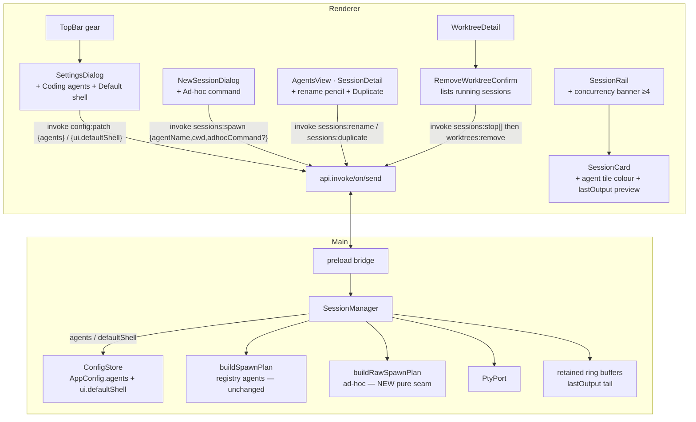

# Agent Config & Integration (AM3) Design

**Spec**: `.specs/features/agent-config/spec.md`
**Status**: Draft
**Sources**: spec.md (AGCF-01..08), PRD #37, `design/handoff/DESIGN_HANDOFF_AGENTS.md` (§Dialog: Settings, §Dialog: Remove-worktree confirmation, §Terminal theming, §Interactions, §State & Data Model), STATE.md **AD-004** (streaming IPC), and the merged **AM2** engine on `main`.

AM3 is **config + polish over AM2's engine**, not a new subsystem. The discipline stays **promote, don't rewrite**: `SessionManager`, `SessionRingBuffer`, `PtyPort`, `TerminalPane`, the AD-004 channels, and the dialog chassis are all reused; AM3 widens a handful of seams. The headline structural change is that the agent list and hosting shell move from **hard-coded constants** (`SEEDED_AGENTS`, `'pwsh'` literal) into **`AppConfig`**, read live by `SessionManager`.

> Diagram note: `mermaid-studio` is not installed — using inline mermaid. Installing it would give rendered/validated SVGs; mentioning once.

> **Honest scope finding (AGCF-07):** `TerminalPane.readTheme()` on `main` **already** maps the full 16-colour ANSI palette to tokens (`--green/--amber/--red/--blue/--accent/--text-muted`) **and** re-emits on theme toggle via a `MutationObserver`. The "basic theme … P2 polish (T12)" comment is **stale** — that work effectively shipped in AM2. So AGCF-07's terminal side is a **verify + de-stale-the-comment**, and the only *new* theming work is the per-agent **tile colour** (agent→colour mapping) on cards/detail, which depends on AGCF-01's registry carrying a colour. The design reflects this rather than inventing terminal work.

---

## Architecture Overview

No new main-process module. `SessionManager` gains four behaviours: (1) resolve agents from `AppConfig.agents` instead of an injected constant; (2) read `AppConfig.ui.defaultShell` for the spawn plan; (3) support **ad-hoc** raw-command sessions via a new pure `buildRawSpawnPlan`; (4) **retain** a stopped session's ring buffer so a 2-line `lastOutput` preview can ride the existing `SessionView`. Two new control verbs (`sessions:rename`, `sessions:duplicate`) are the **only** new IPC — the editable registry and default-shell ride the generic `config:patch`, and the remove-worktree confirmation is **renderer-orchestrated** over the existing `sessions:stop` + `worktrees:remove`.



**Keep / grow boundary:** nothing is deleted. `SEEDED_AGENTS` survives but is **demoted** to the seed for `DEFAULT_CONFIG.agents` (the renderer no longer imports it for the dialog — it reads `config.agents`). `buildSpawnPlan` is **untouched**; ad-hoc gets its own sibling. `SessionManager`'s public surface grows by `rename`/`duplicate`; its `seededAgents` constructor dep is dropped in favour of reading `config.agents`.

---

## Code Reuse Analysis

### Existing components to leverage

| Component | Location | How to use |
| --------- | -------- | ---------- |
| `SessionManager` | `src/main/session-manager.ts` | **Grow:** resolve from `config.agents`; use `config.ui.defaultShell`; ad-hoc spawn; retain buffer on stop; add `rename`/`duplicate`. Same DI test shape |
| `buildSpawnPlan` + per-shell quoting | `src/main/spawn-plan.ts` | **Unchanged** for registry agents. Add sibling `buildRawSpawnPlan` in the same file (+tests) for ad-hoc raw lines |
| `SessionRingBuffer` (incl. `tail()`) | `src/main/session-ring-buffer.ts` | **Unchanged.** `tail(2)` already exists — used for `lastOutput`. Buffer is now retained past stop |
| `ConfigStore` + `merge()` | `src/main/config-store.ts` | **Unchanged.** Verified: missing `agents` key backfills from `DEFAULT_CONFIG`; arrays replace wholesale; `ui` shallow-merges. Registry + shell persist via `config:patch` |
| `SettingsDialog` | `src/renderer/src/components/SettingsDialog.tsx` | **Grow:** add "Coding agents" + "Default shell" sections; already wired to `config:get`/`config:patch` |
| `NewSessionDialog` | `src/renderer/src/components/NewSessionDialog.tsx` | **Grow:** agents come from a prop (config) not `SEEDED_AGENTS`; add Ad-hoc chip + command input |
| `AgentsView` / `SessionRail` / `SessionCard` | `src/renderer/src/components/` | **Grow:** rename pencil + Duplicate (detail header); concurrency banner (rail); tile colour + `lastOutput` preview (card) |
| `TerminalPane.readTheme()` | `src/renderer/src/components/TerminalPane.tsx` | **Reuse as-is** (already full-palette + re-emit). Only de-stale the comment |
| `removeWorktree` + `worktrees:remove` | `src/main/worktree-manager.ts`, index.ts | **Unchanged.** The confirm dialog orchestrates `sessions:stop` then this existing channel |
| Modal chassis (`dialog-backdrop`/`-panel`/`-footer`) | `StartWorkDialog.css`, `NewWorktreeDialog.css` | `RemoveWorktreeConfirm` copies the backdrop/panel/popIn |
| `deriveAttribution` | `src/renderer/src/lib/session-attribution.ts` | Card/detail attribution — unchanged |

### Integration points

| System | Integration method |
| ------ | ------------------ |
| Generic config IPC | Registry (`agents`) + `ui.defaultShell` ride `config:patch`; `config:get` already feeds `SettingsDialog` + can feed the dialog's agent grid |
| AD-004 streaming IPC | Unchanged. Two new **control** verbs (`sessions:rename`/`:duplicate`) on `invoke`/`handle`; the byte firehose is untouched |
| `worktrees:remove` | Renderer-orchestrated confirm: `sessions:stop` each running → then the existing guarded remove (no new main code) |
| electron-vite / electron-builder | **No packaging change** — node-pty plumbing unchanged since AM1 (do not re-litigate) |

---

## Components

### `buildRawSpawnPlan` (pure — new tested seam)
- **Purpose**: Turn an **ad-hoc** raw command string + cwd + shell into a `SpawnPlan`, running the line **verbatim** inside the hosting shell (the user is typing shell syntax themselves, so no per-token re-quoting).
- **Location**: `src/main/spawn-plan.ts` (+ cases in `spawn-plan.test.ts`)
- **Interface**:
  ```ts
  export function buildRawSpawnPlan(command: string, cwd: string, shell: Shell): SpawnPlan
  // pwsh -> { file:'pwsh.exe', args:['-NoExit','-Command', command], cwd, autoCommand: command }
  // cmd  -> { file:'cmd.exe',  args:['/K', command],                 cwd, autoCommand: command }
  ```
- **Dependencies**: none (pure).
- **Reuses**: the same `-NoExit`/`/K` keep-shell-live convention as `buildSpawnPlan`; leaves `buildSpawnPlan` (and its quoting) untouched.
- **Why a sibling, not a flag on `buildSpawnPlan`:** `buildSpawnPlan` quotes each token to preserve argv for *structured* `AgentDef`s; ad-hoc is the opposite contract (one raw shell line). Two small pure functions are clearer than one with a `raw` branch, and both stay trivially testable.

### `SessionManager` — grown (still DI'd, still mock-tested)
- **Location**: `src/main/session-manager.ts` (+ `.test.ts`)
- **Constructor delta**: drop `seededAgents` from `SessionManagerDeps` (agents now live in config). Everything else (`port`/`config`/`emit`/`fsExists`) unchanged.
- **New / changed behaviour**:
  - `#resolve(name)` → `this.deps.config.get().agents.find(a => a.name === name)` (throws `Unknown agent` as before — drives the AM2 forward-compat "deleted agent" edge case).
  - `#start(meta)` → shell = `this.deps.config.get().ui.defaultShell`; plan = `meta.command ? buildRawSpawnPlan(meta.command, cwd, shell) : buildSpawnPlan(#resolve(meta.agent), cwd, shell)`.
  - `spawn(agentName, cwd, adhocCommand?)` → for ad-hoc, `meta = { agent: 'Ad-hoc', command: adhocCommand, title: \`Ad-hoc · ${leaf}\`, … }`; for registry, unchanged.
  - **`rename(id, title)`** → trimmed; empty is a no-op (keeps prior). Patches `sessions[]`, returns the `SessionView`.
  - **`duplicate(id)`** → reads `meta`, spawns a **new running** session cloning `{ agent, cwd, command? }` (fresh id + auto-title). Independent of the source.
  - **buffer retention**: `#finalize` no longer drops the buffer — it moves it into a `#retained: Map<id, SessionRingBuffer>`; `#toView` sets `lastOutput = #retained.get(id)?.tail(2)`. `respawn` replaces it with a fresh buffer; `remove` deletes the retained entry. Restored-stopped sessions (prior run) have no retained buffer ⇒ `lastOutput` undefined ⇒ blank preview.
- **Reuses**: `buildSpawnPlan`/`buildRawSpawnPlan`, `PtyPort`, `SessionRingBuffer.tail`, `ConfigStore`. No new dependency.

### IPC contract changes (`src/shared/ipc-contract.ts`)
```ts
// IpcContract — widen spawn, add two control verbs:
'sessions:spawn':     { req: { agentName: string; cwd: string; adhocCommand?: string }; res: SessionView }
'sessions:rename':    { req: { id: string; title: string };                            res: SessionView }
'sessions:duplicate': { req: { id: string };                                           res: SessionView }
```
`IpcEvents` / `IpcSends` unchanged. (Registry + default-shell use the existing `config:patch`; remove-confirm uses existing `sessions:stop` + `worktrees:remove`.)

### `SettingsDialog` — grown
- **Add** a **Coding agents** section: a list of agent rows (tile + name + `command args` mono + Edit pencil + Delete trash) + a dashed "+ Add agent" button. Add/Edit is an inline row form (name / command / args / colour). Saves the whole array via `config:patch { agents }`.
- **Add** a **Default shell** section: segmented **pwsh | cmd**, saved via `config:patch { ui: { defaultShell } }`.
- Loads both from the existing `config:get` call; the existing ADO/template fields stay. Header copy widens beyond "Azure DevOps & branch template".
- **Reuses**: the existing dialog body, `config:get`/`config:patch`, `busy`/`loaded` pattern.

### `NewSessionDialog` — grown
- Agents come from a **prop** `agents: AgentDef[]` (App passes `config.agents`), not the `SEEDED_AGENTS` import.
- Add an **Ad-hoc command** chip (amber tile, `>_`) alongside the registered agents; selecting it reveals a mono command `<input>`; the "Will run" preview + Spawn-enable use the typed command; empty ⇒ disabled.
- `onSpawn(agentName, cwd, adhocCommand?)` — App forwards `adhocCommand` to `sessions:spawn`.
- **Reuses**: existing cwd grid, browse, highlight, "Will run" preview.

### `AgentsView` / `SessionDetail` — grown (rename + duplicate)
- Header: inline **rename pencil** → editable title `<input>` → `sessions:rename` on commit (Enter/blur; Esc cancels; empty keeps prior). **Duplicate** icon button in the action cluster → `sessions:duplicate` → select the new session.
- **Reuses**: existing header/strip/terminal layout; the stopped footer.

### `SessionRail` / `SessionCard` — grown (banner + tile colour + preview)
- **Concurrency banner**: when `runningCount >= 4`, render the amber banner ("N live sessions — each is a real OS process consuming resources."). Pure-renderer; `runningCount` already computed.
- **Agent tile colour**: `SessionCard`/`SessionDetail` tiles tint from the resolved `AgentDef.color` (looked up by `session.agent` in the agents prop), default token for unknown/ad-hoc (ad-hoc → `--amber`).
- **`lastOutput` preview**: on stopped/path-missing cards, render up to 2 tail lines from `session.lastOutput` (blank when absent).
- **Reuses**: existing card structure, status dot/footer.

### `RemoveWorktreeConfirm` — new (renderer-orchestrated)
- **Purpose**: When **Remove worktree** is invoked on a worktree that has **running** sessions, list them and gate the existing remove (handoff §Dialog: Remove-worktree confirmation).
- **Location**: `src/renderer/src/components/RemoveWorktreeConfirm.tsx` (+ reuse a dialog CSS)
- **Flow**: `WorktreeDetail` already receives `sessions` filtered to this worktree. If any are `running`, intercept its remove click → open this dialog (red warning tile + one row per running session + the dirty-guard note). **Cancel** → nothing. **Terminate & remove** → `await sessions:stop` for each running id → then the existing `worktrees:remove` path → `onRemoved` + refresh sessions. No running sessions ⇒ no dialog (current behaviour).
- **Reuses**: modal chassis; `sessions:stop`; `worktrees:remove`; `deriveAttribution` for the branch label.

---

## Data Models

```ts
// src/main/spawn-plan.ts — AgentDef gains an optional tile colour
export interface AgentDef {
  name: string
  command: string
  args: string[]
  icon?: string
  color?: string   // NEW: tile tint (handoff agent→colour); default token when unset
}

// src/shared/config.ts
export interface PersistedSession {
  id: string
  agent: string        // registry name, or 'Ad-hoc' label
  cwd: string
  title: string        // editable via rename (AGCF-04)
  status: SessionStatus // 'running' | 'stopped' (amber agent-exited still deferred)
  command?: string     // NEW: raw ad-hoc command (absent for registry agents); drives respawn
}

export interface SessionView extends PersistedSession {
  pathMissing: boolean
  lastOutput?: string  // NEW: up to 2 tail lines from a retained buffer; absent after restart
}

export interface AppConfig {
  ui: { theme: 'dark' | 'light'; direction: 'tree' | 'board' | 'agents'; defaultShell: Shell } // + defaultShell
  // …
  agents: AgentDef[]   // NEW top-level array; DEFAULT_CONFIG.agents = SEEDED_AGENTS
  sessions: PersistedSession[]
}

// DEFAULT_CONFIG:  ui.defaultShell = 'pwsh',  agents = SEEDED_AGENTS (the demoted constant)
```
**Back-compat (verified against `ConfigStore.load`)**: a pre-AM3 file missing `agents`/`ui.defaultShell` inherits them from `DEFAULT_CONFIG` (parsed-over-defaults merge); `agents` patches replace the array wholesale; `ui.defaultShell` shallow-merges into `ui`. An explicit empty `agents: []` is a valid saved state (registry intentionally emptied) — the dialog still offers Ad-hoc.

---

## Error Handling Strategy

| Scenario | Handling | User impact |
| -------- | -------- | ----------- |
| Persisted session's `agent` no longer in registry (deleted) | `#resolve` throws inside `respawn`; reject → toast; card stays stopped | "Unknown agent" toast; no crash (reaffirms AM2 edge) |
| Agent edited while a session from it runs | Live PTY untouched (plan built at spawn); next spawn/respawn uses new def | No surprise mutation of a running agent |
| `defaultShell` changed while sessions run | Only new spawns/respawns read it (`#start` runs once per spawn) | Running sessions keep their shell |
| Ad-hoc command empty | Spawn disabled (same rule as no-cwd) | Can't spawn an empty command |
| Ad-hoc command needs shell syntax | Run verbatim via `buildRawSpawnPlan` (no re-quoting) | Behaves like typing it in the shell |
| Registry emptied to `[]` | Dialog still offers Ad-hoc; empty agent grid renders, no crash | Spawning never fully blocked |
| Remove-worktree confirm, worktree turns dirty before confirm | After terminating sessions, the existing dirty guard still blocks `worktrees:remove`; note shown in dialog | Sessions stopped, removal refused with the dirty reason |
| Rename submitted empty | No-op; prior title kept | No blank titles |
| Stopped preview after restart | No retained buffer ⇒ `lastOutput` undefined ⇒ blank | No stale/fabricated preview |

---

## Tech Decisions (non-obvious)

| Decision | Choice | Rationale |
| -------- | ------ | --------- |
| **Agent-exit (amber) stays deferred** | AM3 status remains `running`/`stopped` (+`pathMissing`) | No observable agent-exit signal in a shell-hosted PTY without a sentinel/process-poll; both rejected this slice (user call). Carried to a later slice/v3 |
| Registry + shell ride `config:patch` | **No new IPC** for AGCF-01/02 | `config:patch` already does array-replace + section-merge; adding bespoke channels would duplicate it |
| `defaultShell` lives in `ui` | `AppConfig.ui.defaultShell` | It's an app-level preference like `theme`/`direction`; nests cleanly so `config:patch { ui: { defaultShell } }` merges (a top-level scalar wouldn't patch via `ConfigPatch`) |
| Ad-hoc as a **raw** plan, persisted via `command?` | New pure `buildRawSpawnPlan`; `PersistedSession.command?` | Ad-hoc = "run this shell line"; respawn must re-run the same line. Keeps `buildSpawnPlan`'s argv-quoting contract intact |
| Ad-hoc **not** saved to registry | One-shot only (user call) | Registry is edited solely in Settings; ad-hoc is the lightweight escape hatch |
| Remove-confirm is **renderer-orchestrated** | `sessions:stop[]` then `worktrees:remove` | `WorktreeDetail` already has the worktree's sessions; reuses two existing channels; main stays unchanged |
| `lastOutput` rides `SessionView` | Tail computed in `#toView` from a **retained** buffer | No new `tail` IPC — it flows through the existing `sessions:list` + status refresh |
| AGCF-07 terminal theming is **already done** | Reuse `readTheme()`; only add agent tile colour | Honest: the full-palette map + re-emit shipped in AM2; inventing terminal work would be busywork |
| Drop `seededAgents` constructor dep | `SessionManager` reads `config.agents` | The registry is now the single source; `SEEDED_AGENTS` only seeds `DEFAULT_CONFIG` |

---

## Verification Plan (maps spec → gates)

| Req | Verified by |
| --- | ----------- |
| AGCF-01 registry + Settings | `session-manager.test.ts` (resolve from `config.agents`; unknown-agent throws) + CDP: add/edit/delete agent, chip appears/disappears, running session unaffected by delete |
| AGCF-02 default shell | `session-manager.test.ts` (uses `config.ui.defaultShell` in the plan; running untouched) + `spawn-plan.test.ts` (pwsh/cmd already covered) + CDP: switch shell → next spawn's PTY changes |
| AGCF-03 ad-hoc | `spawn-plan.test.ts` (`buildRawSpawnPlan` pwsh/cmd verbatim) + `session-manager.test.ts` (ad-hoc persists `command`, respawn re-runs it) + CDP: ad-hoc spawn, registry unchanged |
| AGCF-04 rename + duplicate | `session-manager.test.ts` (rename trims/no-op-empty/persists; duplicate clones agent+cwd+command, new id, runs) + CDP: rename persists across restart; duplicate gives a 2nd live session |
| AGCF-05 remove-worktree confirm | Hand/CDP: remove a worktree with a running session → dialog lists it → terminate & remove leaves zero orphans (`Get-Process`); no running session → no dialog; dirty guard still applies |
| AGCF-06 concurrency warning | Hand/CDP: 4 running → banner; drop below → gone; spawning still allowed |
| AGCF-07 ANSI palette + tile colour | Code review/CDP: confirm `readTheme()` palette + re-emit on toggle (already shipped); agent tiles tint per `AgentDef.color`; comment de-staled |
| AGCF-08 last-output preview | `session-manager.test.ts` (`lastOutput` = `tail(2)` after stop; undefined after restore; cleared on respawn/remove) + CDP: stop shows preview; restart shows blank |

**Gate** (per `.specs/codebase/TESTING.md`): `npm run typecheck && npm run lint && npm test` green (grown `session-manager.test.ts` + `spawn-plan.test.ts`; the shared-type widenings are typecheck-enforced) + **Manual/CDP** drive in `dev` for the Settings/dialog/confirm/rail OS+renderer surfaces. **No `build:win`** — packaging is unchanged since AM1.
