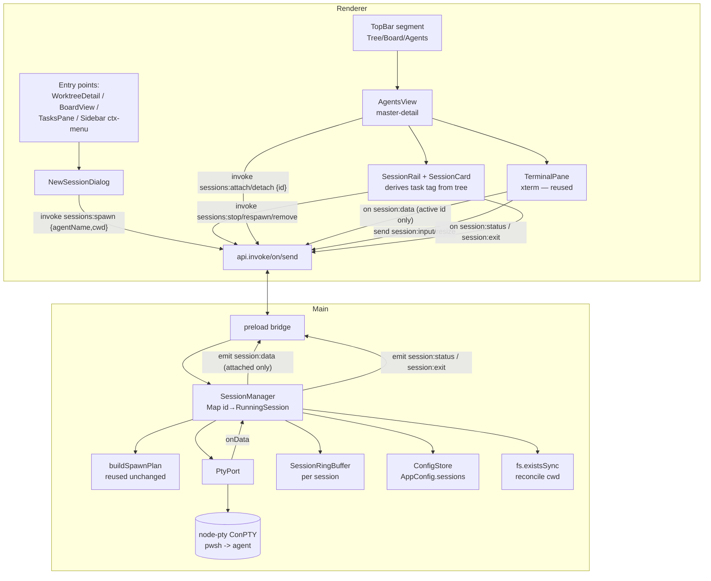

# Agent Sessions (AM2) Design

**Spec**: `.specs/features/agent-sessions/spec.md`
**Status**: Draft
**Sources**: PRD #37 (§Modules `SessionManager`/`SessionRingBuffer`/`PtyPort`, §Hosting model), `design/handoff/DESIGN_HANDOFF_AGENTS.md` (§Screen Direction C, §Entry points, §New Session dialog, §State & Data Model, §Interactions), STATE.md **AD-004** (streaming IPC), and the merged **AM1** plumbing on `main`.

AM2 turns AM1's single-agent spike into the real master-detail feature. The discipline is **promote, don't rewrite**: the AM1 throwaway (inline orchestrator + `sessions:spawn`/`sessions:kill` + the `App.tsx` spike trigger) is deleted; the permanent seams it proved (`PtyPort`, `buildSpawnPlan`, the AD-004 `emit`/`onSend` helpers + maps, `TerminalPane`) are reused untouched or grown.

> Diagram note: `mermaid-studio` is not installed — using inline mermaid. Installing it would give rendered/validated SVGs; mentioning once.

---

## Architecture Overview

`SessionManager` (main) owns a `Map<id, RunningSession>`, each entry a `PtyHandle` + a `SessionRingBuffer`. It is the single owner of session lifecycle and the **only** code that calls `PtyPort` and `ConfigStore` for sessions. Control verbs are request/response (`invoke`/`handle`); the PTY byte firehose + keystrokes stay on the AD-004 push/fire-and-forget channels. Crucially, **only the attached (visible) session streams `session:data`** to the renderer — the others keep running and buffering in main. Attribution (worktree/task) is **derived in the renderer** from the existing `tree` + `taskIdFromBranch`; `path-missing` is the one fact only main can know (an FS check), surfaced per session.



**Keep / throw boundary realized:** delete `registerSpikeAgent()`, `spikeSession`, `CLAUDE`/`SPIKE_*` consts, the `sessions:kill` channel, and `App.tsx`'s `spikeSessionId`/`toggleSpike`/`closeSpike` + the TopBar spike button. Everything else from AM1 is reused.

---

## Code Reuse Analysis

### Existing components to leverage

| Component | Location | How to use |
| --------- | -------- | ---------- |
| `PtyPort` | `src/main/pty-port.ts` | **Unchanged.** Injected into `SessionManager` (the seam it was designed for — its comment already says so) |
| `buildSpawnPlan` | `src/main/spawn-plan.ts` | **Unchanged.** Called by `SessionManager` as-is; `-NoExit`/`/K` already keep the shell live after the agent quits (card stays running) |
| `emit` / `onSend` / `handle` | `src/main/ipc.ts` | Reuse as-is for the new control channels + status event; no new IPC mechanism |
| `IpcContract` / `IpcEvents` / `IpcSends` + `RendererApi` | `src/shared/ipc-contract.ts` | Replace `sessions:spawn`/`:kill` with the AM2 control set; add `session:status` to `IpcEvents` |
| `ConfigStore` + `AppConfig` | `src/main/config-store.ts`, `src/shared/config.ts` | Persist `sessions[]` exactly like `pinnedTasks`; injected into `SessionManager` (DI test pattern) |
| `TerminalPane` | `src/renderer/src/components/TerminalPane.tsx` | **Reuse;** add `attach` on mount / `detach` on cleanup. xterm + fit + live theming already correct |
| `taskIdFromBranch`, `PinnedTaskView` | `src/shared/tasks.ts` | Derive session→task tag (the project's "link is derived, not stored" principle) |
| `task-pills.ts`, `Icon.tsx` | `src/renderer/src/lib/`, `components/` | Type/state pills + agent/status glyphs on cards + attribution strip |
| `countWorktreesByTask`, `findWorktree` | `src/renderer/src/App.tsx` | Pinned-task 0/1/many worktree resolution + highlight (already written for STWK) |
| Modal shell pattern | `StartWorkDialog.tsx`, `NewWorktreeDialog.tsx` | `NewSessionDialog` copies the backdrop/panel/popIn + footer layout |
| `TaskBoard` DI + test pattern | `task-board.ts` / `task-board.test.ts` | Template for `SessionManager` (inject `PtyPort`/`ConfigStore`/`fsExists`/`emit`; unit-test logic) |

### Integration points

| System | Integration method |
| ------ | ------------------ |
| AD-004 streaming IPC | Control verbs (`spawn`/`list`/`stop`/`respawn`/`remove`/`attach`/`detach`) on `invoke`/`handle`; bytes + keystrokes + status on `emit`/`onSend` |
| `ui.direction` persistence | Widen `'tree' \| 'board'` → add `'agents'`; reuse the existing direction-persist path (PWCF/board work) |
| electron-vite / electron-builder | **No packaging change** — `node-pty` already externalized + auto-unpacked + proven packaged in AM1 (do not re-litigate) |

---

## Components

### `SessionRingBuffer` (pure — tested seam)
- **Purpose**: Bounded per-session scrollback so a detached session can be replayed on re-attach (handoff: ~5,000 lines / ~1 MB).
- **Location**: `src/main/session-ring-buffer.ts` (+ `.test.ts`)
- **Interface**:
  ```ts
  class SessionRingBuffer {
    constructor(opts?: { maxBytes?: number; maxLines?: number })
    append(chunk: string): void   // raw PTY bytes (ANSI included), oldest dropped past cap
    snapshot(): string            // full retained scrollback, ready to term.write()
    tail(lines: number): string   // last N lines for the card's last-output preview
  }
  ```
- **Dependencies**: none (pure string ops).
- **Reuses**: nothing — new, deliberately pure so it is fully unit-tested (cap enforcement, overflow drop, tail).

### `buildSpawnPlan` — reused unchanged
- AM2 calls AM1's `buildSpawnPlan(agent, cwd, 'pwsh')` as-is. `-NoExit`/`/K` already keep the shell live after the agent quits, so the card naturally **stays running** on a live shell prompt. The amber **agent exited · shell** sub-status (and the exit-sentinel that would be needed to detect it) is **deferred to AM3** — AM2 does not distinguish agent-alive from agent-quit while the shell is up.

### `SessionManager` (orchestrator — tested with mocks)
- **Purpose**: Own all session lifecycle, persistence, streaming routing, sentinel detection, and reconciliation. Replaces AM1's `registerSpikeAgent` inline block.
- **Location**: `src/main/session-manager.ts` (+ `.test.ts`)
- **Constructor (DI for testability, mirrors `TaskBoard`)**:
  ```ts
  new SessionManager({
    port: PtyPort,
    config: ConfigStore,
    emit: <E>(channel: E, payload: IpcEvents[E]) => void, // bound to mainWindow.webContents
    fsExists: (p: string) => boolean,                      // injectable for reconcile tests
    seededAgents: AgentDef[]
  })
  ```
- **Interfaces** (each wired 1:1 to a control channel):
  ```ts
  list(): SessionView[]                          // persisted ∪ running, reconciled (pathMissing)
  spawn(agentName: string, cwd: string): SessionView
  stop(id: string): void                          // kill PTY → status 'stopped'
  respawn(id: string): SessionView                // re-spawn stopped/agent-exited in same agent+cwd
  remove(id: string): void                        // stopped/path-missing only; deletes from config
  attach(id: string): void                        // set active emit target; replay buffer over session:data, then live
  detach(id: string): void                        // stop emitting; PTY + buffer keep running
  input(id: string, data: string): void           // onSend('session:input')
  resize(id: string, cols: number, rows: number): void
  killAll(): void                                 // window-all-closed: no orphans
  ```
- **Internal `RunningSession`**: `{ meta: PersistedSession; handle: PtyHandle; buffer: SessionRingBuffer }`. Stopped/restored sessions live only in config (no Map entry) until respawned.
- **Behavior**:
  - **spawn**: resolve `agentName`→`AgentDef` from `seededAgents`; `buildSpawnPlan(agent, cwd, 'pwsh')`; `port.spawn`; create buffer; wire `onData`→(append buffer → if active, `emit('session:data')`); `onExit`→ status `stopped` + `emit('session:exit'/'session:status')`; persist; return view.
  - **attach**: set `activeId=id`; `emit('session:data', { id, data: buffer.snapshot() })` (replay rides the **same ordered channel** as live → no seam race), then live deltas flow because `activeId===id`.
  - **status model**: `running` (hosting shell PTY alive — agent quit or not) → on `onExit` `stopped`. `pathMissing` is an orthogonal reconcile flag in the view. The amber `agent-exited` sub-status is AM3.
  - **persistence**: write `AppConfig.sessions` on every spawn/stop/remove/status change; `{ id, agent, cwd, title, status }`.
  - **restore**: on construct, read `config.sessions`, normalize every `status` to `stopped` (PTYs died with the last run); no Map entries until respawn.
  - **reconcile**: `list()` sets `pathMissing = !fsExists(cwd)` per session.
- **Dependencies**: `PtyPort`, `ConfigStore`, the lifted `mainWindow.webContents` (via `emit`), `fs`.
- **Reuses**: `buildSpawnPlan`, `PtyPort`, `SessionRingBuffer`, `ConfigStore`; the `TaskBoard` DI/test shape.

### IPC contract changes
- **Location**: `src/shared/ipc-contract.ts`
- **Control (`IpcContract`)** — replace AM1's `sessions:spawn`/`sessions:kill` with:
  ```ts
  'sessions:list':    { req: void;                              res: SessionView[] }
  'sessions:spawn':   { req: { agentName: string; cwd: string }; res: SessionView }
  'sessions:stop':    { req: { id: string };                    res: void }
  'sessions:respawn': { req: { id: string };                    res: SessionView }
  'sessions:remove':  { req: { id: string };                    res: void }
  'sessions:attach':  { req: { id: string };                    res: void }
  'sessions:detach':  { req: { id: string };                    res: void }
  ```
- **Events (`IpcEvents`)** — add the status push beside the existing two:
  ```ts
  'session:status': { id: string; status: SessionStatus; pathMissing: boolean }
  ```
- **Sends (`IpcSends`)** — unchanged (`session:input`, `session:resize`).

### Renderer: `AgentsView` (master-detail container)
- **Purpose**: The Agents direction — composes the rail + the terminal detail panel; owns `selectedSession`.
- **Location**: `src/renderer/src/components/AgentsView.tsx` (+ `.css`)
- **Interface**: `<AgentsView sessions={SessionView[]} tree={WorkspaceNode[]} tasks={...} onSpawnClick={() => void} onSessionsChanged={() => void} />`. Renders `<SessionRail>` + a detail panel = header bar (agent tile, title, cwd, status pill, Stop/Respawn/Remove) + attribution strip (derived) + `<TerminalPane sessionId={active}>` + stopped footer.
- **Dependencies**: `SessionRail`, `TerminalPane`, `task-pills`, `Icon`.
- **Reuses**: derivation helpers from App (`findWorktree`-style cwd match), `taskIdFromBranch`.

### Renderer: `SessionRail` + `SessionCard`
- **Purpose**: 344px rail — header ("AGENTS" + "N running" + "+ New session") + one card per session.
- **Location**: `src/renderer/src/components/SessionRail.tsx` (+ `.css`)
- **Interface**: `<SessionRail sessions selectedId onSelect onStop onRespawn onRemove onNew tree />`. Each card derives branch + task tag from `tree`; renders status dot/pill + footer actions per status (running→Stop; stopped→Respawn+Remove; path-missing→Remove). Detached/path-missing show their variant rows + last-output preview from `tail`.
- **Reuses**: `task-pills`, `Icon`. **No** concurrency warning (AM3).

### Renderer: `NewSessionDialog`
- **Purpose**: Pick a seeded agent + a cwd, then spawn.
- **Location**: `src/renderer/src/components/NewSessionDialog.tsx` (+ `.css`)
- **Interface**: `<NewSessionDialog open source onSpawn={(agentName, cwd) => void} onClose />` where `source` carries pre-fill (`{ cwd?, taskId?, highlightWorktrees? }`). Agent grid from `SEEDED_AGENTS`; cwd grid from `tree` worktrees (+ task-highlight) + dashed "Browse for a folder…" (P3). Spawn disabled until cwd chosen; shows the "Will run" preview. **No** ad-hoc input, **no** Settings (AM3).
- **Reuses**: `StartWorkDialog` modal shell; `repo-options`/`tree` for the worktree grid; `SEEDED_AGENTS`.

### Renderer: `TerminalPane` — add attach/detach
- **Change**: in the mount effect, `api.invoke('sessions:attach', { id: sessionId })` after subscribing to `session:data`; in cleanup, `api.invoke('sessions:detach', { id: sessionId })`. Scrollback arrives as the first `session:data` chunk (no new code path). Everything else (xterm, fit, theme, input, resize) is unchanged.
- **Decision**: the agent is a full TUI — the **xterm surface itself is the input** (AM1's working model). The prototype's separate "input bar" control is *not* reproduced as a distinct text field; the styled bar is presentation/focus affordance only. Reproducing a separate input field would break raw key/arrow handling that Claude Code needs.

### Renderer: entry-point edits (thin deltas)
- `TopBar.tsx`: third **Agents** segment (+ gear is AM3, skip).
- `WorktreeDetail.tsx`: "AGENTS" section between "Open with" and Danger — Spawn-agent button (cwd pre-fill) + chips for this worktree's sessions (deep-link → Agents + select).
- `BoardView.tsx`: card-footer Spawn-agent icon button (cwd pre-fill).
- `TasksPane.tsx`: "Agent" button with 0/1/many worktree resolution (reuse `countWorktreesByTask`; 0 → disabled + reason).
- `Sidebar.tsx`: worktree-row context menu "Spawn agent here" (cwd pre-fill).
- `App.tsx`: hold `sessions` + `nsSource`/`nsOpen` state (like the other dialogs); `refreshSessions()` via `sessions:list`; subscribe `session:status`/`session:exit` to keep the list live; route all entry points → open `NewSessionDialog`; remove the spike code.

---

## Data Models

```ts
// src/shared/agents.ts — fixed seed for AM2 (AM3 moves this into AppConfig + Settings)
export const SEEDED_AGENTS: AgentDef[] = [
  { name: 'Claude',  command: 'claude',  args: [] },
  { name: 'Copilot', command: 'gh',      args: ['copilot'] },
  { name: 'Codex',   command: 'codex',   args: ['--full-auto'] }
]

// src/shared/config.ts
export type SessionStatus = 'running' | 'stopped' // amber 'agent-exited' is AM3

export interface PersistedSession {
  id: string
  agent: string   // AgentDef.name
  cwd: string
  title: string   // auto `<agent> · <branch-leaf>`; rename is AM3
  status: SessionStatus // normalized to 'stopped' on load
}

// AppConfig gains:  sessions: PersistedSession[]   (DEFAULT_CONFIG.sessions = [])
// AppConfig.ui.direction:  'tree' | 'board' | 'agents'

// Returned to the renderer (persisted + reconciled; not stored):
export interface SessionView extends PersistedSession {
  pathMissing: boolean
}
```
**Relationships**: derived only (not stored) — attached worktree (`cwd === worktree.path`), task tag (`taskIdFromBranch(worktree.branch)`), `agentLive` (status), `detached` (cwd matches no worktree). Mirrors how `pinnedTasks` persist while their task↔worktree link stays derived.

---

## Error Handling Strategy

| Scenario | Handling | User impact |
| -------- | -------- | ----------- |
| Spawn fails (bad cwd / shell missing) | `port.spawn` throws inside `spawn()`; no Map entry / no card created; reject → toast | "Couldn't start session" toast; no half-card |
| Agent binary missing | Shell hosts it → prints "not recognized" and stays live; card stays **running** at a usable prompt | Error visible in-terminal; shell still usable (this is *why* we shell-host) |
| Worktree deleted out-of-band | `list()` reconcile → `pathMissing`; stopped → red Remove-only; running keeps showing | Clear "path missing", not a crash |
| Restart with prior sessions | restore normalizes status→`stopped`; PTYs gone (no daemon) | Cards reappear stopped, one-click Respawn |
| App quit with live PTYs | `killAll()` on `window-all-closed` | Zero orphaned processes |
| Config has no `sessions` (pre-AM2) | `DEFAULT_CONFIG.sessions = []` + `ConfigStore` merge | No migration error |
| Detached attach race | replay rides the **same** `session:data` channel as live (ordered) | No gap/dupe at the seam |

---

## Tech Decisions (non-obvious)

| Decision | Choice | Rationale |
| -------- | ------ | --------- |
| **Agent-exit (amber) deferred to AM3** | AM2 status = `running` (shell alive) / `stopped` (shell exited) only | The PTY is the *shell*; agent exit is otherwise invisible and detecting it needs a sentinel + stream scanning (STATE Deferred-Ideas limitation). Deferred per user call to keep AM2 focused on the master-detail engine; an agent that quits simply leaves a live shell prompt (card stays running) |
| Stream only the **attached** session | `attach`/`detach` gate `emit('session:data')`; others buffer in main | N PTYs but one visible terminal — streaming all is wasteful and pointless |
| Replay over the **data channel** | `attach` emits `buffer.snapshot()` as a `session:data` chunk, then live | One ordered channel ⇒ no replay/live seam race (vs. returning scrollback from `invoke` racing the push stream) |
| Interactive **xterm**, no separate input bar | Keep AM1's `term.onData→session:input` | Hosting a TUI (Claude Code) needs raw keys/arrows; a separate text field can't deliver them. Prototype's input bar is presentational |
| Derive attribution in the **renderer** | Renderer already has `tree` + `taskIdFromBranch` | Keeps the "link is derived, not stored" principle; main stays attribution-free |
| `path-missing` computed in **main** | `fsExists(cwd)` in `list()` | Only main can check the filesystem; it's the one fact the renderer can't derive |
| Seed agents in **shared** const | `src/shared/agents.ts` | AM2's list is fixed; both main (resolve) + renderer (chips) import it. AM3 relocates to `AppConfig` |
| `SessionManager` over `Map`, DI'd | Inject `PtyPort`/`ConfigStore`/`fsExists`/`emit` | Makes the orchestrator unit-testable (no Electron) like `TaskBoard` — the lifecycle logic is the risky part |

---

## Verification Plan (maps spec → gates)

| Req | Verified by |
| --- | ----------- |
| AGSN-01 Agents direction | Hand/CDP: segment switches, 344px rail + terminal, persists across restart |
| AGSN-02 spawn N sessions | `session-manager.test.ts` (spawn adds Map+config, resolves agent, independent ids) + CDP: two live terminals |
| AGSN-03 attach/detach replay | `session-ring-buffer.test.ts` (cap/overflow/tail) + `session-manager.test.ts` (attach emits snapshot then live) + CDP: leave/return shows missed output |
| AGSN-04 status + Stop | `session-manager.test.ts` (onExit→stopped; stop kills + removes Map entry) + CDP: card running while shell live, stopped on `exit`, no orphan on Stop |
| AGSN-05 persist/restore/respawn/remove | `session-manager.test.ts` (persist shape, restore normalizes→stopped, respawn reuses agent+cwd, remove gated to stopped) + CDP: restart shows stopped cards |
| AGSN-06 entry points | Hand/CDP: spawn from worktree detail / board card / pinned task (0/1/many) / sidebar ctx-menu |
| AGSN-07 attribution | Unit (derivation helper) + CDP: task tag on card + strip; detached label |
| AGSN-08 reconcile/path-missing | `session-manager.test.ts` (fsExists=false → pathMissing, respawn blocked) + CDP: delete worktree → red card |
| AGSN-09 detached browse | Hand/CDP: browse folder → detached session runs |

**Gate** (per `.specs/codebase/TESTING.md`): `npm run typecheck && npm run lint && npm test` green (new unit suites for ring-buffer + session-manager; `spawn-plan.test.ts` unchanged) + **Manual/CDP** terminal drive in `dev` for the OS/IPC/renderer surfaces. No `build:win` requirement this time — packaging was the AM1 deliverable and is unchanged.
