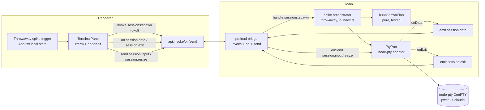

# Agent Spike (AM1) Design

**Spec**: `.specs/features/agent-spike/spec.md`
**Status**: Draft
**Sources**: PRD #37 (§Hosting model, §Modules, §Implementation Decisions), STATE.md AD-004 (streaming IPC), `design/handoff/DESIGN_HANDOFF_AGENTS.md` (§C-b, §Terminal theming)

The spike's deliverable **is** this architecture: prove `node-pty` (native) + typed streaming IPC (AD-004) + `xterm.js`, **rebuilt and packaged**, with the permanent plumbing cleanly separable from a throwaway single-agent trigger.

---

## Architecture Overview

A worktree-rooted **shell** PTY runs in main (`PtyPort` over `node-pty`); its bytes stream to the renderer over a new **push** channel; the renderer's `xterm.js` (`TerminalPane`) renders them and fires keystrokes/resize back over a **fire-and-forget** channel. Control (spawn) stays on the existing request/response `invoke`/`handle`. The pure **`buildSpawnPlan`** decides the shell + auto-run command (the one unit-tested seam).



**Keep / throw boundary** (the spike's discipline): everything above is **permanent** except the two dashed-intent pieces — the `App.tsx` spike trigger and the inline **spike orchestrator** (the hard-coded single agent + fixed session id). AM2 replaces the orchestrator with `SessionManager` (`Map<id, RunningSession>`) and the trigger with the Agents direction + rail; `PtyPort`, `buildSpawnPlan`, the IPC maps/wrappers/bridge, and `TerminalPane` are untouched.

---

## Code Reuse Analysis

### Existing components to leverage

| Component | Location | How to use |
| --------- | -------- | ---------- |
| `handle()` typed wrapper | `src/main/ipc.ts` | Pattern to mirror for the new `emit()` / `onSend()` helpers; reuse for `sessions:spawn` |
| `IpcContract` + `RendererApi` | `src/shared/ipc-contract.ts` | Add `sessions:spawn` to the contract; add `IpcEvents`/`IpcSends` maps and `on`/`send` to `RendererApi` beside it |
| preload bridge | `src/preload/index.ts` + `index.d.ts` | Extend the `api` object with `on`/`send`; keep the untyped pass-through style |
| renderer `api` wrapper | `src/renderer/src/lib/api.ts` | Add `on`/`send` methods mirroring the `invoke` error-wrapping style |
| `ShortcutLauncher` spawn idioms | `src/main/shortcut-launcher.ts` | Reference for child-process/shim handling (`code` `.cmd` lesson → why we shell-host the agent) |
| DI + pure-seam test pattern | `task-board.test.ts`, `shortcut-launcher.test.ts` | `buildSpawnPlan` is an input→output pure test; `PtyPort` is the hand-verified shell |
| Theme tokens | `src/renderer/src/styles/tokens.css` | Read CSS custom properties to build the xterm theme; re-read on `data-theme` change |
| `mainWindow` reference | `src/main/index.ts` `createWindow()` | `emit()` needs the target `webContents`; lift `mainWindow` so the orchestrator can reach it |

### Integration points

| System | Integration method |
| ------ | ------------------ |
| electron-vite main build | **Add `externalizeDepsPlugin()` to `main`** so `node-pty` is externalized, not bundled (Vite cannot bundle a `.node`) |
| electron-builder packaging | `node-pty` ships as a prod dependency; rebuilt by existing `postinstall: electron-builder install-app-deps`; native module auto-unpacked from asar (fallback: explicit `asarUnpack`) |
| Existing IPC | `sessions:spawn` joins `IpcContract`; the byte stream rides the **new** `IpcEvents`/`IpcSends` maps (AD-004) — request/response untouched |

---

## Components

### `buildSpawnPlan` (pure — the tested seam)
- **Purpose**: Turn an agent definition + cwd + shell preference into the concrete PTY launch (shell auto-runs the agent so `.cmd`/`.ps1` shims + PATH resolve — PRD story 15).
- **Location**: `src/main/spawn-plan.ts` (+ `spawn-plan.test.ts`)
- **Interface**:
  ```ts
  type Shell = 'pwsh' | 'cmd'
  interface AgentDef { name: string; command: string; args: string[]; icon?: string }
  interface SpawnPlan { file: string; args: string[]; cwd: string; autoCommand: string }
  function buildSpawnPlan(agent: AgentDef, cwd: string, shell: Shell): SpawnPlan
  ```
  - `pwsh` → `file: 'pwsh.exe'`, `args: ['-NoExit','-Command', autoCommand]`, `autoCommand: 'claude'` (command + args joined); `cmd` → `file: 'cmd.exe'`, `args: ['/K', autoCommand]`. `-NoExit`/`/K` keep the shell live after the agent quits (spec: agent-exit drops to a live prompt).
- **Dependencies**: none (no FS, no spawn).
- **Reuses**: the `code`-is-a-`.cmd`-shim lesson from `ShortcutLauncher` (why we never spawn the agent binary directly).

### `PtyPort` (thin OS shell — hand-verified)
- **Purpose**: node-pty adapter — the only file that imports `node-pty` (PRD §Modules `PtyPort`).
- **Location**: `src/main/pty-port.ts`
- **Interface**:
  ```ts
  interface PtyHandle {
    onData(cb: (data: string) => void): void
    onExit(cb: (e: { exitCode: number }) => void): void
    write(data: string): void
    resize(cols: number, rows: number): void
    kill(): void
  }
  class PtyPort { spawn(plan: SpawnPlan, env?: NodeJS.ProcessEnv): PtyHandle }
  ```
  - `spawn` calls `pty.spawn(plan.file, plan.args, { name: 'xterm-color', cwd: plan.cwd, env: { ...process.env, ...env }, useConpty: true })` — **inherits the developer's environment** (PATH etc., PRD story 40).
- **Dependencies**: `node-pty` (new runtime dep).
- **Reuses**: nothing — it is the new OS boundary, deliberately kept tiny so the untested surface is minimal (`TESTING.md` convention). It is the injectable seam AM2's `SessionManager` will depend on (mirrors `TaskBoard ← WorkItemSource`).

### Streaming IPC additions (AD-004 — hand-verified wiring)
- **Purpose**: First push/fire-and-forget transport.
- **Location**: `src/shared/ipc-contract.ts` (maps + types), `src/main/ipc.ts` (`emit`/`onSend`), `src/preload/index.ts` (+ `.d.ts`), `src/renderer/src/lib/api.ts`.
- **Contract** (added beside `IpcContract`):
  ```ts
  // control verb stays request/response
  interface IpcContract { /* …existing… */ 'sessions:spawn': { req: { cwd: string }; res: { id: string } } }
  // main -> renderer push
  interface IpcEvents {
    'session:data': { id: string; data: string }
    'session:exit': { id: string; exitCode: number }
  }
  // renderer -> main fire-and-forget
  interface IpcSends {
    'session:input': { id: string; data: string }
    'session:resize': { id: string; cols: number; rows: number }
  }
  ```
  `RendererApi` gains: `on<E extends keyof IpcEvents>(channel: E, listener: (payload: IpcEvents[E]) => void): () => void` (returns unsubscribe) and `send<S extends keyof IpcSends>(channel: S, payload: IpcSends[S]): void`.
- **Main helpers** (peers to `handle`): `emit(webContents, channel, payload)` over `webContents.send`; `onSend(channel, fn)` over `ipcMain.on`.
- **Dependencies**: the lifted `mainWindow.webContents` for `emit`.
- **Reuses**: the exact typed-map discipline of `handle()` / `IpcContract`.

### `TerminalPane` (renderer — CDP/visual-verified)
- **Purpose**: Embedded xterm bound to one session (PRD stories 2, 18; handoff §C-b surface).
- **Location**: `src/renderer/src/components/TerminalPane.tsx` (+ `.css`)
- **Interface**: `<TerminalPane sessionId={id} />`. On mount: create `Terminal` + `FitAddon`, `fit()`, subscribe `api.on('session:data', …)` (filter by id) → `term.write`; `term.onData(d => api.send('session:input', { id, data: d }))`; on resize → `fit()` + `api.send('session:resize', { id, cols, rows })`; `api.on('session:exit', …)` → write a plain "shell exited" line. Cleanup unsubscribes + `term.dispose()` on unmount.
- **Dependencies**: `@xterm/xterm`, `@xterm/addon-fit` (new renderer deps); the streaming `api`.
- **Reuses**: theme tokens (`tokens.css`) for the xterm theme map.

### Throwaway spike trigger + orchestrator (deleted by AM2)
- **Trigger**: local `spikeOpen` state in `App.tsx` toggled by a clearly-marked temporary button (TopBar right cluster). When open, calls `sessions:spawn` with a fixed cwd and renders `<TerminalPane>` for the returned id. **No `ui.direction` / config schema change** (keeps the throwaway boundary crisp; the real Agents segment is AM2).
- **Orchestrator**: inline in `index.ts` `handle('sessions:spawn', …)` — `buildSpawnPlan(CLAUDE, cwd, 'pwsh')` → `PtyPort.spawn` → wire `onData`→`emit('session:data')`, `onExit`→`emit('session:exit')`, register `onSend('session:input')`→`write`, `onSend('session:resize')`→`resize`; keep the single handle in a module-scoped variable (no `Map` yet). Killed on `window-all-closed` (PTYs die on quit — no daemon).

---

## Data Models

```ts
// Hard-coded for AM1 (AM3 makes these configurable in AppConfig)
const CLAUDE: AgentDef = { name: 'Claude', command: 'claude', args: [] }
```
No persisted state in AM1 — `AppConfig` is untouched (the `sessions[]` array is AM2).

---

## Error Handling Strategy

| Scenario | Handling | User impact |
| -------- | -------- | ----------- |
| `pwsh` not on PATH | `buildSpawnPlan` already chose a shell; spike hard-codes `pwsh` but the fallback path is `cmd`. If `pwsh.exe` spawn fails, `PtyPort.spawn` throws → `sessions:spawn` returns a rejected/empty id, renderer shows a one-line error | Terminal shows "couldn't start shell" (edge case) |
| Agent (`claude`) not installed | Shell hosts it → shell prints "command not found" and stays live | Agent error visible in-terminal; shell still usable (this is *why* we shell-host) |
| node-pty fails to load in **packaged** app | The de-risk target (ASPK-05): add `node-pty` to `asarUnpack`; record the working config as a STATE.md Lesson | Without fix, packaged terminal is dead — the spike is not "done" until fixed |
| High-volume output burst | xterm handles backpressure; no ring buffer yet (AM2) — confirm it survives | Terminal renders; no replay/scrollback persistence yet |
| App quit with PTY running | `PtyPort` handle killed on `window-all-closed` | No orphaned process |

---

## Tech Decisions (non-obvious)

| Decision | Choice | Rationale |
| -------- | ------ | --------- |
| Bundle vs externalize node-pty | **`externalizeDepsPlugin()` on `main`** | Vite cannot bundle a native `.node`; project's empty `main: {}` would try to — verified via electron-vite docs. Externalized deps load from packaged `node_modules` |
| Native rebuild | Existing `postinstall: electron-builder install-app-deps` (+ `npmRebuild: false`) | Already in place; rebuilds node-pty against Electron's ABI at install — no new tooling |
| asar unpack | Rely on electron-builder auto-detection first; explicit `asarUnpack: node_modules/node-pty/**` only if the packaged load fails | Recent electron-builder honors-rule bugs make the explicit fallback a known contingency (ASPK-05 AC3) |
| Stream transport | Typed `IpcEvents`/`IpcSends` maps + `on`/`send` (AD-004) | Per the recorded decision; rejected multiplexed channel + MessageChannel |
| Spike control surface | One `sessions:spawn` invoke (req/res), stream over events/sends | Keeps the AD-004 split clean; `sessions:spawn` is partially permanent (AM2 grows it), the orchestrator behind it is throwaway |
| One fixed session id, no Map | Module-scoped single handle | AM1 has one terminal; `Map<id, RunningSession>` + lifecycle is `SessionManager` (AM2) |
| xterm theming | Read CSS tokens at mount, re-emit on `data-theme` change | Matches the app's light/dark token system (handoff §Terminal theming); P2 polish |

---

## Verification Plan (maps spec → gates)

| Req | Verified by |
| --- | ----------- |
| ASPK-01 spawn-plan | Vitest unit (`spawn-plan.test.ts`): pwsh + cmd shapes, cwd passthrough |
| ASPK-02 PtyPort | Hand-run `dev`: agent banner, type/respond, exit event |
| ASPK-03 streaming IPC | `npm run typecheck` (maps coherent) + exercised live through ASPK-04 |
| ASPK-04 TerminalPane | CDP smoke / visual: output renders, input echoes, resize reflows |
| ASPK-05 packaged | `npm run build:win` → install → drive terminal; record asar/unpack outcome as a Lesson |
| ASPK-06 theming | Visual: toggle theme with terminal open; colors recolor + stay readable |

Gate: `npm run typecheck && npm run lint && npm test` green (Full) + mandatory **Build** (`build:win`) + **Manual** terminal drive in `dev` and packaged.
