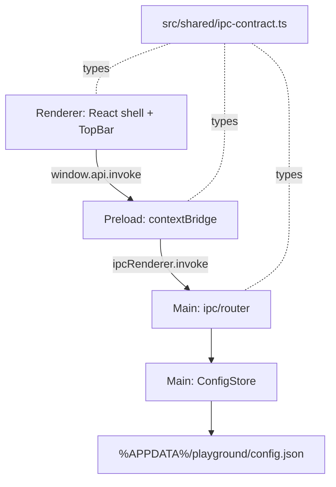

# App Skeleton & Design System — Design

**Spec**: `.specs/features/app-skeleton/spec.md`
**Status**: Approved (user approved proceeding through Design → Tasks → Execute)

---

## Architecture Overview

electron-vite three-target layout (`src/main`, `src/preload`, `src/renderer`) with a shared types directory. The renderer is sandboxed (contextIsolation on, nodeIntegration off — electron-vite defaults); all main-process capability is exposed through one typed request/response bridge.



Startup flow: main creates BrowserWindow → renderer mounts → renderer invokes `config:get` → applies persisted theme/direction → user toggles write back via `config:patch`.

## Research Notes (verified 2026-06-11)

- Current stable versions (npm registry): electron-vite 5.0.0, Electron 42, React 19.2, Vitest 4, TypeScript 6.0. Local Node v24.9.0 — compatible.
- Scaffold: `npm create @quick-start/electron` with the `react-ts` template is the canonical electron-vite starter.
- Fonts self-hosted via `@fontsource/hanken-grotesk` and `@fontsource/jetbrains-mono` (SKEL-02 AC4 — no runtime Google Fonts).

## Code Reuse Analysis

Greenfield — nothing to reuse yet. This feature CREATES the patterns later features reuse:

| Pattern created here                     | Reused by                                           |
| ---------------------------------------- | --------------------------------------------------- |
| `src/shared/ipc-contract.ts` channel map | Every M1–M4 feature adds channels here              |
| `ConfigStore` (atomic JSON persistence)  | Workspaces (M1), pinned tasks (M3), settings (M4)   |
| Design tokens + pill/tint conventions    | Every pane/dialog in the handoff                    |
| Behavior tests in temp dirs (Vitest)     | `WorktreeManager`, `TaskBoard`, `RepoScanner` tests |

## Components

### IPC contract + bridge

- **Purpose**: Single typed request/response channel map shared by main, preload, renderer.
- **Location**: `src/shared/ipc-contract.ts`, `src/preload/index.ts`, `src/renderer/src/lib/api.ts`, `src/main/ipc.ts`
- **Interfaces**:
  - `IpcContract = { 'config:get': { req: void; res: AppConfig }, 'config:patch': { req: Partial<AppConfig>; res: AppConfig } }` — grows per feature
  - Main: `handle<C extends Channel>(channel: C, fn: (req) => Promise<res>)` — thin wrapper over `ipcMain.handle`
  - Renderer: `api.invoke<C extends Channel>(channel: C, req): Promise<res>` via `contextBridge`
- **Dependencies**: Electron ipcMain/ipcRenderer/contextBridge
- **Notes**: `ipcRenderer.invoke` on an unregistered channel rejects natively → satisfies the unregistered-channel edge case; wrapper normalizes it to a typed error message.

### ConfigStore (main process)

- **Purpose**: Owns the global config file; all reads/writes hidden behind a small interface (deep-module style per PRD).
- **Location**: `src/main/config-store.ts`
- **Interfaces**:
  - `load(): AppConfig` — reads file; on missing → defaults; on corrupt → renames bad file to `config.json.bak-<ts>`, logs, returns defaults
  - `get(): AppConfig`
  - `patch(partial: Partial<AppConfig>): AppConfig` — merge, atomic write (tmp file + rename)
- **Dependencies**: `app.getPath('userData')`, `node:fs`. Constructor takes an explicit `dir` so tests use temp dirs without Electron.
- **Reuses**: —

### Design tokens & theme

- **Purpose**: Both handoff token sets as CSS custom properties; theme switching by `data-theme` attribute on `<html>`.
- **Location**: `src/renderer/src/styles/tokens.css`, `src/renderer/src/styles/global.css`
- **Interfaces**: CSS variables exactly as named in handoff §Design Tokens (`--bg`, `--panel`, `--panel-2`, `--border`, `--border-strong`, `--text`, `--text-muted`, `--text-faint`, `--accent`, `--accent-text`, `--green`, `--amber`, `--red`, `--blue`, `--shadow`); fonts via @fontsource imports; tints via `color-mix(in oklab, …)`
- **Dependencies**: none at runtime

### TopBar (renderer)

- **Purpose**: Persistent 54px shell bar per handoff §Top bar: brand, Tree/Board segmented control, spacer, sync-status placeholder, refresh + theme-toggle icon buttons.
- **Location**: `src/renderer/src/components/TopBar.tsx` (+ `Icon.tsx` for the inline stroke SVGs)
- **Interfaces**: `props: { direction, theme, onDirectionChange, onThemeToggle, onRefresh }` — purely presentational
- **Dependencies**: tokens.css
- **Notes**: Sync status is a static placeholder ("az · not connected") until M3; refresh is a no-op hook point.

### App shell (renderer root)

- **Purpose**: Layout (top bar + content region), UI-state ownership, config hydration/persistence.
- **Location**: `src/renderer/src/App.tsx`
- **Interfaces**: holds `theme`/`direction` state; on mount `config:get`; on change sets `data-theme` and fires `config:patch`; renders Tree/Board placeholder per direction.
- **Reuses**: api client, TopBar

## Data Models

```typescript
// src/shared/config.ts
interface AppConfig {
  ui: {
    theme: 'dark' | 'light' // default 'dark'
    direction: 'tree' | 'board' // default 'tree'
  }
  // M1+: workspaces[]; M3: pinnedTasks[], defaultOrg/Project; M4: branchTemplate
}
```

## Error Handling Strategy

| Error Scenario              | Handling                                 | User Impact                                                   |
| --------------------------- | ---------------------------------------- | ------------------------------------------------------------- |
| Config file missing         | Defaults, file created on first patch    | None — first-run behavior                                     |
| Config file corrupt         | Rename to `.bak-<ts>`, log, defaults     | App opens with defaults; bad file preserved                   |
| Config write fails          | Log, keep in-memory state                | UI works this session; persistence silently degraded (logged) |
| IPC to unregistered channel | Native rejection, normalized typed error | Dev-time signal; never hangs                                  |

## Testing (greenfield baseline — future TESTING.md seed)

- Runner: **Vitest** (`vitest run`), tests co-located as `*.test.ts`.
- Philosophy per PRD: behavior of deep modules with real FS in temp dirs; no React component tests; thin wrappers untested.
- This feature: **ConfigStore** gets behavior tests (defaults, round-trip, corrupt-file recovery, atomic write). IPC wrapper and React shell: none (thin wrapper / view, per PRD).
- Gate commands: **quick** = `npm test` (vitest run) · **build** = `npm run typecheck && npm run build`.

## Tech Decisions (non-obvious only)

| Decision          | Choice                                  | Rationale                                                                                                                                                                              |
| ----------------- | --------------------------------------- | -------------------------------------------------------------------------------------------------------------------------------------------------------------------------------------- |
| Build tooling     | electron-vite 5 (`react-ts` template)   | Fast HMR, native TS across all three targets, secure defaults; Forge's webpack template is slower and heavier                                                                          |
| Config format     | JSON (`config.json`)                    | PRD allows YAML/JSON; global config is machine-managed (no human editing expected) → zero extra deps. Per-workspace `.app/` files (M4, human-readable/committed) may choose YAML there |
| Fonts             | @fontsource packages                    | Self-hosting requirement from handoff §Assets with zero manual font management                                                                                                         |
| Theme switching   | `data-theme` attr + two variable blocks | Matches handoff "swap the variable set"; trivially testable in devtools                                                                                                                |
| Test runner       | Vitest 4                                | Native Vite integration with the chosen build tool; PRD's real-FS philosophy works unchanged                                                                                           |
| App id / dir name | `playground`                            | Sets `%APPDATA%/playground/`; matches the repo name                                                                                                                                    |
