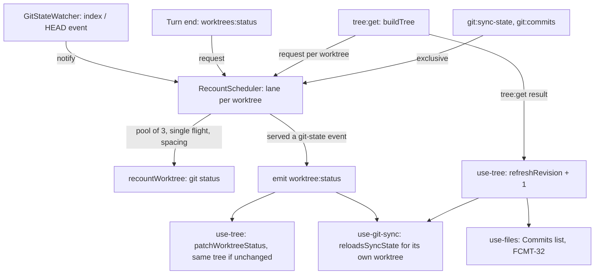

# Git Recount Coalescing Design

**Spec**: `.specs/features/git-recount-coalesce/spec.md`
**Status**: Approved (planned 2026-10-01, approved by the owner 2026-10-01). Executes only after #147 (`perf-diagnostics`): T1 reads its
baseline and can stop the feature.

---

## Architecture Overview

One new deep module in main, `src/main/recount-scheduler.ts`, owns every `git status` main runs to
count a worktree. It keeps one **lane** per worktree path: the lane holds the pending burst, the
waiting requests, the last start time and what is running. Three inputs feed it: `notify` (a git-state
event from the watcher), `request` (a turn end or the tree build, answered with a count) and
`exclusive` (the status bar's sync-state and commit-list reads, which only borrow the lane). One output
leaves it: `onRecounted`, called after a recount that served a git-state event, which `index.ts` turns
into `worktree:status`.

The renderer stops using tree identity as the git-state signal. `patchWorktreeStatus` returns the same
tree when nothing changed, `use-tree` counts `tree:get` results in a `refreshRevision`, and the status
bar's hook subscribes to `worktree:status` and re-reads only when the event names the worktree it
describes.



### Approaches considered

All three deliver the same scope; the recommendation leads.

1. **A per-worktree lane scheduler in main (chosen).** Coalescing, single flight, the trailing run,
   the spacing, the pool and the read exclusion sit in one class with a fake-clock test. Every path
   that counts a worktree goes through it, so the target holds whatever set the recount off. Costs a new
   module and the rewrite of the watcher's batch.
2. **Keep the watcher's batch and de-duplicate in `recountWorktree`** (share one in-flight promise per
   worktree). Small, but the rate stays at four starts a second under steady writes, a trailing change
   is answered by a stale run, and the status bar's reads still overlap the next recount. Misses both
   targets.
3. **Coalesce in the renderer** (debounce the patch and the sync re-read). Leaves main's `git status`
   rate and the focus fan-out untouched. Rejected.

---

## Code Reuse Analysis

### Existing Components to Leverage

| Component | Location | How to Use |
| --------- | -------- | ---------- |
| `Scheduler` (`after(ms, fn)` returning a cancel) | `src/main/file-watcher.ts:22-26` | The scheduler's timer seam; `timerScheduler` (`src/main/index.ts:153-158`) is the real one |
| `GitStateWatcher` | `src/main/git-state-watcher.ts:28-87` | Keeps `sync`, `closeAll`, the git-dir resolve and the `index` / `HEAD` filter; loses `startBatch` and `schedule`, gains `onEvent` and `onDropped` |
| Its fakes | `src/main/git-state-watcher.test.ts` (`harness`, `handleOf`, fake handles that `fire`) | Kept; assertions move from "settles after the flush" to "reports the event" |
| `recountWorktree` | `src/main/index.ts:164-170` | Becomes the scheduler's runner unchanged: one `worktreeStatus`, a logged `null` on failure; #147's `recountStarted` probe stays in it |
| `worktreeStatus`, `statusOf`, `STATUS_ARGS` | `src/main/worktree-manager.ts:420-443` | `worktreeStatus` stays the counter; `listWorktrees` takes the counter as a parameter defaulting to it |
| `buildTree` | `src/main/tree.ts:12-36` | Gains an optional `countChanges` passed to `listWorktrees` |
| Real-git fixtures | `src/main/tree.test.ts:14-23`, `src/main/worktree-manager.test.ts` | The injected-counter tests reuse them |
| `patchWorktreeStatus` | `src/renderer/src/lib/tree-status.ts:12-30` | Gains the unchanged-value early return |
| `status-bar.ts` pure helpers | `src/renderer/src/lib/status-bar.ts` (`barTargetFor`, `syncSectionFor`) | `reloadsSyncState` joins them, tested in `status-bar.test.ts` |
| `useGitSync` | `src/renderer/src/lib/use-git-sync.ts:63-171` | Its `targetPathRef` and `popoverPathRef` already answer "what is described now"; the new subscription reads them |
| The `api.on` subscription pattern | `src/renderer/src/lib/use-tree.ts:74-80` | Same shape for the hook's `worktree:status` subscription |
| The status bar smoke | `scripts/smoke-status-bar.mjs` (`seed`, `selectWorktree`, `waitBar`, `check`, `counterRefresh`, the `finally` restore) | The new `counterFollow` section and `SMOKE_ONLY=follow` reuse all of it |
| `SMOKE_ONLY` focused modes | `scripts/smoke-files-diff.mjs:16-20`, `:517-519` | Same switch shape |
| #147's bench | `scripts/bench-sessions.mjs` (`OPTIONS` table), `scripts/bench-summary.mjs` | `--select` is one more `OPTIONS` row; the summary is read as is, plus the raw `--json` lines for `rev-list` |

### Integration Points

| System | Integration Method |
| ------ | ------------------ |
| The IPC contract | No change: `worktree:status` keeps `{ worktreePath, dirty, changes }`, `worktrees:status` keeps its answer; their meaning is documented in `src/shared/ipc-contract.ts` |
| #147's diagnostics | `recountStarted` stays in `recountWorktree`; `emitted('worktree:status')` moves with the emit into `onRecounted` |
| The quit path | `src/main/index.ts:391-394` (`will-quit`) gains `recounts.stop()` beside `gitStateWatcher.closeAll()` |

---

## Components

### RecountScheduler (`src/main/recount-scheduler.ts`)

- **Purpose**: decide when each worktree's `git status` runs, run at most one per worktree and three in
  all, and keep the status bar's reads off a worktree while it is being counted.
- **Location**: `src/main/recount-scheduler.ts`, tested by `src/main/recount-scheduler.test.ts`
- **Constants** (exported, each pinned by a literal assertion, L-009 / L-019; tests never override them,
  the fake clock makes them free):
  - `RECOUNT_QUIET_MS = 250`
  - `RECOUNT_MAX_WAIT_MS = 1_000`
  - `RECOUNT_MIN_INTERVAL_MS = 1_000`
  - `RECOUNT_POOL_SIZE = 3`
- **Interface**:

  ```typescript
  import type { Scheduler } from './file-watcher'

  export interface WorktreeCount {
    dirty: boolean
    changes: number
  }

  export interface RecountSchedulerDeps {
    /** One `git status` for the worktree; `null` when git could not answer (SCRF-06). */
    recount: (worktreePath: string) => Promise<WorktreeCount | null>
    /** A recount that served at least one git-state event returned a count (RCNT-09). */
    onRecounted: (worktreePath: string, count: WorktreeCount) => void
    /** Monotonic milliseconds; `performance.now()` in the app. */
    now: () => number
    schedule: Scheduler
  }

  export class RecountScheduler {
    constructor(deps: RecountSchedulerDeps)
    /** A git-state event for this worktree (RCNT-02..08). */
    notify(worktreePath: string): void
    /** Count this worktree now-ish; answered by the first recount that starts after the call (RCNT-13..15). */
    request(worktreePath: string): Promise<WorktreeCount | null>
    /** Run `task` while no recount of this worktree runs, one task at a time (RCNT-18). */
    exclusive<T>(worktreePath: string, task: () => Promise<T>): Promise<T>
    /** The watcher dropped this worktree: cancel its waiting git-state recount (RCNT-11). */
    forget(worktreePath: string): void
    /** Quit: cancel everything waiting, answer requests with null, emit nothing more (RCNT-12). */
    stop(): void
  }
  ```

- **Lane state** (one per worktree path, created on first use):

  ```typescript
  interface Lane {
    path: string
    /** What holds the lane: nothing, a recount, or an exclusive read. */
    busy: 'idle' | 'recount' | 'read'
    /** The pending git-state burst; both null when none. */
    firstEventAt: number | null
    lastEventAt: number | null
    /** Requests waiting for the next recount to start. */
    waiters: Array<(count: WorktreeCount | null) => void>
    /** When this worktree's last recount started; null before the first. */
    lastStartAt: number | null
    /** The armed timer's cancel, if any. */
    cancelTimer: (() => void) | null
    /** Due and waiting for a pool slot. */
    queued: boolean
    /** Exclusive reads waiting for the lane, FIFO. */
    reads: Array<() => void>
  }
  ```

- **The due time** of a lane with something pending:

  ```
  wanted = waiters.length > 0
             ? now
             : min(lastEventAt + RECOUNT_QUIET_MS, firstEventAt + RECOUNT_MAX_WAIT_MS)
  due    = max(wanted, lastStartAt + RECOUNT_MIN_INTERVAL_MS)   // lastStartAt null → wanted
  ```

- **Behaviour**:
  - `notify(path)`: ignored after `stop`. Sets `firstEventAt ??= now` and `lastEventAt = now`. If the
    lane is idle and not queued, `arm(lane)`; if it is busy, nothing more: the burst waits for the end
    of the run (RCNT-06).
  - `request(path)`: after `stop`, resolves `null` at once. Otherwise pushes a waiter, then `arm(lane)`
    when the lane is idle and not queued.
  - `arm(lane)`: cancels the armed timer; computes `due`; if `due <= now` the lane is queued for a pool
    slot and `pump()` runs; otherwise `schedule.after(due - now, () => arm(lane))`. Re-computing on
    fire, rather than trusting the earlier figure, lets a later event push the quiet period out
    (RCNT-02) without a second timer.
  - `pump()`: while fewer than `RECOUNT_POOL_SIZE` recounts run and the FIFO of queued lanes is not
    empty, takes the oldest; a lane that a read took meanwhile is unqueued and re-armed when the read
    ends (RCNT-18).
  - **Start** (RCNT-05, 07, 09): `busy = 'recount'`, `lastStartAt = now`; takes the burst
    (`servedEvent = firstEventAt !== null`) and the waiters, clears both; calls `recount(path)`. A
    throw counts as `null` (RCNT-10). When it settles: every taken waiter gets the count; if
    `servedEvent` and the count is not `null` and the scheduler is not stopped, `onRecounted(path,
    count)`. Then `busy = 'idle'`, the slot frees, the next waiting read runs if any, else the lane is
    re-armed if anything is pending, and `pump()` runs.
  - `exclusive(path, task)`: an idle lane runs `task` at once with `busy = 'read'`; otherwise the task
    waits in `reads`. When it settles (either way, its outcome passed to the caller unchanged), the
    next read runs, else the lane is re-armed if a recount is pending. Reads take no pool slot.
  - `forget(path)`: cancels the timer and drops the burst; a queued lane with no waiter leaves the FIFO;
    waiters and reads stay and are served (RCNT-41). An idle lane with nothing pending is deleted, so
    the map holds only worktrees in use.
  - `stop()`: marks the scheduler stopped, cancels every timer, empties the FIFO, resolves every waiter
    with `null`. A recount already running finishes, but emits nothing (RCNT-12). Reads keep running.
- **Dependencies**: `Scheduler` from `file-watcher.ts`; nothing else.
- **Reuses**: the injected-fake pattern of `GitStateWatcher` and `FileWatcher` (TESTING.md, pattern 3).

### GitStateWatcher (`src/main/git-state-watcher.ts`, modified)

- **Purpose**: unchanged in what it watches; it now reports each relevant event instead of batching.
- **Interface**:

  ```typescript
  export interface GitStateWatcherDeps {
    watch: WatchPort
    resolveGitDir: (worktreePath: string) => Promise<string>
    /** Every `index` or `HEAD` event in this worktree's git dir, as it happens (RCNT-01). */
    onEvent: (worktreePath: string) => void
    /** This worktree is no longer watched (a later `sync` dropped it), not called by `closeAll`. */
    onDropped: (worktreePath: string) => void
  }
  ```

- **Changes**: `schedule`, `onSettled`, `startBatch`, `Entry.cancelBatch` and the `BATCH_MS` import
  go. The listener calls `onEvent(path)` for `index` and `HEAD` only. `sync` calls `onDropped(path)`
  for every worktree it closes. `closeAll` closes without calling it (the quit path stops the scheduler
  itself).

### Worktree listing and the tree build (modified)

- `listWorktrees(repoPath: string, countChanges: CountChanges = worktreeStatus): Promise<WorktreeNode[]>`
  with `type CountChanges = (worktreePath: string) => Promise<{ dirty: boolean; changes: number } | null>`.
  A `null` answer reads as clean, the stance `statusOf` keeps today; `statusOf` is folded into this
  line.
- `buildTree(registry: WorkspaceRegistry, opts: { countChanges?: CountChanges } = {})` passes
  `opts.countChanges` to every `listWorktrees`.

### Main wiring (`src/main/index.ts`, modified)

| Where | Change |
| ----- | ------ |
| Before the watcher | `const recounts = new RecountScheduler({ recount: recountWorktree, onRecounted, now: () => performance.now(), schedule: timerScheduler })`; `onRecounted` emits `worktree:status` to `mainWindow` with `{ worktreePath, ...count }` and calls #147's `diagnostics().emitted('worktree:status', worktreePath)` |
| `GitStateWatcher` construction | `onEvent: (p) => recounts.notify(p)`, `onDropped: (p) => recounts.forget(p)`; `schedule` and `onSettled` removed |
| `tree:get` | `buildTree(registry, { countChanges: (p) => recounts.request(p) })` |
| `worktrees:status` | `({ worktreePath }) => recounts.request(worktreePath)` |
| `git:sync-state`, `git:commits` | `recounts.exclusive(worktreePath, () => readSyncState(worktreePath))`, same for `readCommits` |
| `will-quit` | `recounts.stop()` beside `gitStateWatcher.closeAll()` |

`git:run` stays outside the lane (Out of Scope).

### The tree patch (`src/renderer/src/lib/tree-status.ts`, modified)

`patchWorktreeStatus` finds the worktree first. Absent, or present with equal `dirty` and `changes`,
returns the input tree. Otherwise it maps as today, but returns the original workspace, repo and
worktree objects on every branch that does not hold the patched worktree, so every other worktree
object keeps its identity (RCNT-20).

### The sync trigger (`src/renderer/src/lib/status-bar.ts`, new function)

```typescript
/** Whether a git-state event should re-read the bar's sync state (RCNT-22/23). */
export function reloadsSyncState(targetPath: string | null, event: { worktreePath: string }): boolean
```

True only when `targetPath` is not null and equals `event.worktreePath`. The paths compare exactly:
both come from the same `git worktree list` output (the watcher is synced with the tree's paths), as
`patchWorktreeStatus` already relies on.

### `use-tree` (modified)

Adds `refreshRevision: number`, starting at 0 and incremented when any of the three `tree:get` calls
lands (`refreshTree`, `refreshAndSelect`, `refreshAndSelectDefault`). Patches and `recount` never touch
it.

### `use-git-sync` (modified)

- Option `tree: WorkspaceNode[]` is replaced by `refreshRevision: number` (STBR-11 / RCNT-24). The
  effect at `:113-117` depends on `[targetPath, refreshRevision, loadState, loadCommits]`.
- A new effect subscribes once: `api.on('worktree:status', (event) => { const path =
  targetPathRef.current; if (!reloadsSyncState(path, event)) return; loadState(path); if
  (popoverPathRef.current === path) loadCommits(path) })`. Reading the refs makes the check run
  against the worktree described when the event lands (RCNT-40).
- `StatusBar` gains a `refreshRevision` prop it passes through; `tree` stays for `barTargetFor`. `App`
  passes `refreshRevision` from `useTree`.

### `App` and the Files direction (modified)

`useFiles({ treeRevision: refreshRevision })` instead of `tree` (RCNT-26). FCMT-32 names a status-bar
operation and a focus; both end in `refreshTree`, so both still bump the revision. The Files watcher's
`gitStateChanged` path (`use-files.ts:510-514`) keeps reloading on its own git-state signal.

### Bench option (`scripts/bench-sessions.mjs`, modified after #147)

One `OPTIONS` row: `{ flag: '--select', default: 0, parse: wholeNumber }`, 0 meaning none. Validated
with the other options before any seed or launch: outside 1..max(N, 1) exits 2 naming the range
(RCNT-31). After `window.api` is ready and before the spawns, the harness clicks the Tree direction's
segment and the sidebar row whose `.sidebar-worktree-branch` reads `bench/<i>`, the way
`smoke-status-bar.mjs`'s `selectWorktree` does, and waits until `.status-bar-branch`'s `title` is
`bench/<i>`. The header line of the summary prints `select=<i>`.

### Smoke section (`scripts/smoke-status-bar.mjs`, modified)

- Seed: one more linked worktree `wt/follow` on `FOLLOW_BRANCH` (`user/dev/4821-fix-login/12351-follow-head`,
  fictional) cut from `main`, pushed with `-u` to the temp bare `origin`, plus one untracked `a.txt`.
- `counterFollow()`, run right after `counterRefresh()` (both ahead of the changes-popover section that
  stops the script on `main`, see status-changes-refresh T9):
  1. Select `FOLLOW_BRANCH`; wait for `↓0 ↑0` and a counter of `1`; check both (L-031: the start differs
     from the end state).
  2. From the script: write untracked `b.txt`, then `git add a.txt` and `git commit`. The count stays
     `1`. Require `↓0 ↑1` within 2,000 ms with no refresh and no focus, and the counter still `1`
     (RCNT-28; L-088: ahead moves while the count does not).
  3. From the script: `git switch -q -c <FOLLOW_BRANCH>-2`. Require the sync section to read
     `no upstream` within 2,000 ms, the counter still `1` (RCNT-29; L-061: `HEAD` as the second
     source).
- `SMOKE_ONLY=follow` runs the seed, the registration, `counterFollow()` and `counterRefresh()`, and the
  `finally` restore, skipping every other section. The full script still runs everything.

---

## Data Models

No new data. The IPC payloads keep their shape:

```typescript
// src/shared/ipc-contract.ts, documentation change only
/**
 * Sent after main recounted a worktree because its `index` or `HEAD` moved; the event is the
 * git-state signal (the status bar re-reads on it), the count is that recount's. A recount that only
 * answered a request (turn end, tree build) sends nothing.
 */
'worktree:status': { worktreePath: string; dirty: boolean; changes: number }
```

### Timing walk-through (default constants)

| Situation | Events | Recount starts |
| --------- | ------ | -------------- |
| One commit, worktree idle for a while | `index` at 0, 40, 90 ms | 340 ms (quiet) |
| Continuous writes every 100 ms | 0, 100, 200, ... | 1,000 ms (max wait), then at least 1,000 ms after each start |
| A short recount, then a short burst | run 1 at 0 ms ends at 50; events at 60, 90 | 1,000 ms (spacing), not 340 |
| A turn end right after a git-state run started at 0 | request at 200 ms | 1,000 ms; the request is answered by that run |
| A focus with 7 worktrees, all idle | 7 requests at 0 | 3 at 0, the next 3 as slots free, then 1 |

---

## Error Handling Strategy

| Error Scenario | Handling | User Impact |
| -------------- | -------- | ----------- |
| `git status` fails (vanished path, broken git dir) | `recountWorktree` logs and answers `null`; waiters get `null`; no event; the lane frees | The last count stays (SCRF-06); a tree build shows the worktree clean, as today |
| The runner throws | Treated as `null` | Same |
| A sync-state or commit-list read throws | The error reaches the IPC caller unchanged; the lane frees | Same as today: the renderer logs it |
| An event arrives after quit | Ignored | None |
| A request arrives after quit | Answered `null` at once | None (the window is closing) |
| A worktree is dropped with a recount running | The run finishes; its event lands on a tree that no longer holds the worktree and changes nothing | None |

---

## Risks & Concerns

| Concern | Location (file:line) | Impact | Mitigation |
| ------- | -------------------- | ------ | ---------- |
| The spacing delays a recount that follows another within a second | `src/main/recount-scheduler.ts` (new) | A second commit right after a first shows up to 1,000 ms later than today | SCRF-01's 2,000 ms bound and RCNT-27..29 are smoke checks (T17); the owner confirmed the values on 2026-10-01 and accepted that the status bar may take up to about 1 s to update |
| `tree:get` now waits for pooled, single-flight recounts | `src/main/index.ts:320-333`, `src/main/tree.ts:12-36` | A cold build of N worktrees takes about ceil(N / 3) `git status` times; a worktree recounted under a second ago waits up to 1,000 ms | Bounded and measured: T18 records the startup row and a hand-timed Refresh on the bench seed; the owner confirmed the pool size on 2026-10-01 |
| Existing tests pin superseded behaviour | `src/main/git-state-watcher.test.ts:108-145` (the 250 ms batch, SCRF-02), `src/renderer/src/lib/tree-status.test.ts:44-50` (new identity on an equal count, SCRF-03) | Rewriting a test is normally forbidden | These rewrites follow from owner-confirmed supersessions (issue #149); each task names the tests it rewrites and why, and the spec notes land in the same commit |
| Earlier smoke checks measure what this restructures (L-086) | `scripts/smoke-status-bar.mjs` `counterRefresh` (SCRF-01/07/09/10), the STBR-11 check "a local commit shows ↓0 ↑1 after a refresh"; `scripts/smoke-files-commits.mjs` check 20 (FCMT-32) | A broken trigger would only show there | T17 runs the full status bar smoke; T15 runs the Files Commits smoke |
| The status bar's own operations run outside the lane | `src/main/index.ts:356` (`git:run`) | A pull's index write starts a recount beside the pull | Out of Scope: user-initiated, rare; the bench drives no operation |
| The diagnostics `recounts` figure changes meaning | `src/main/index.ts:164-170` (#147's probe) | Startup and focus rows read higher than #147's baseline | Steady rows hold no tree build, and the targets read the steady rows; recorded in the spec assumptions and in T18 |
| A main-process mutant is not live in `npm run dev` | dev app | A falsification could pass on old code (status-changes-refresh T9) | T17 relaunches the dev app for every main mutant and checks the mutant applied |
| The branch label after a terminal checkout stays stale until a `tree:get` | `src/renderer/src/lib/tree-status.ts` | RCNT-29 reads the sync section, not the label | Pre-existing; Out of Scope |
| The lane map | `src/main/recount-scheduler.ts` (new) | Could grow with paths seen | `forget` deletes idle lanes; every lane path is a tree worktree |
| The watcher resolves each new worktree's git dir in parallel at `sync` | `src/main/git-state-watcher.ts:41-49` | One `rev-parse --git-dir` per new worktree at once, after the first `tree:get` | Once per worktree, not per event or focus, and one per worktree, so the per-worktree overlap target is unaffected; the pool's evidence is T7's unit tests and T11's wiring, not the startup row |

---

## Tech Decisions (only non-obvious ones)

| Decision | Choice | Rationale |
| -------- | ------ | --------- |
| Who coalesces | The scheduler alone; the watcher's batch goes | Two coalescers add their delays (250 + 250 ms before any run) |
| Re-arm on fire | The timer re-computes the due time when it fires | One timer per lane, and a later event moves the quiet period without bookkeeping |
| The spacing | A third constant, 1,000 ms between starts | Makes "at most one per second" true by construction, whatever the event pattern |
| Pool reach | Every recount, not only the tree build | One bound on concurrent `git status`; a git-state burst during a focus cannot add three more |
| The read exclusion | `exclusive` on the scheduler, not a second lock | The lane already knows what runs on the worktree |
| Event shape | Unchanged; the event is the git-state signal | Today only the watcher emits; no contract churn |
| Tree identity for the Files list | `refreshRevision`, not `tree` | FCMT-32's triggers are all `tree:get` results |
| Clock | `performance.now()` | A wall clock can jump |

> **AD-TBD (number chosen at Execute; main holds up to AD-051; #147's own AD-TBD takes the number
> before it): main coalesces every worktree recount in one scheduler, and tree identity means a count
> changed.** `src/main/recount-scheduler.ts` owns every `git status` main runs to count a worktree:
> git-state events wait for a 250 ms quiet period or 1,000 ms at most; turn-end and tree-build
> requests skip the quiet period; a worktree runs one recount at a time, one trailing recount serves
> what arrived during it, starts are at least 1,000 ms apart per worktree, and at most 3 run at once.
> The status bar's sync-state and commit-list reads share the worktree's lane. `worktree:status` is the
> git-state signal: the status bar re-reads on its own worktree's event and on a `tree:get` result,
> never on tree identity, and `patchWorktreeStatus` returns the same tree when nothing changed.
> **Revises** SCRF-02 (the watcher's 250 ms batch moves into the scheduler; the criterion still holds),
> **supersedes** SCRF-03, **amends** STBR-11 ("the tree refreshes" is a `tree:get` result) and
> FCMT-32's trigger (the Commits list follows `tree:get` results). Spec / design / tasks:
> `.specs/features/git-recount-coalesce/` (RCNT-01..41).
