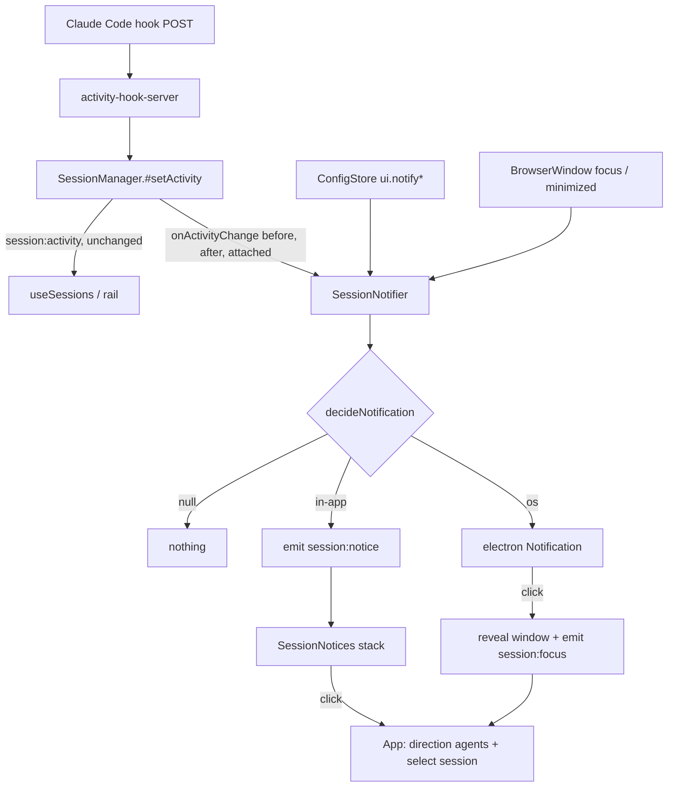

# Session Activity Notifications Design

**Spec**: `.specs/features/session-idle-notifications/spec.md`
**Status**: Approved

---

## Architecture Overview

Main owns the whole decision. `SessionManager` already folds every hook event into a
`SessionActivity` and already knows which session is attached (`#activeId`); main can read
window focus directly. A new DI'd `SessionNotifier` receives each activity **transition**
from `SessionManager`, asks a pure `decideNotification` whether and where to notify, and then
either shows a native `Notification` or pushes a `session:notice` to the renderer, which
renders a clickable in-app notice. Both surfaces click through the same `session:focus`
push, which switches to the agents direction and selects the session.



### Approaches considered

| Approach | Summary | Verdict |
| -------- | ------- | ------- |
| **A. Main decides (chosen)** | `SessionManager` reports transitions to a DI'd `SessionNotifier` in main; OS notification from main, in-app notice pushed to the renderer | One decision point, so the two surfaces cannot disagree (spec assumption row). Fits the DI-orchestrator-tested-via-fakes convention (`SessionManager`, `WorkflowManager`) and reuses the shipped `Notification` + click-to-reveal path |
| B. Renderer decides | `useSessions` sees each `session:activity`, uses `document.hasFocus()` + the selected id, and the HTML5 `Notification` API | No new IPC, but "attached" becomes "selected" (not the same thing: leaving the agents direction detaches), the previous state must be tracked a second time in the renderer, and it splits notification code across two processes |
| C. Hook server decides | Notify straight from the raw hook payload | Duplicates the state machine's folding; rejected by AD-019's single-machine design |

---

## Code Reuse Analysis

### Existing Components to Leverage

| Component | Location | How to Use |
| --------- | -------- | ---------- |
| Activity state machine + `sameView` emit gate | `src/main/activity-machine.ts:167` | Unchanged. Transitions come out of `#setActivity`, which already runs only on a changed view (ACTV-06) |
| `SessionManager.#setActivity` | `src/main/session-manager.ts:340` | Single call site for the new `onActivityChange` dep, with `before`, `after` and `attached` |
| `#activeId` attach tracking | `src/main/session-manager.ts:80`, `TerminalPane.tsx:206/310` | "Attached" = a mounted `TerminalPane`; leaving the agents direction unmounts it and detaches, so attached already means "on screen" |
| Native notifier + click-to-reveal | `src/main/index.ts:238` | Extract `revealWindow()` (show + focus, destroyed-safe) and reuse it for workflow and session clicks |
| `workflow:focus-run` renderer handler | `src/renderer/src/App.tsx:164` | Mirror it for `session:focus`: set direction `agents`, persist, `setSelectedSessionId(id)` |
| `ConfigStore` / `config:patch` persist-on-change | `src/main/config-store.ts`, `SettingsDialog.tsx:87` (`persistShell`) | Same pattern for the five switches |
| `SessionView.agent` / `title` | `src/shared/config.ts:39` | Notification title |

### Integration Points

| System | Integration Method |
| ------ | ------------------ |
| IPC contract | Two new main→renderer events: `session:notice` and `session:focus` (`src/shared/ipc-contract.ts`) |
| Config | Five flat optional booleans under `ui`; absent = on |
| Electron | `Notification` (already imported in `index.ts`), `BrowserWindow.isFocused()` / `isMinimized()` / `isDestroyed()` |

---

## Components

### Notification preferences (shared)

- **Purpose**: One reading of the five switches with the "absent = on" default, used by main to decide and by the settings dialog to render.
- **Location**: `src/shared/notifications.ts`
- **Interfaces**:
  - `type NotifiableState = 'needs-approval' | 'needs-input' | 'waiting' | 'error'`
  - `NOTIFIABLE_STATES: readonly NotifiableState[]`
  - `NOTIFY_STATE_KEYS: Record<NotifiableState, NotifyStateKey>` — state → `ui` key
  - `readNotificationPrefs(ui: AppConfig['ui']): NotificationPrefs`
- **Dependencies**: `AppConfig` type only
- **Reuses**: nothing; pure

### `decideNotification` / `describeNotification` (main, pure)

- **Purpose**: Whether a transition notifies and on which surface; and the title/body it carries.
- **Location**: `src/main/activity-notification.ts`
- **Interfaces**:
  - `decideNotification(input: { before: SessionActivity | null; after: SessionActivity | null; attached: boolean; windowFocused: boolean; prefs: NotificationPrefs }): 'os' | 'in-app' | null`
  - `describeNotification(session: { agent: string; title: string }, activity: SessionActivity): { title: string; body: string }`
- **Rules, in order** (each maps to a spec ID):
  1. `after` null, or `after.state` not notifiable → `null` (NOTF-10, NOTF-26)
  2. `before` null → `null` (NOTF-27: a first event is not a finished turn)
  3. `before.state === after.state` → `null` (only *entering* a state notifies; detail-only changes such as a subagent count stay silent)
  4. master off, or that state's switch off → `null` (NOTF-13, NOTF-14)
  5. `windowFocused && attached` → `null` (NOTF-03)
  6. `windowFocused` → `'in-app'` (NOTF-02, NOTF-09)
  7. otherwise → `'os'` (NOTF-01, NOTF-07, NOTF-08, NOTF-24)
- **Wording**: title `"<title>"`, prefixed `"<agent> · "` only when the title does not already start with it (a renamed session loses the prefix) — NOTF-12. Body:
  - `needs-approval`: `Needs approval to run <tool>` / `Needs your approval` (NOTF-04)
  - `needs-input`: `Needs your input`
  - `waiting`: `Finished its turn`
  - `error`: `Turn failed: <error>` / `Turn failed` (NOTF-08)
- **Dependencies**: `SessionActivity`, `NotificationPrefs`
- **Reuses**: nothing; pure, table-tested

### `SessionNotifier` (main, DI'd)

- **Purpose**: Turn one activity transition into an OS notification or an in-app push.
- **Location**: `src/main/session-notifier.ts`
- **Interfaces**:
  - `constructor(deps: SessionNotifierDeps)`
  - `handle(change: ActivityChange): void`
  - `interface SessionNotifierDeps { prefs(): NotificationPrefs; windowFocused(): boolean; showOs(title: string, body: string, onClick: () => void): void; reveal(): void; emit: EmitFn }`
- **Behaviour**: `'os'` → `showOs(title, body, () => { reveal(); emit('session:focus', { id }) })`; `'in-app'` → `emit('session:notice', { id, title, body })`; `null` → nothing.
- **Dependencies**: the two pure modules; everything Electron injected
- **Reuses**: the `SessionManager` DI shape; tested with fakes, no Electron

### `SessionManager` change

- **Purpose**: Report transitions.
- **Location**: `src/main/session-manager.ts`
- **Interfaces**:
  - `SessionManagerDeps.onActivityChange?: (change: ActivityChange) => void`
  - `interface ActivityChange { id: string; agent: string; title: string; before: SessionActivity | null; after: SessionActivity | null; attached: boolean }` — declared in `activity-notification.ts`, so the pure module owns the shape and `SessionManager` imports it
- **Behaviour**: called in `#setActivity` right after the `session:activity` emit, so only on a changed view. `#finalize` clears activity directly and never calls it, so a stopping PTY cannot notify (NOTF-26). `title` reads `session.meta`, which `rename` keeps current.
- **Reuses**: existing emit gate

### `index.ts` wiring

- **Purpose**: Bind the notifier to Electron.
- **Location**: `src/main/index.ts`
- `revealWindow()`: `if (!mainWindow || mainWindow.isDestroyed()) return; if (mainWindow.isMinimized()) mainWindow.restore(); mainWindow.show(); mainWindow.focus()` — shared with the workflow click (NOTF-21).
- `windowFocused()`: `!!mainWindow && !mainWindow.isDestroyed() && mainWindow.isFocused() && !mainWindow.isMinimized()` (NOTF-24).
- `showOs`: `Notification.isSupported()` guard (NOTF-06); the `Notification` instance is held in a `Set` until `click` or `close`, so it is not collected before the click (see Risks).
- `prefs`: `readNotificationPrefs(configStore.get().ui)` per call, so a toggle applies to the next transition without a restart.

### `SessionNotices` (renderer)

- **Purpose**: Clickable in-app notices, one per session.
- **Location**: `src/renderer/src/components/SessionNotices.tsx` + `.css`; list logic in `src/renderer/src/lib/session-notices.ts`
- **Interfaces**:
  - `upsertNotice(list: Notice[], notice: Notice): Notice[]` — a newer notice for the same session replaces the old one in place; different sessions stack (NOTF-22)
  - `dropNotice(list: Notice[], id: string): Notice[]`
  - `<SessionNotices notices onOpen(id) onDismiss(id) />` — each notice auto-dismisses after 8 s, click opens, × dismisses
- **Reuses**: `Toast.css` motion (`toastIn`) and tokens; not the single-slot 2.2 s `Toast`, which is neither clickable nor stackable

### `App.tsx` changes

- Subscribe `session:notice` → `upsertNotice`.
- Subscribe `session:focus` → `openSession(id)`: direction `agents` (state + `config:patch`), `setSelectedSessionId(id)`. The in-app notice's click calls the same `openSession` and drops the notice (NOTF-05). A stopped session is still in the list and gets selected (NOTF-23).

### `SettingsDialog` change

- **Purpose**: Split the dialog into tabs and add the five switches (NOTF-18, NOTF-20, NOTF-28, NOTF-29).
- **Tabs**: a `role="tablist"` row under the header with **General** and **Notifications**, reusing the `TopBar` segmented look (`topbar-segmented` / `topbar-segment` styles, copied into `SettingsDialog.css` as `set-tabs` / `set-tab` so the top bar stays untouched). Local `tab` state, not persisted; the dialog always opens on General (NOTF-28). The header title follows the tab: *Azure DevOps, agents & shell* / *Agent notifications*.
- **General tab**: today's body, unchanged. All field state already lives in the dialog component, and only the tab body is swapped, so unsaved ADO/template edits and an open agent form survive a tab switch (NOTF-29).
- **Notifications tab**: master checkbox, then four checkboxes labelled *Needs approval*, *Needs input*, *Finished its turn*, *Turn failed*, `disabled` while the master is off. Each toggle sets local state and `config:patch({ ui: { <key>: value } })` immediately (NOTF-16). Toggling the master never writes a state key (NOTF-19).
- **Footer**: unchanged on both tabs. *Save* only commits the General text fields; the switches never need it. Keeping it on the Notifications tab means a pending General edit can still be saved from there instead of being lost.

---

## Data Models

### Config (`AppConfig.ui`, all optional, absent = `true`)

```typescript
interface AppConfig {
  ui: {
    // …existing
    /** Master switch for session activity notifications; absent = on (NOTF-13, NOTF-17). */
    notify?: boolean
    /** Per-state switches; absent = on. Ignored while `notify` is false, never cleared by it (NOTF-19). */
    notifyNeedsApproval?: boolean
    notifyNeedsInput?: boolean
    notifyWaiting?: boolean
    notifyError?: boolean
  }
}
```

### Prefs and IPC

```typescript
interface NotificationPrefs {
  enabled: boolean
  states: Record<NotifiableState, boolean>
}

// ipc-contract.ts, main → renderer
'session:notice': { id: string; title: string; body: string }
'session:focus': { id: string }
```

`DEFAULT_CONFIG` does not gain the keys: absence is the default, so existing config files need no migration.

---

## Error Handling Strategy

| Error Scenario | Handling | User Impact |
| -------------- | -------- | ----------- |
| OS has no notification support | `Notification.isSupported()` false → return (NOTF-06) | No OS notification; rail still shows state |
| Window destroyed before a click | `revealWindow` and `emitToWindow` both no-op on a missing/destroyed window (NOTF-21) | Click does nothing |
| Session removed before the click | Renderer selects an unknown id; `AgentsView` already falls back to the first session | Lands on the agents direction |
| Session stopped before the click | Still in the list; selected (NOTF-23) | Lands on the stopped session, Respawn available |
| `onActivityChange` throws | Wrapped in `try/catch` + `console.error` inside `SessionManager` so a notifier bug never breaks the activity push | Notification lost; rail keeps working |

---

## Risks & Concerns

| Concern | Location (file:line) | Impact | Mitigation |
| ------- | -------------------- | ------ | ---------- |
| Fragile: an unreferenced Electron `Notification` can be garbage-collected before the user clicks it, silently dropping the `click` handler (widely reported for Windows toasts; not verified against Electron docs — flagged uncertain) | `src/main/index.ts:241` | Clicking a notification does nothing; workflow toasts share the bug | Hold each instance in a `Set` until `click`/`close`/`failed`; applied to the shared `showOs` helper, so workflow toasts get it too. Hand-check the click after a minute in the background |
| Config patch merges `ui` one level deep | `src/main/config-store.ts:53` | A nested `notifications` object would be replaced whole, so toggling the master could wipe the state switches, breaking NOTF-19 | Flat keys under `ui`; each toggle patches one key |
| Existing `Toast` is single-slot, 2.2 s, not clickable | `src/renderer/src/components/Toast.tsx:11` | Several sessions would overwrite each other; too short to click | New `SessionNotices` stack; `Toast` untouched |
| Test gap: renderer components have no unit tests by convention (AD-004) | `src/renderer/src/App.tsx`, `SettingsDialog.tsx` | Click-to-select and the settings switches are not covered by `npm test` | Push all list logic into `lib/session-notices.ts` (unit-tested); cover the settings tabs and switches and the `session:focus` path in a CDP smoke (`scripts/smoke-notifications.mjs`) that emits the events rather than spending tokens |
| Idle-prompt on a fresh session: a Claude session left untouched may report `idle_prompt` as its first event | `src/main/activity-machine.ts:133` | A "finished" notification for a turn that never ran | Rule 2: no notification when there was no prior activity (NOTF-27, added to the spec) |
| Test-suite timeouts under extra load (lesson L-005) | `src/main/session-manager.test.ts` | New cases could push slow suites past the default timeout | All new tests are pure or fake-driven; no real PTY, git or process |

---

## Tech Decisions

| Decision | Choice | Rationale |
| -------- | ------ | --------- |
| Where the decision lives | Main (`SessionNotifier`), approach A | Resolves the spec's Design-level row; one decision, two surfaces |
| What counts as a transition | A change of `state`, with a prior state present | `session:activity` also fires on tool and subagent changes; notifying those would repeat the same notification within a turn |
| Config key shape | Five flat optional booleans | Resolves the spec's Design-level row; the one-level-deep merge makes nested objects unsafe for NOTF-19 |
| Click-through channel | New `session:focus`, not a generalised `workflow:focus-run` | Keeps the shipped workflow contract unchanged; the two handlers select different things |
| Settings layout | Two tabs inside the existing dialog, not a second dialog | Owner request; one entry point stays, and dialog-level state keeps edits across tabs for free |
| In-app notice lifetime | 8 s, click or × dismisses | Long enough to read and click; the rail keeps the state after it disappears |
| Notification wording | English, fixed strings in `describeNotification` | The UI is English; one pure function makes every string a test assertion |

> No new project-level `AD-NNN`: every choice here is local to this feature.
