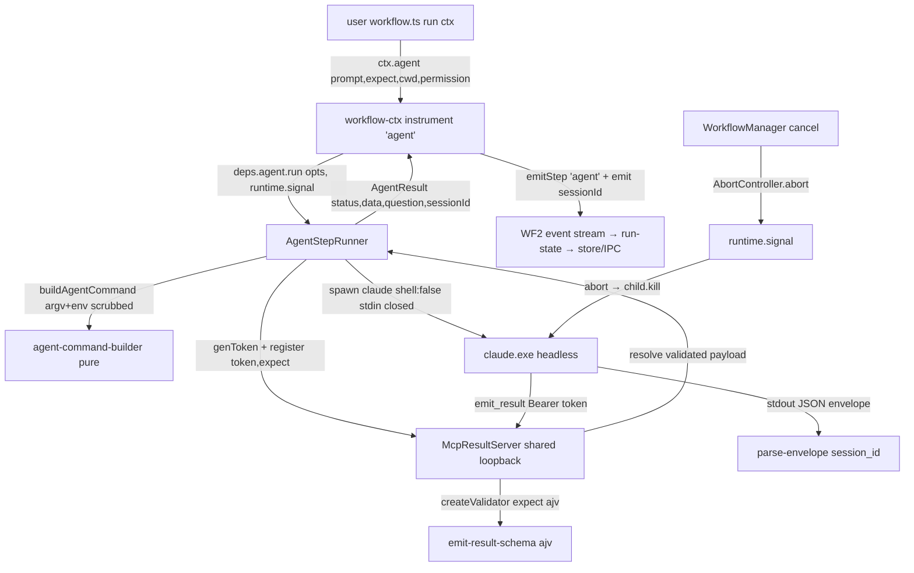

# WF3 — Structured Agent Step — Design

**Spec**: `.specs/features/workflows-agent-step/spec.md`
**Status**: Draft

---

## Architecture Overview

WF3 adds one leaf primitive — `ctx.agent()` — to the WF2 facade. Under it sits a
DI'd **`AgentStepRunner`** that drives a headless `claude` child through a shared,
self-hosted **`McpResultServer`** and returns a **validated** `{ status, data?,
question?, sessionId }`. Everything the WF1 spike proved end-to-end is re-homed from
`scripts/wf1-spike/` into `src/main/` as tested production modules; the only genuinely
new logic is the **runner** (spawn → await forced `emit_result` → validate → one
corrective `--resume` retry → cancel-kill) and the **permission-preset** flag mapping.

The MCP arm is the only path (Arm N dropped, AD-008). Structured output is enforced by
the agent's tool machinery: the server hosts a forced `emit_result` whose `inputSchema`
is `buildToolInputSchema(expect)`; a per-step **bearer token** both routes and
authorizes the call; **ajv** validates the payload against `expect`.



---

## Approaches Considered (Large — approach exploration)

All three deliver the same scoped thing (`ctx.agent()` returning validated data over
MCP); they differ only in **where the step orchestration lives** and the **server
lifecycle**.

| Approach | Shape | Verdict |
| --- | --- | --- |
| **A — Dedicated `AgentStepRunner` + one shared server (RECOMMENDED)** | Runner is a DI'd module (fake spawner + fake server in tests); `ctx.agent` is a thin `instrument`-wrapped delegate; one shared `McpResultServer` multiplexed by per-step token. | **Chosen.** Matches the project's DI-orchestrator-tested-via-fakes convention (`SessionManager`, `WorkflowManager`); keeps `ctx` thin delegation (WF2 rule); the runner is exactly the PRD's named unit-test target; shared server matches PRD Further Notes + forward-compat with concurrency. |
| B — Fold the flow into `makeCtx` | No runner module; `ctx.agent` contains spawn/retry/validate inline. | Rejected: puts substantial untested-by-convention logic inside `ctx` (WF2 designates `ctx` as hand-verified thin delegation); the spawn/retry/cancel branches would have no natural unit home. |
| C — One server **per run** | Runner starts/stops its own `McpResultServer` each run. | Rejected: re-binds an HTTP listener every run, discards the per-step-token multiplexing the PRD calls forward-compatible, and complicates the "one agent step, then another" case within a run. |

The rest of the shape is fixed by existing conventions (mirror `SessionManager` DI,
reuse the WF1 spike modules verbatim where possible, reuse the WF2 `instrument`/
`CtxRuntime`/`CtxDeps` seams). Design presented for approval before Tasks.

---

## Code Reuse Analysis

### Existing Components to Leverage

| Component | Location | How to Use |
| --- | --- | --- |
| `scrubAuthEnv` + `HIGHER_PRECEDENCE_AUTH_VARS` (pure, tested) | `scripts/wf1-spike/scrub-auth-env.ts` | **Re-home verbatim** to `src/main/scrub-auth-env.ts`; the command-builder composes it into the child `env`. Test moves too. |
| `buildToolInputSchema` + `validate` envelope logic (pure, tested) | `scripts/wf1-spike/emit-result-schema.ts` | **Re-home + swap** the minimal `checkSchema` for **ajv** (AD-008). Keep `buildToolInputSchema`, the `{status,data?,question?}` envelope checks, and `EmitResultPayload`/`JsonSchema`/`ValidateResult`. |
| `buildAgentArgv` (pure, tested) | `scripts/wf1-spike/build-agent-argv.ts` | **Re-home + narrow to MCP** + **add preset mapping**; drop the `native` arm and `resumeSessionId`-only path stays. Rename to `buildAgentCommand` returning `{argv, env}`. |
| `parseEnvelope` (pure, tested) | `scripts/wf1-spike/parse-envelope.ts` | **Re-home verbatim** to `src/main/parse-envelope.ts` (drop the now-unused `structuredOutput` field). |
| `createMcpResultServer` (behavior-tested) | `scripts/wf1-spike/mcp-server.ts` | **Re-home ~verbatim** to `src/main/mcp-result-server.ts`; its internal `validate` now routes through the ajv-backed `emit-result-schema`. |
| `makeCtx` / `instrument` / `CtxDeps` / `CtxRuntime` | `src/main/workflow-ctx.ts:133,143,57,88` | Add `ctx.agent` built through `instrument('agent', …)`; extend `CtxDeps` with `agent`, `CtxRuntime` with `signal`. |
| `WorkflowManager` cancel token + `#apply` choke-point | `src/main/workflow-manager.ts:40,107,151,168` | Extend `CancelToken` with an `AbortController`; `cancel()` also `.abort()`s it; `runtime.signal` = `token.controller.signal`. |
| `StepEvent` (WF2 shared type) + `run-state.reduce` | `src/shared/workflows.ts:262`, `src/main/run-state.ts` | Add optional `sessionId?` to `StepEvent`; the reducer already spreads events into `events[]` — pass-through, no branch change. |
| `index.ts` boot wiring (`sessionManager`, `WorkflowManager`, `emitToWindow`) | `src/main/index.ts:118,126` | Construct the shared server + runner; inject `agent` into `ctxDeps`; `server.stop()` on `will-quit`. |
| smoke-over-CDP skeleton | `scripts/smoke-workflow.mjs` | `smoke-agent-workflow.mjs` copies the seed-fixture → `workflows:run` → collect-events → `check()` pattern. |

### Integration Points

| System | Integration Method |
| --- | --- |
| WF2 `ctx` facade | One new leaf `ctx.agent`; `CtxDeps.agent` + `CtxRuntime.signal` are the only seam growth. |
| Main boot (`index.ts` `whenReady`) | Build `McpResultServer` (started lazily on first step), `AgentStepRunner`, inject `agent` into the `ctxDeps` bag already passed to `WorkflowManager`. |
| electron-builder packaging | `@modelcontextprotocol/sdk` is pure JS (no native); promoting devDep→dep must not trigger a node-gyp rebuild — install with the WF2 `--ignore-scripts` discipline (STATE lesson). |
| Filesystem | Example workflow lives under `~/.playground/workflows/review-pr/` (seeded by the smoke script on a scratch repo, like `smoke-gate`). |

---

## Components

### 1. `src/main/scrub-auth-env.ts` (re-home, WF3-02)

- **Purpose**: Child-env with every higher-precedence auth source removed → forces subscription auth.
- **Interfaces**: `scrubAuthEnv(parent): NodeJS.ProcessEnv`; `HIGHER_PRECEDENCE_AUTH_VARS`.
- **Reuses**: verbatim from spike (+ its test).

### 2. `src/main/emit-result-schema.ts` (re-home + ajv, WF3-03/25)

- **Purpose**: The structured-output contract — build the `emit_result` `inputSchema` and validate a payload with **ajv**.
- **Interfaces**:
  - `buildToolInputSchema(expect: JsonSchema): JsonSchema` — **unchanged** (`{status enum, data:expect, question}`, `required:['status']`).
  - `createValidator(expect: JsonSchema): (payload: unknown) => ValidateResult` — compiles `expect` **once** with ajv (`new Ajv({allErrors:true})`), returns a reusable checker doing the envelope logic (`status` present; `blocked`→non-empty `question`; `done`→`data` present **and** ajv-valid). Throws on an **invalid `expect`** (ajv compile error) — surfaced by the runner before spawn (WF3-24).
  - `validate(payload, expect): ValidateResult` — convenience wrapper (`createValidator(expect)(payload)`) for tests + the server.
  - Types `EmitResultPayload`, `JsonSchema`, `ValidateResult` — unchanged.
- **Dependencies**: `ajv` (**new prod dep**). **Reuses**: spike envelope logic; ajv replaces `checkSchema`/`matchesType`.

### 3. `src/main/agent-command-builder.ts` (re-home + presets, WF3-06/07/11..15)

- **Purpose**: Pure builder → the headless `claude` `{ argv, env }` for a step (MCP arm only) + resume.
- **Interfaces**:
  - `type Permission = 'read' | 'write' | 'bypass'`
  - `buildAgentCommand(opts): { argv: string[]; env: NodeJS.ProcessEnv }` where
    `opts = { prompt; mcpUrl; token; permission?; parentEnv; resumeSessionId? }`.
    - Always: `[--resume <id>?] --print <prompt> --output-format json --mcp-config <inline JSON {type:http,url,Bearer token}> --append-system-prompt <emit_result instruction>` (WF3-07).
    - Permission → `--permission-mode` + `--allowedTools` (WF3-11..15):
      | Preset | Mode | allowedTools |
      | --- | --- | --- |
      | `read` (default) | `dontAsk` | `mcp__result__emit_result,Read,Grep,Glob` |
      | `write` | `dontAsk` | `…read set… ,Edit,Write,Bash` |
      | `bypass` | `bypassPermissions` | (none needed — all allowed) |
    - `env = scrubAuthEnv(opts.parentEnv)` (WF3-02) — co-located so one test asserts argv **and** the stripped env (PRD test list).
- **Dependencies**: `scrub-auth-env`, `emit-result-schema` (`JsonSchema` type). **Reuses**: spike `buildAgentArgv` structure; `--json-schema`/`native` branch **removed**.
- ⚠ The read-only allow-list + `bypassPermissions` mode name are **documented leads** beyond WF1's confirmed `dontAsk`+`emit_result` (see Risks).

### 4. `src/main/parse-envelope.ts` (re-home, WF3-16)

- **Purpose**: Pull `session_id` from the headless JSON envelope; throw on non-JSON / no session_id.
- **Interfaces**: `parseEnvelope(stdout: string): { sessionId: string; result: string }`.
- **Reuses**: verbatim from spike minus `structuredOutput`.

### 5. `src/main/mcp-result-server.ts` (re-home, WF3-06/08/09/10)

- **Purpose**: One shared loopback HTTP MCP server forcing `emit_result`; per-step token = auth + routing.
- **Interfaces**: `createMcpResultServer(): McpResultServer` with
  `start(): Promise<{url,port}>`, `register(token, expect): Promise<EmitResultPayload>`,
  `revoke(token): void`, `stop(): Promise<void>` — **unchanged** from the spike. Low-level
  `Server`+`setRequestHandler`, `enableJsonResponse:true`, `tools/list` returns
  `buildToolInputSchema(expect)` verbatim; unknown/revoked token → 401 (WF3-08); `revoke`
  rejects an un-settled pending (WF3-09).
- **Dependencies**: `@modelcontextprotocol/sdk` (**promote to prod dep**), `emit-result-schema`. **Reuses**: spike server + its behavior test.

### 6. `src/main/agent-step-runner.ts` (NET-NEW — the core, WF3-01/04/05/16/17/20)

- **Purpose**: Drive one agent step end-to-end; the DI'd unit-test target.
- **Interfaces**:
  - `interface AgentStepOptions { prompt: string; expect: JsonSchema; cwd: string; permission?: Permission }`
  - `interface AgentResult { status: 'done' | 'blocked'; data?: unknown; question?: string; sessionId: string }`
  - `type AgentSpawn = (bin, argv, opts:{cwd,env}) => AgentChild` where `AgentChild` exposes
    `{ stdout$, stderr$, onClose(cb), kill() }` (a thin seam over `child_process.spawn`; a fake in tests).
  - `interface AgentStepRunnerDeps { server: McpResultServer; spawn: AgentSpawn; resolveClaude: () => string; genToken: () => string }`
  - `class AgentStepRunner { run(opts: AgentStepOptions, signal?: AbortSignal): Promise<AgentResult> }`
- **`run` algorithm**:
  1. `const check = createValidator(opts.expect)` — **throws before spawn** on invalid `expect` (WF3-24).
  2. `token = genToken()`; `pending = server.register(token, opts.expect)`; capture the resolved payload if it fires (`pending.then(p => captured = p)`).
  3. `{argv, env} = buildAgentCommand({…, mcpUrl: server url, token, permission, parentEnv})`; `spawn(resolveClaude(), argv, {cwd, env})` (`shell:false`, stdin ignored — enforced by the spawn seam). If `resolveClaude()` fails → step fails "agent binary not found" (WF3-23, no spawn).
  4. Wire `signal`: on `abort` → `child.kill()` and reject `CancellationError` (WF3-20).
  5. `await close` → capture `{stdout, stderr, code}`; `env = parseEnvelope(stdout)` for `sessionId`.
  6. **If a valid payload was captured** → `revoke(token)`; return `{ …payload, sessionId }` (WF3-01; `blocked` returned as-is, WF3-17).
  7. **Else (no valid emit — invalid or never called)** → **one corrective retry** (WF3-04/05): fresh `token2`+`register`; `buildAgentCommand({resumeSessionId: sessionId, prompt: CORRECTIVE_PROMPT(lastError), …})`; spawn; await close.
     - valid payload → return `{…payload, sessionId: env2.sessionId}`.
     - still invalid / no emit → **throw** a step error carrying `{stdout, stderr, code}` (WF3-05).
  8. `finally` → `revoke` any live tokens.
- **Dependencies**: `mcp-result-server`, `agent-command-builder`, `parse-envelope`, `emit-result-schema`. **Reuses**: `SessionManager`-style DI + fakes; the spike `run.ts` grace/spawn logic (productionized, now tested).

### 7. `src/main/workflow-ctx.ts` (edit, WF3-01/17/19)

- **Add** to `CtxDeps`: `agent: { run(opts: AgentStepOptions, signal: AbortSignal): Promise<AgentResult> }`.
- **Add** to `CtxRuntime`: `signal: AbortSignal` (the run's cancellation signal).
- **Add** to `Ctx`: `agent(opts: AgentStepOptions): Promise<AgentResult>` — built through
  `instrument('agent', …)` so it auto-checks cancel + emits `step-started` `agent` (WF3-19),
  delegates to `deps.agent.run(opts, runtime.signal)`, then records the `sessionId` on the run
  via `runtime.emitLog(\`agent session ${r.sessionId}\`, currentGroup(), r.sessionId)` (WF3-16).
- **`emitLog`** signature grows an optional `sessionId?` (3rd/4th arg) threaded onto the `step-logged` event.
- **Reuses**: `instrument`, `currentGroup`, the WF2 facade shape.

### 8. `src/main/workflow-manager.ts` (edit, WF3-20)

- `CancelToken` gains `controller: AbortController`; `run()` builds `{ cancelled:false, controller:new AbortController() }`; `runtime.signal = token.controller.signal`.
- `cancel(runId)` also calls `token.controller.abort()` (in addition to setting `cancelled`) so a **running child** is killed, not just the next checkpoint (extends WF2-14).
- `#apply`/`#emit` unchanged; the new `sessionId` field rides the existing `step-logged` path.

### 9. `src/shared/workflows.ts` + `src/main/run-state.ts` (edit, WF3-16)

- `StepEvent` gains `sessionId?: string` (populated on the agent's `step-logged`).
- `run-state.reduce` unchanged (it already appends `step-logged` events verbatim — the field passes through). A guard test confirms the field survives the fold.

### 10. `index.ts` (edit, WF3-10/23)

- Build `const resultServer = createMcpResultServer()` (started **lazily**: the runner calls `server.start()` on first use, memoized) and `const agentRunner = new AgentStepRunner({ server: resultServer, spawn: realSpawn, resolveClaude, genToken: randomUUID })`.
- Inject `agent: agentRunner` into the `ctxDeps` bag given to `WorkflowManager`.
- `app.on('will-quit', () => void resultServer.stop())` to free the port.
- `resolveClaude()` = `where claude` first line, else `config.agent?.claudePath`, else throw (WF3-23).

### 11. Example workflow — `~/.playground/workflows/review-pr/workflow.ts` (net-new fixture, WF3-21)

- **Purpose**: The gate example. `meta` (name, description, inputs: `worktreePath`); `run(ctx)`:
  read `ctx.worktree.changedFiles(input.worktreePath)` → build a diff-context prompt →
  `ctx.agent({ prompt, expect: FINDINGS_SCHEMA, cwd: worktreePath, permission: 'read' })` →
  `ctx.notify` a summary. `FINDINGS_SCHEMA` = `{ type:'object', properties:{ findings:{ type:'array', items:{ type:'object', properties:{ file:{type:'string'}, severity:{enum:['info','warn','error']}, summary:{type:'string'} }, required:['file','severity','summary'] } } }, required:['findings'] }`.
- **Reuses**: WF2 `ctx.worktree`/`ctx.notify`; seeded by the smoke script like `smoke-gate`.

### 12. `scripts/smoke-agent-workflow.mjs` (net-new, WF3-22)

- **Purpose**: Owner-run gate over CDP (needs a live subscription, à la WF1's empirical gate).
- **Behavior**: seed a scratch git repo with a small diff + the `review-pr` fixture under `~/.playground/workflows/`; `window.api.invoke('workflows:run', {id:'review-pr', input:{worktreePath}})`; collect `workflow:step|log|status` to `done`; `check()` the persisted run record has `status:done`, the findings validate against `FINDINGS_SCHEMA`, a non-empty `session_id` is present, and **no worktree files were mutated** (read posture, WF3-11). Copies `smoke-workflow.mjs`.

---

## Data Models

```typescript
// agent-step-runner.ts (main-only; the renderer never sees ctx/AgentResult)
type Permission = 'read' | 'write' | 'bypass'
interface AgentStepOptions { prompt: string; expect: JsonSchema; cwd: string; permission?: Permission }
interface AgentResult { status: 'done' | 'blocked'; data?: unknown; question?: string; sessionId: string }

// src/shared/workflows.ts — StepEvent grows ONE optional field (WF3-16)
interface StepEvent { /* …WF2 fields… */ sessionId?: string }
```

**Relationships**: `AgentResult` is the `ctx.agent()` return (author-facing). `sessionId`
also lands on the run's `step-logged` `StepEvent` so WF4 can find it on the persisted run.
`AgentStepOptions.permission` defaults to `read`.

---

## Error Handling Strategy

| Error Scenario | Handling | User Impact |
| --- | --- | --- |
| Agent emits non-conforming payload (once) | server returns `isError` (agent may self-correct in-turn); if the run ends with no valid emit, runner does one `--resume` corrective retry (WF3-04) | Usually invisible; one extra turn |
| Non-conforming twice (after retry) | runner **throws** with `{stdout,stderr,code}`; WF2 manager → `failed` (WF3-04/05) | Run `failed`; evidence on the record |
| Agent exits without ever calling `emit_result` | same no-valid-emit path → corrective retry → fail if still absent (WF3-05) | Run `failed`, never hangs |
| Invalid `expect` (ajv compile error) | `createValidator` throws **before** spawn (WF3-24) | Run `failed` fast; no agent spawned |
| `claude` binary unresolved | runner throws "agent binary not found" (WF3-23) | Run `failed`; no spawn |
| Unknown/revoked bearer token calls `emit_result` | server 401 (WF3-08); `revoke` rejects a pending (WF3-09) | Late/duplicate call cannot resolve a step |
| MCP server fails to bind | `server.start()` rejects → step fails clearly | Run `failed` (no agent that can't emit) |
| Run cancelled mid-agent | `signal.abort` → `child.kill()` → `CancellationError` → `cancelled` (WF3-20) | Child stopped; no orphan claude |
| `status:'blocked'` emitted | returned as `{status:'blocked',question,sessionId}` — no pause, no throw (WF3-17) | Author handles; WF4 adds the engine pause |

---

## Risks & Concerns

| Concern | Location | Impact | Mitigation |
| --- | --- | --- | --- |
| Read-only allow-list (`Read/Grep/Glob`) + `bypassPermissions` mode name are **leads** beyond WF1's confirmed `dontAsk`+`emit_result` | `agent-command-builder.ts` (new) | A `read` step might permit a tool that can mutate, or `bypass` mode name could be wrong | The owner-run review-PR smoke (WF3-22) confirms `read` end-to-end incl. "no files mutated"; `bypass` is exercised by WF4's implement-ticket example. If a listed tool name is wrong, `dontAsk` **auto-denies** it (safe default — a read step degrades to emit-only, never gains write). Flag for empirical confirm at Execute. |
| Killing `claude.exe` may leave grandchild processes (agent-spawned Bash) on Windows | `agent-step-runner.ts` (new) | Cancel might orphan a subprocess tree | v1: `child.kill()` (SIGTERM to the direct child). Tree-kill is a known Windows gap; note as accepted v1 limitation (serial runs, single child typical for `read`). |
| Agent steps can run minutes under the **serial** guard | `workflow-manager.ts:97` | No other run proceeds during a long agent step | Accepted v1 (epic Out-of-Scope: serial); cancel now force-kills (WF3-20). |
| Promoting `@modelcontextprotocol/sdk` devDep→dep could trigger a native rebuild on install | `package.json` | node-gyp failure on this machine (known) | SDK is pure JS; install with `--ignore-scripts` (STATE lesson / node-rebuild workaround). No native module added. |
| ajv bundled into main by electron-vite | `electron.vite.config` | Bundling/ESM interop | `externalizeDepsPlugin()` already externalizes deps in main (WF2 loader relies on it); ajv loads from `node_modules` at runtime — no bundle concern. |
| Shared server port stays bound if `stop()` not called on quit | `index.ts` (new) | Leaked listener across dev reloads | `app.on('will-quit', stop)`; port is ephemeral (`:0`) so collisions are unlikely. |
| `src/main/ado-gateway.ts` is UTF-16 (git sees binary) | pre-existing | Not touched by WF3 | Out of scope; noted for a future cleanup (STATE). |

---

## Tech Decisions (only non-obvious ones)

| Decision | Choice | Rationale |
| --- | --- | --- |
| Where step orchestration lives | Dedicated `AgentStepRunner` (Approach A) | DI-tested-via-fakes convention; keeps `ctx` thin; the PRD's named test target. |
| Validator lifecycle | `createValidator(expect)` compiled **once** per step, reused by server + runner + retry | ajv compilation is non-trivial; compile-once avoids recompiling on the corrective retry, and surfaces invalid `expect` before spawn. |
| Cancellation of a running child | `AbortSignal` (new) alongside WF2's boolean token | WF2's poll-at-checkpoint can't interrupt a long `await`; a signal→`child.kill()` is event-driven. Token stays for the non-agent primitives. |
| `session_id` capture | Ride the existing `step-logged` event via an optional `StepEvent.sessionId` | No new event kind, no reducer branch — smallest change that puts the id on the persisted run for WF4. |
| Command builder returns `{argv, env}` | Co-locate the scrubbed env with argv | One pure test asserts both the flags **and** `ANTHROPIC_API_KEY` absence (PRD test list). |
| Server started **lazily**, shared, memoized | Runner calls `start()` on first step | Avoids binding a port until an agent step actually runs; one server for all steps/runs (PRD Further Notes). |

> **Project-level candidates** (record as `AD-NNN` at Execute if they hold): the
> `AbortSignal`-for-child-kill pattern and the "re-home spike seams into `src/main/`
> as tested prod modules" convention. AD-008 already records the four scope decisions.

---

## Requirement → Component Map

| Req | Component(s) |
| --- | --- |
| WF3-01 | `agent-step-runner.run`, `ctx.agent` |
| WF3-02 | `scrub-auth-env` via `agent-command-builder` env |
| WF3-03 | `emit-result-schema.createValidator` (ajv) |
| WF3-04 | `agent-step-runner` corrective `--resume` retry |
| WF3-05 | `agent-step-runner` exit-without-emit → fail |
| WF3-06 | `mcp-result-server.register` + `buildAgentCommand` mcp-config |
| WF3-07 | `buildAgentCommand` `--append-system-prompt` |
| WF3-08 | `mcp-result-server` 401 unknown/revoked token |
| WF3-09 | `mcp-result-server.revoke` |
| WF3-10 | `mcp-result-server` shared lazy loopback + `index.ts` |
| WF3-11..15 | `agent-command-builder` preset→mode/allowedTools table |
| WF3-16 | `parse-envelope` + `StepEvent.sessionId` + `ctx.agent` emitLog |
| WF3-17 | `agent-step-runner` returns `blocked` as-is |
| WF3-18 | `emit-result-schema` validate (blocked requires question) |
| WF3-19 | `ctx.agent` via `instrument('agent')` |
| WF3-20 | `AbortController` in `workflow-manager` + runner `child.kill` |
| WF3-21 | `review-pr/workflow.ts` fixture |
| WF3-22 | `scripts/smoke-agent-workflow.mjs` |
| WF3-23 | `resolveClaude` in `index.ts` / runner |
| WF3-24 | `createValidator` throws pre-spawn |
| WF3-25 | `ajv` dep + `@modelcontextprotocol/sdk` promotion |

---

## Tips applied

- Reuse-first: 6 WF1 spike modules re-homed (5 near-verbatim + tests), 4 WF2 seams
  extended minimally; only `agent-step-runner` is net-new logic.
- Interfaces defined before Tasks; the pure/behavior seams (`createValidator`,
  `buildAgentCommand`, `parseEnvelope`, `mcp-result-server`, `agent-step-runner` w/ fakes)
  are the unit-test targets.
- Every concern carries a mitigation; the one empirical risk (preset flag leads) is
  pinned to the owner-run smoke gate.
