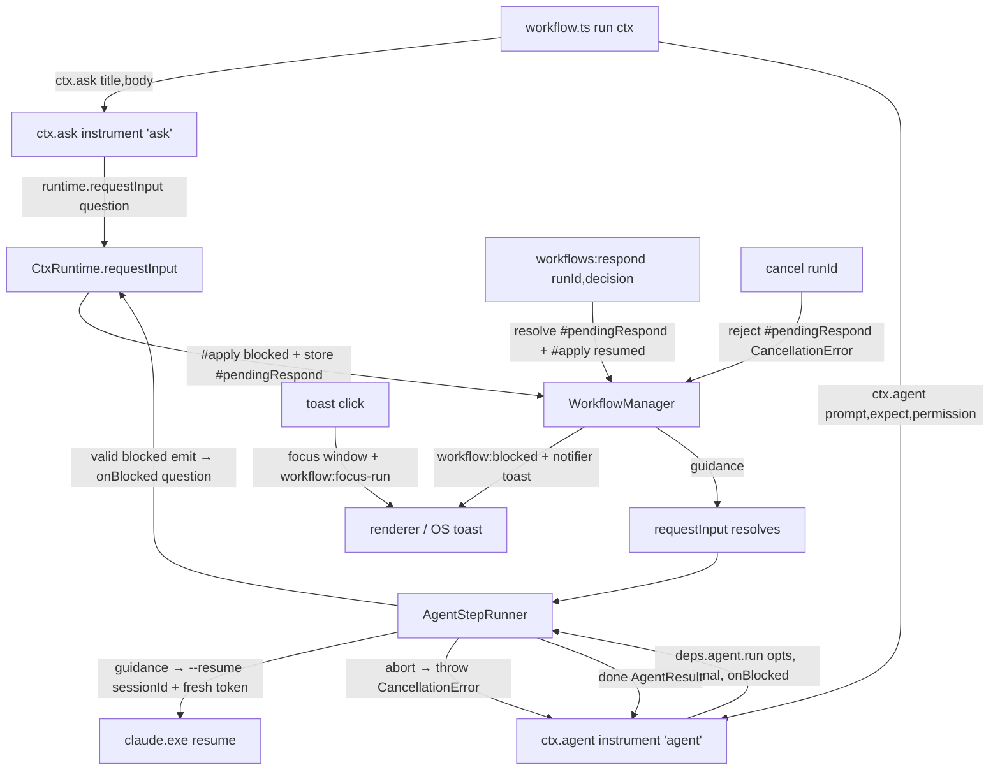

# WF4 — Blocker + Resume — Design

**Spec**: `.specs/features/workflows-blocker-resume/spec.md`
**Status**: Draft

---

## Architecture Overview

WF4 adds the **human-in-the-loop** loop on top of WF3's dormant seams. Two author-facing
surfaces block a run — `ctx.ask()` (explicit) and `ctx.agent()` (engine-driven on a
`blocked` agent result) — and both funnel through **one** manager-owned pause primitive
(`runtime.requestInput`). The manager holds a single `#pendingRespond` (serial ⇒ at most
one), transitions the run to `blocked`, emits `workflow:blocked`, and fires a native
lifecycle toast. `workflows:respond` resolves that promise (`blocked → running`); `cancel`
rejects it (`blocked → cancelled`).

The **agent resume loop** lives in the tested `AgentStepRunner` (not `ctx`): `ctx.agent`
injects an `onBlocked` resolver wired to `runtime.requestInput`; the runner, on a valid
`blocked` emit, calls `onBlocked` — `abort` throws `CancellationError`, `guidance` resumes
the **same** session via `--resume` (fresh token + re-registered `expect`) and loops until
`done`. WF3's `done` happy path and the corrective-retry path are untouched (the latter is
only refactored to interpolate the server's field-level ajv error — WF4-18).



---

## Approaches Considered (Large — approach exploration)

The one genuine architectural fork is **where the `blocked → respond → resume` loop
lives**. All three deliver the same scoped behavior (engine-driven pause + resume, abort →
cancelled, toasts).

| Approach | Shape | Verdict |
| --- | --- | --- |
| **A — Loop in `AgentStepRunner` via an injected `onBlocked` resolver (RECOMMENDED)** | `run(opts, signal?, onBlocked?)`; on a valid `blocked` emit the runner calls `await onBlocked(question, sessionId)` → abort throws, guidance resumes the same session and loops. `ctx.agent` wires `onBlocked` to `runtime.requestInput`; the manager owns the pause state (`#pendingRespond`, `blocked`/`resumed` events, toast). | **Chosen.** Mirrors WF3 Approach A exactly (logic in the DI'd runner, `ctx` stays thin hand-verified delegation). The loop is unit-tested with a fake `onBlocked`; the pause state machine is unit-tested in the manager via DI. Clean split: runner = agent turns, manager = run lifecycle. |
| B — Loop in `ctx.agent` (`workflow-ctx`) | `ctx.agent` calls `deps.agent.run`, and on `blocked` calls `runtime.requestInput` then re-invokes `deps.agent.run` with a resume. | Rejected: puts the untested-by-convention block/guidance/resume loop inside `ctx` (WF2 designates `ctx` as hand-verified thin delegation — same reason WF3 rejected its Approach B). |
| C — Loop in `WorkflowManager` | The manager intercepts each agent step's `blocked` result and drives resume. | Rejected: the manager runs `loaded.run(ctx)` as a black box — it cannot intercept an individual `ctx.agent` call's result without threading a callback, which **is** Approach A but with the loop misplaced away from the agent-turn code it coordinates. |

The rest of the shape is fixed by existing conventions (extend the WF2 reducer, the
`CtxRuntime`/`CtxDeps` seams, the `#apply`/`#emit` choke-point, the WF3 `#attempt` turn).
Design presented for approval before Tasks.

---

## Code Reuse Analysis

### Existing Components to Leverage

| Component | Location | How to Use |
| --- | --- | --- |
| `run-state.reduce` + `RunStatus`/`StepEvent` | `src/main/run-state.ts`, `src/shared/workflows.ts:33,39` | Add `blocked` to `RunStatus`; add `blocked`/`resumed` to `StepEvent.kind` + a `question?` field; add reducer transitions `running→blocked`, `blocked→running`, `blocked→cancelled`. The append-in-order fold is unchanged. |
| `WorkflowManager` `#apply`/`#emit` choke-point + `notifier` (reserved) | `src/main/workflow-manager.ts:36,182,207` | Add `#pendingRespond`, `respond()`, `requestInput` on the inline `runtime`; wire the reserved `deps.notifier` to fire on block/done/fail; emit `workflow:blocked` in `#emit`. |
| `WorkflowManager.cancel` (token + AbortController) | `src/main/workflow-manager.ts:164` | Also reject `#pendingRespond` with `CancellationError` so a **blocked** run cancels cleanly. |
| `CtxRuntime`/`CtxDeps`/`makeCtx`/`instrument` | `src/main/workflow-ctx.ts:97,58,150,160` | Add `runtime.requestInput`; add `ctx.ask` (instrument `'ask'`); extend `deps.agent.run` signature with `onBlocked`; `ctx.agent` wires `onBlocked` to `requestInput`. |
| `AgentStepRunner.run` + `#attempt` + `correctivePrompt` | `src/main/agent-step-runner.ts:109,162,84` | Refactor `run` into an outer block-loop over a `#turn` helper (= existing attempt + one corrective retry); add the `onBlocked` guidance-resume path; make `correctivePrompt` carry the server's field-level ajv error (WF4-18). |
| `agent-command-builder` `resumeSessionId` → `--resume` | `src/main/agent-command-builder.ts:44,64` | **Unchanged** — already emits `--resume <id>`; the guidance resume reuses it with `prompt = guidance`. |
| `McpResultServer` (register/revoke, per-token validate) | `src/main/mcp-result-server.ts:91,110` | Store `reg.lastError` on an invalid payload + expose `lastError(token)` (WF4-18); add a `httpServer.once('error', reject)` in `start()` so a bind failure rejects (WF4-20). |
| IPC contract + `handle`/`emitToWindow` wiring | `src/shared/ipc-contract.ts:94`, `src/main/index.ts:66,287` | Add `workflows:respond` channel, `workflow:blocked`/`workflow:focus-run` events; `handle('workflows:respond', …)`; extend the real `notifier` with a click handler (focus + `workflow:focus-run`). |
| `smoke-agent-workflow.mjs` skeleton | `scripts/smoke-agent-workflow.mjs` | `smoke-blocker-resume.mjs` copies the seed → run → collect-events pattern, adding a `workflows:respond` guidance step. |
| `review-pr` example fixture | `~/.playground/workflows/review-pr/workflow.ts` (WF3-21) | Model for the net-new `implement-ticket` fixture (write/bypass step that provokes a blocker). |

### Integration Points

| System | Integration Method |
| --- | --- |
| WF2 `ctx` facade | One new leaf `ctx.ask`; `ctx.agent` grows an `onBlocked` wire. `CtxRuntime.requestInput` + `CtxDeps.agent.run(…, onBlocked?)` are the only seam growth. |
| WF2 run-state | `blocked`/`resumed` join the event union; three new guarded transitions. |
| Main boot (`index.ts`) | `handle('workflows:respond')`; the real `notifier` gains a click handler; no new long-lived objects (the MCP server + runner already exist from WF3). |
| electron `Notification` | `notifier(title, body, { runId })` attaches a `click` handler that `mainWindow.show()/focus()` + `emitToWindow('workflow:focus-run', { runId })`. |
| Filesystem | `implement-ticket` example under `~/.playground/workflows/` (seeded by the smoke script on a scratch repo). |

---

## Components

### 1. `src/shared/workflows.ts` (edit — types, WF4-06/07/11)

- Add `RunStatus` member `'blocked'`.
- `StepEvent.kind` union gains `'blocked' | 'resumed'`; add `question?: BlockerQuestion`
  (carried on a `blocked` event).
- New shared types:
  - `interface BlockerQuestion { title: string; body: string }`
  - `type RespondDecision = { action: 'abort' } | { action: 'guidance'; guidance: string }`
- **Reuses**: the existing flat-optional `StepEvent` shape; `question` is one nested
  serializable object (crosses IPC).

### 2. `src/main/run-state.ts` (edit — reducer, WF4-06)

- `blocked` is **non-terminal**; `TERMINAL` set unchanged (`done`/`failed`/`cancelled`).
- New transitions:
  - `case 'blocked'`: `running → blocked`, append event (records `question`).
  - `case 'resumed'`: `blocked → running`, append event.
  - `case 'cancelled'`: guard widened to accept `running` **or** `blocked` → `cancelled`.
  - `step-started`/`step-logged`/`done`/`failed`: unchanged (`running`-only) — no events
    flow while truly blocked.
- **Reuses**: the guarded-append fold; invalid transitions stay no-ops.

### 3. `src/main/workflow-manager.ts` (edit — pause/respond/toast, WF4-01/05/07/09/13/14/15)

- `#pendingRespond: { resolve: (d: RespondDecision) => void; reject: (e: Error) => void } | null = null`
  (serial ⇒ at most one).
- `runtime.requestInput(question: BlockerQuestion): Promise<RespondDecision>` (added to the
  inline `runtime` in `run()`): returns a promise that stores `resolve`/`reject` in
  `#pendingRespond`, then `#apply({ kind: 'blocked', question })` (drives status + emit +
  toast). It does **not** resolve until `respond`/`cancel`.
- `respond(runId: string, decision: RespondDecision): void`:
  - No-op unless `runId === #activeRunId && #pendingRespond` (WF4-07 stray = no-op).
  - Else: capture + clear `#pendingRespond`, `#apply({ kind: 'resumed' })`, then
    `pending.resolve(decision)`. Uniform for abort **and** guidance — `blocked → running`
    always; the abort→`cancelled` outcome is produced downstream by the agent-block
    consumer throwing (see Tech Decisions).
- `cancel(runId)`: existing token+abort, **plus** if `#pendingRespond`: capture+clear and
  `pending.reject(new CancellationError())` (WF4-09 — the reject bubbles through
  `requestInput` → `loaded.run` → catch → `#apply({ kind: 'cancelled' })`).
- `#emit` additions (keyed off the **new** status / event kind):
  - `event.kind === 'blocked'` → `emit('workflow:blocked', { runId, question })` +
    `deps.notifier(question.title, question.body, { runId })` (WF4-13).
  - transition to `done` → `deps.notifier('Workflow finished', \`${run.workflowId} completed\`, { runId })`.
  - transition to `failed` → `deps.notifier('Workflow failed', \`${run.workflowId}: ${run.error ?? 'failed'}\`, { runId })`.
  - transition to `cancelled` → **no** lifecycle toast (WF4-13).
- `run()` `finally` also clears `#pendingRespond`.
- `WorkflowManagerDeps.notifier` type widens to
  `(title: string, message: string, opts?: { runId?: string }) => void`.
- **Reuses**: `#apply`/`#stamp`/`#emit`, the `CancellationError` fold (WF2-14).

### 4. `src/main/workflow-ctx.ts` (edit — `ctx.ask` + `onBlocked` wire, WF4-01/11/12)

- `CtxRuntime` gains `requestInput(question: BlockerQuestion): Promise<RespondDecision>`.
- `CtxDeps.agent.run` signature grows an optional 3rd arg:
  `run(opts: AgentStepOptions, signal?: AbortSignal, onBlocked?: BlockedResolver): Promise<AgentResult>`
  where `type BlockedResolver = (question: BlockerQuestion, sessionId: string) => Promise<RespondDecision>`.
- `Ctx` gains `ask(opts: { title: string; body: string }): Promise<RespondDecision>` —
  built via `instrument('ask', (o) => runtime.requestInput({ title: o.title, body: o.body }))`
  (auto `step-started` `ask` + cancel check, WF4-12); returns the decision **as-is**
  (no throw on abort, WF4-11).
- `ctx.agent` delegate now passes `onBlocked`:
  `deps.agent.run(opts, runtime.signal, (q) => runtime.requestInput(q))` — the block-loop
  itself stays in the runner (Approach A). `emitLog(sessionId)` on the final `done` result
  is unchanged.
- **Reuses**: `instrument`, `currentGroup`, the WF2 facade shape.

### 5. `src/main/agent-step-runner.ts` (edit — block-loop + field-level retry, WF4-02/03/04/05/18)

- `run(opts, signal?, onBlocked?)` refactored to an **outer block-loop** over a `#turn`
  helper:
  1. `createValidator(opts.expect)` (pre-spawn, unchanged); `#ensureStarted()`.
  2. `let prompt = opts.prompt, resumeId: string | undefined`.
  3. **loop**: `{ payload, sessionId } = await #turn({ prompt, resumeSessionId: resumeId, expect, url, permission, cwd, tokens, signal })`.
     - `payload.status === 'done'` → `return { ...payload, sessionId }` (WF4-03).
     - `payload.status === 'blocked'`:
       - `!onBlocked` → `return { ...payload, sessionId }` (WF3 back-compat / unit fakes).
       - `decision = await onBlocked({ title: 'Agent needs input', body: payload.question! }, sessionId)`.
       - `abort` → `throw new CancellationError()` (WF4-05).
       - `guidance` → `prompt = decision.guidance; resumeId = sessionId; continue` (WF4-02/04
         — resume the **same** session; unbounded rounds).
  4. `finally` → revoke all tokens (unchanged).
- `#turn` = the current `run()` body: first `#attempt`; if no valid emit → **one**
  corrective `--resume` retry; still none → `throw AgentStepError`. Returns the valid
  `{ payload, sessionId }` (done **or** blocked).
- `correctivePrompt` now receives the server's field-level error:
  `correctivePrompt(server.lastError(token) ?? 'no valid emit_result call was made')`
  (WF4-18).
- **Dependencies**: `mcp-result-server` (new `lastError`), `workflow-ctx` `CancellationError`.
- **Reuses**: `#attempt`, `parseEnvelope`, `buildAgentCommand` (`--resume`), the token-revoke
  discipline.

### 6. `src/main/mcp-result-server.ts` (edit — lastError + bind-failure, WF4-18/20)

- `Registration` gains `lastError?: string`; the `CallToolRequestSchema` handler sets
  `reg.lastError = result.error` on a non-conforming payload (before returning `isError`).
- Interface gains `lastError(token: string): string | undefined`.
- `start()` adds `httpServer.once('error', reject)` so an `EADDRINUSE`/bind failure
  **rejects** the start promise instead of hanging forever (WF4-20) — the runner's
  `#ensureStarted()` await then throws before any spawn.
- **Reuses**: the per-token registration map, the low-level `Server` transport.

### 7. `src/shared/ipc-contract.ts` (edit — channels/events, WF4-07/15)

- Request/response: `'workflows:respond': { req: { runId: string; decision: RespondDecision }; res: void }`.
- Events: `'workflow:blocked': { runId: string; question: BlockerQuestion }`,
  `'workflow:focus-run': { runId: string }`.
- **Reuses**: the existing `workflows:*` / `workflow:*` typing pattern.

### 8. `src/main/index.ts` (edit — respond handler + toast click, WF4-07/15)

- `handle('workflows:respond', ({ runId, decision }) => workflows.respond(runId, decision))`.
- Extend `notifier(title, body, opts?)`: when `opts?.runId`, build the `Notification` with a
  `click` handler → `mainWindow?.show(); mainWindow?.focus();
  emitToWindow('workflow:focus-run', { runId: opts.runId })` (WF4-15). Without `runId`
  (WF2-09 `ctx.notify`), behavior is unchanged.
- **Reuses**: `Notification`, `emitToWindow`, `mainWindow` handle (already lifted for
  `SessionManager`).

### 9. Example workflow — `~/.playground/workflows/implement-ticket/workflow.ts` (net-new fixture, WF4-16)

- **Purpose**: The WF4 gate example. `meta` (name, description, inputs: `repoPath`,
  `branch`); `run(ctx)`: create a worktree, then a single
  `ctx.agent({ prompt, expect, cwd: worktreePath, permission: 'write' })` whose prompt asks
  it to implement something **under-specified on purpose** so the agent emits a `blocked`
  question — the author writes **no** pause/resume code (the engine handles it). On `done`
  it `ctx.notify`s a summary.
- **Reuses**: WF2 `ctx.worktree`; WF3 `ctx.agent`; modeled on `review-pr`.

### 10. `scripts/smoke-blocker-resume.mjs` (net-new, WF4-17)

- **Purpose**: Owner-run gate over CDP (live subscription, à la WF3-22).
- **Behavior**: seed a scratch repo + the `implement-ticket` fixture; `workflows:run`;
  collect `workflow:step|log|status|blocked` until `blocked`; assert a `workflow:blocked`
  arrived (+ a toast fired on block, hand-observed); send `workflows:respond` with
  `{ action: 'guidance', guidance: '<the missing detail>' }`; assert the run **resumes the
  same `session_id`** and reaches `status:'done'` on the persisted record. Copies
  `smoke-agent-workflow.mjs`.

---

## Data Models

```typescript
// src/shared/workflows.ts
type RunStatus = 'pending' | 'running' | 'blocked' | 'done' | 'failed' | 'cancelled'
interface BlockerQuestion { title: string; body: string }
type RespondDecision = { action: 'abort' } | { action: 'guidance'; guidance: string }
interface StepEvent {
  /* …WF2/WF3 fields… */
  kind: 'run-started' | 'step-started' | 'step-logged'
      | 'blocked' | 'resumed' | 'done' | 'failed' | 'cancelled'
  question?: BlockerQuestion // blocked
}

// src/main/workflow-ctx.ts
type BlockedResolver = (question: BlockerQuestion, sessionId: string) => Promise<RespondDecision>
```

**Relationships**: `RespondDecision` is the `ctx.ask()` return (author-facing) **and** the
`workflows:respond` payload. `BlockerQuestion` rides the `blocked` `StepEvent` (persisted)
and the `workflow:blocked` IPC event. `ctx.agent` still resolves `AgentResult` (WF3), now
always `status:'done'` in practice (the runner consumes `blocked` internally).

---

## Error Handling Strategy

| Error Scenario | Handling | User Impact |
| --- | --- | --- |
| `workflows:respond` for a non-blocked / unknown / already-resolved run | manager no-op (guard on `#activeRunId` + `#pendingRespond` presence, WF4-07) | Stray/duplicate respond ignored; no double-resolve |
| Cancel while blocked | `cancel` rejects `#pendingRespond` → `CancellationError` bubbles → run `cancelled` (WF4-09) | Blocked run stops cleanly; serial guard released |
| Abort response on an agent block | runner's `onBlocked` returns abort → runner throws `CancellationError` → run `cancelled` (WF4-05) | Run ends `cancelled`; no further agent turn |
| Guidance resume agent fails to conform (own corrective retry exhausted) | `#turn` throws `AgentStepError` → run `failed` with captured output (existing WF3 path) | Run `failed`; evidence on the record |
| Agent blocks repeatedly | each round re-pauses via `requestInput` (WF4-04) | Unbounded block↔guidance rounds until done/abort/cancel |
| MCP server fails to bind | `start()` rejects (WF4-20) → `#ensureStarted` throws → step fails, no spawn | Run `failed`; no orphan agent |
| App quits while blocked | run lost (ephemeral v1); worktree persists | Accepted v1 limitation (durable runs = v2) |
| `Notification` unsupported | `notifier` silently skips (WF2-09) | No toast; run proceeds |

---

## Risks & Concerns

| Concern | Location | Impact | Mitigation |
| --- | --- | --- | --- |
| `respond` always emits `resumed` (`blocked→running`) even for abort, so an agent-abort run transiently shows `running` before `cancelled` | `workflow-manager.ts` (new) | A one-tick `running` blip in the event log on abort | Intentional + documented (Tech Decisions): keeps `respond` uniform so `ctx.ask` can return abort to the author (it needs the run live to continue). Observable end state is `cancelled` (WF4-05). A `run-state` test asserts the blocked→running→cancelled sequence. |
| `#started` memoizes a **rejected** start promise on bind failure — later steps also fail | `agent-step-runner.ts:105` | A transient bind error would poison the runner for the app's life | Accepted v1: a loopback ephemeral-port (`:0`) bind failure is effectively unrecoverable and app-wide; failing every subsequent step clearly is correct. Port collisions are near-impossible with `:0`. Noted, not fixed. |
| Widening `deps.agent.run` to a 3rd `onBlocked` arg touches the WF3 runner signature + its tests | `agent-step-runner.ts:109`, `workflow-ctx.ts:88` | Signature churn across WF3 tests | `onBlocked` is **optional** — WF3 tests calling `run(opts, signal)` keep compiling; a `blocked` result with no `onBlocked` returns as-is (WF3 back-compat preserved and tested). |
| `blocked` widens `RunStatus`; the renderer/WF5 must handle the new case | `src/shared/workflows.ts:33` | An unhandled status in a future `switch` | WF5 owns the UI; WF4 only adds the value + the main-side signals. The renderer imports neither `shared/workflows` nor `RunStatus` today (grep-confirmed — the Workflows view is WF5), so no renderer branch can go stale. |
| Killing the block-loop relies on `CancellationError` unwinding through `loaded.run(ctx)` | `workflow-manager.ts` | If author code swallows the throw in a `try/catch`, cancel/abort could be absorbed | Same accepted WF2 model (author owns their control flow; `try/finally` is their tool). Documented; not a regression. |
| `src/main/ado-gateway.ts` is UTF-16 (git sees binary) | pre-existing | Not touched by WF4 | Out of scope; noted (STATE). |

---

## Tech Decisions (only non-obvious ones)

| Decision | Choice | Rationale |
| --- | --- | --- |
| Where the block-loop lives | `AgentStepRunner` via injected `onBlocked` (Approach A) | DI-tested-via-fakes; keeps `ctx` thin (WF2 rule); mirrors WF3. |
| One pause primitive for both surfaces | `runtime.requestInput` funnels `ctx.ask` **and** `ctx.agent`'s `onBlocked` | One `#pendingRespond`, one `blocked`/`resumed`/toast path — no duplicate state machines. |
| `respond` uniform for abort + guidance | Always `blocked→running` (resumed) + resolve with the decision | `ctx.ask` must return abort to the author with the run live; the agent path's abort→`cancelled` is produced by the runner throwing, not a special reducer edge. Keeps the reducer to three new transitions. |
| Abort → `cancelled` (not a new status) | Reuse the terminal `cancelled` (owner AD-decision) | No `RunStatus` growth beyond `blocked`; the existing WF2 `CancellationError` fold does the work. |
| Field-level corrective prompt | Server stores `reg.lastError`; runner interpolates it (WF4-18) | The ajv message already exists server-side (`invalid emit_result: …`); surfacing it makes the retry actionable instead of generic. |
| Lifecycle toast placement | In `#emit`, keyed off the new status/event | Single choke-point already owns emit; toasts ride it so the stored log and the toast never diverge (same discipline as WF3). |

> **Project-level candidates** (record as `AD-NNN` at Execute if they hold): the
> "one manager-owned pause primitive (`requestInput` + `#pendingRespond`) funnelling both
> `ctx.ask` and the agent block-loop" pattern, and "abort maps to `cancelled` via the
> consumer throwing, not a reducer edge." AD-009 already carried the three WF3 polish items
> now closed here (WF4-18/19/20).

---

## Requirement → Component Map

| Req | Component(s) |
| --- | --- |
| WF4-01 | `runtime.requestInput` + `#apply('blocked')` + `#emit('workflow:blocked')` |
| WF4-02 | `agent-step-runner` guidance path → `buildAgentCommand({resumeSessionId})` |
| WF4-03 | `agent-step-runner` returns `done`; `ctx.agent` unchanged happy path |
| WF4-04 | `agent-step-runner` outer block-loop (`continue`) |
| WF4-05 | `agent-step-runner` abort → `throw CancellationError` |
| WF4-06 | `run-state.reduce` blocked/resumed/cancelled transitions |
| WF4-07 | `WorkflowManager.respond` (guard = no-op) + `workflows:respond` handler |
| WF4-08 | existing WF2 serial guard (`#activeRunId` held while blocked) |
| WF4-09 | `WorkflowManager.cancel` rejects `#pendingRespond` |
| WF4-10 | block-loop only resumes on guidance; abort throws before any spawn |
| WF4-11 | `ctx.ask` returns decision as-is (no throw) |
| WF4-12 | `ctx.ask` via `instrument('ask')` |
| WF4-13 | `#emit` toast on blocked/done/failed; cancel silent |
| WF4-14 | `notifier` lifecycle path distinct from `ctx.notify` (WF2-09) |
| WF4-15 | `index.ts` `notifier` click → focus + `workflow:focus-run` |
| WF4-16 | `implement-ticket/workflow.ts` fixture |
| WF4-17 | `scripts/smoke-blocker-resume.mjs` |
| WF4-18 | `mcp-result-server.lastError` + `correctivePrompt` interpolation |
| WF4-19 | `agent-step-runner` shared server `start()` once (test) |
| WF4-20 | `mcp-result-server.start()` `once('error', reject)` |

---

## Tips applied

- Reuse-first: every WF4 change extends an existing WF2/WF3 seam; only `ctx.ask`, the
  runner block-loop, and two IPC channels are genuinely new surface. No new modules.
- Interfaces defined before Tasks: `requestInput`, `respond`, `BlockedResolver`,
  `RespondDecision`, `BlockerQuestion`, `lastError` are the unit-test targets (manager +
  reducer + runner via fakes; `ctx`/`index.ts`/examples hand-verified per convention).
- Every concern carries a mitigation; the one empirical risk (live block→resume over a real
  subscription) is pinned to the owner-run smoke gate (WF4-17).
</content>
