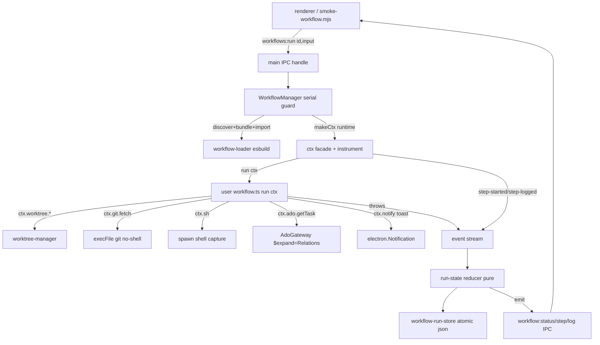

# WF2 — Workflows Engine + Deterministic Primitives — Design

**Spec**: `.specs/features/workflows-engine/spec.md`
**Status**: Approved

---

## Architecture Overview

WF2 adds a deterministic orchestration core to the Electron **main** process. It
mirrors the proven `SessionManager` shape: a DI object-bag orchestrator
(`WorkflowManager`) wired at boot in `index.ts`, driven over a typed `workflows:*`
IPC surface, streaming events back exactly like `session:*`.

A run flows through four pure/near-pure stages the author never sees:

1. **Loader** discovers `~/.playground/workflows/<name>/` folders, bundles each
   `workflow.ts` with **esbuild (bundle mode)**, `import()`s it, and returns
   `{ meta, run }` or `{ error }`.
2. **`ctx` facade** (`makeCtx`) hands `run(ctx)` the deterministic primitives.
   Every leaf primitive is built through an explicit **`instrument()`** wrapper
   that (a) checks the cancellation token, (b) emits a `step-started` event, then
   (c) runs the real call — this is how WF2-10 auto-logs every `ctx.*` with zero
   author effort.
3. **Runner + pure `run-state` reducer** fold the ordered event stream into a
   `WorkflowRun` (`pending→running→done|failed|cancelled`), fail-fast, no rollback.
4. **Run store** persists the record + events as one atomic-rewritten JSON file
   per run under `%APPDATA%/playground/workflow-runs/`, and each event is streamed
   over `workflow:status|step|log`.



---

## Approach (Large — confirmed)

The overall shape is fixed by existing conventions (mirror `SessionManager` DI,
mirror the 3-map `ipc-contract`, reuse `worktree-manager`, atomic store à la
`ConfigStore`). The three genuine forks were confirmed with the owner (2026-07-03):

| Fork | Chosen | Why |
| --- | --- | --- |
| Auto-log `ctx.*` (WF2-10) | **Explicit `instrument(name, fn)` wrapper** | Testable with direct-assert; idiomatic (`spawn-plan` style); avoids Proxy magic on nested namespaces + special `ctx.step/log/input`. |
| Loader import (WF2-02) | **esbuild → temp `.mjs` → `import(pathToFileURL)`** | Robust, debuggable, no size limit; unique temp name per load busts the ESM cache. |
| ADO `$expand=Relations` (WF2-08) | **New dedicated `getWorkItemWithRelations`** | ADO couples `fields`/`$expand` mutually; a second method keeps each request single-purpose vs. branching the existing `getWorkItems`. |

---

## Code Reuse Analysis

### Existing Components to Leverage

| Component | Location | How to Use |
| --- | --- | --- |
| `createWorktree` / `removeWorktree` / `changedFilesOf` | `src/main/worktree-manager.ts:72,263,359` | `ctx.worktree.*` delegates verbatim; return result objects (`{ok,...}`), never throw (WF2-05). |
| private `git(cwd,args)` seam | `src/main/worktree-manager.ts:438` | Same `execFile('git',…,{cwd,windowsHide,GIT_TERMINAL_PROMPT:'0'})` **no-shell** mechanism reused by `ctx.git.fetch` (WF2-07). |
| `AdoGateway.getWorkItems` + `fetchWithTimeout` seam | `src/main/ado-gateway.ts:52,137` | Children batch-fetch (fields-only) reuses `getWorkItems`; new relations method reuses the token cache + `fetchWithTimeout` (WF2-08). |
| `ConfigStore.persist()` atomic tmp+rename | `src/main/config-store.ts:65` | Copy the tmp-write+rename discipline into `WorkflowRunStore` (WF2-16). |
| `SessionManager` DI object-bag + `EmitFn` | `src/main/session-manager.ts:13,50` | `WorkflowManager` mirrors the `constructor(private readonly deps)` bag + `emit` seam (WF2-13/18). |
| `handle` / `emit` / `onSend` typed wrappers | `src/main/ipc.ts:17,28,40` | Register `workflows:*` handlers + stream `workflow:*` exactly as `session:*` (WF2-18). |
| 3-map `ipc-contract` | `src/shared/ipc-contract.ts:18,105,111` | Add `workflows:*` to `IpcContract`, `workflow:*` to `IpcEvents` (WF2-18/19). |
| preload/renderer `api.invoke`/`api.on` | `src/preload/index.ts:9`, `src/renderer/src/lib/api.ts:17` | Untyped pass-through already forwards any channel — no change; smoke drives via `window.api.invoke`. |
| smoke-script-over-CDP skeleton | `scripts/smoke-create.mjs`, `scripts/smoke-agent.mjs` | `smoke-workflow.mjs` copies the poll-9222 → WS → `Runtime.evaluate(window.api.invoke(...))` → `check()` pattern (WF2-20). |

### Integration Points

| System | Integration Method |
| --- | --- |
| Main boot (`index.ts` `app.whenReady`) | Construct `WorkflowManager` alongside `sessionManager`; inject the same lazy `emitToWindow` `EmitFn` (`index.ts:126`). |
| ADO gateway | Add one method; the existing instance already lives on `TaskBoard` (`index.ts:118`) — give `WorkflowManager` its own `AdoGateway` (stateless token cache) or share. |
| Filesystem | `os.homedir()/.playground/workflows/` (net-new reader); run logs under `app.getPath('userData')/workflow-runs/`. |

---

## Components

### 1. Shared types — `src/shared/workflows.ts` (net-new, WF2-19)

- **Purpose**: The WF2 type vocabulary shared by main + renderer + smoke.
- **Interfaces** (data models below): `WorkflowMeta`, `WorkflowInput`, `WorkflowDef`,
  `RunStatus`, `StepEvent`, `WorkflowRun`.
- **Dependencies**: none. **Reuses**: sits beside `src/shared/worktrees.ts`,
  `agents.ts`.

### 2. `workflow-loader` — `src/main/workflow-loader.ts` (net-new, WF2-01/02/03/04)

- **Purpose**: Discover workflow folders and load one `workflow.ts` into `{meta,run}`.
- **Interfaces**:
  - `discoverWorkflows(root: string): Promise<string[]>` — folder names under
    `root`; `[]` if root missing/empty (WF2-01). *Pure-ish: fs read only.*
  - `loadWorkflow(folder: string): Promise<LoadedWorkflow>` where
    `LoadedWorkflow = { meta: WorkflowMeta; run: RunFn } | { error: string }` —
    esbuild `build({ entryPoints:[<folder>/workflow.ts], bundle:true,
    platform:'node', format:'esm', write:false, external:[<node builtins>,'electron'] })`,
    write bundle to a unique temp `.mjs`, `import(pathToFileURL(tmp))`, validate a
    well-formed `meta` + async `run` are exported (WF2-02/03).
  - `validateMeta(mod: unknown): { meta, run } | { error }` — **pure**, directly
    unit-tested (missing `meta`/`run` → `{error}`), no esbuild/fs (WF2-03/04).
- **Dependencies**: `esbuild` (**promoted to direct dep**, WF2-D4), `node:fs`,
  `node:os`, `node:url` (`pathToFileURL`).
- **Reuses**: mirrors nothing structurally; `validateMeta` follows the pure-fn
  direct-assert convention (`spawn-plan.ts`).

### 3. `run-state` — `src/main/run-state.ts` (net-new, WF2-12)

- **Purpose**: Pure reducer folding the event stream into run status.
- **Interfaces**:
  - `initialRun(id, workflowId, input): WorkflowRun` — status `pending`.
  - `reduce(run: WorkflowRun, event: StepEvent): WorkflowRun` — **pure**, guarded:
    invalid transitions return `run` unchanged (e.g. any event after a terminal
    status is a no-op; `done` from `pending` w/o `running` is guarded). Transitions:
    `pending --run-started--> running`; `running --step-started/step-logged-->
    running` (appends to `steps`); `running --done--> done`; `running --failed-->
    failed` (captures `error/stdout/code`); `running --cancelled--> cancelled`.
- **Dependencies**: types only. **Reuses**: pure-fn direct-assert convention.

### 4. `workflow-run-store` — `src/main/workflow-run-store.ts` (net-new, WF2-16)

- **Purpose**: Ephemeral per-run persistence, one atomic-rewritten JSON per run.
- **Interfaces**:
  - `constructor(dir: string)` — injected (`app.getPath('userData')/workflow-runs`
    in prod; a temp dir in tests, à la `ConfigStore`/`session-manager` tests).
  - `save(run: WorkflowRun): void` — `mkdirSync(recursive)` → write
    `<dir>/<runId>.json.tmp` → `renameSync` (copy of `ConfigStore.persist` :65).
    Best-effort: log-and-continue on disk error.
  - `load(runId): WorkflowRun | null`, `list(): WorkflowRun[]` — for smoke/debug.
- **Dependencies**: `node:fs`. **Reuses**: `ConfigStore` atomic-write discipline.
- **Note**: no TTL/cleanup in v1 (Assumptions); files accumulate.

### 5. `workflow-ctx` — `src/main/workflow-ctx.ts` (net-new, WF2-05..11)

- **Purpose**: Build the per-run `ctx` facade with auto-logging + cancellation.
- **Interfaces**:
  - `makeCtx(deps: CtxDeps, runtime: CtxRuntime): Ctx` — assembles the facade.
  - `instrument(name, fn)` — the shared wrapper: `runtime.checkCancel()` (throws
    `CancellationError` if cancelled, WF2-14) → `runtime.emitStep(label)` →
    `await fn(...args)`. Every leaf primitive is built through it (WF2-10).
  - `Ctx` surface:
    - `ctx.worktree.create/remove/changedFiles` → delegate to `deps.worktree.*`
      (WF2-05).
    - `ctx.sh(cmd,{cwd,allowFail?})` → `deps.runShell`; **non-zero throws** with
      `{code,stdout,stderr}` on the error unless `allowFail`, then returns them
      (WF2-06, WF2-D6 — spawned **with a shell**, unlike the agent).
    - `ctx.git.fetch({cwd,remote?,branch?})` → `deps.gitFetch` (no-shell execFile,
      WF2-07).
    - `ctx.ado.getTask(ref)` → `deps.ado.getWorkItemWithRelations` then batch
      `deps.ado.getWorkItems` for `Hierarchy-Forward` children → `{task,children}`;
      **throws on auth failure** (WF2-08).
    - `ctx.notify(msg,{toast?})` → `runtime.emitLog(msg)` + (if `toast`)
      `deps.notifier(title,msg)` → `electron.Notification` (WF2-09/D1).
    - `ctx.log(msg)` → `runtime.emitLog(msg)` (WF2-10).
    - `ctx.step(label, fn)` → push `label` on the group stack, run `fn`, pop; child
      `emitStep`/`emitLog` carry the parent group id so events nest (WF2-10).
    - `ctx.input` → `runtime.input` (frozen trigger values, WF2-11).
- **Dependencies**: `CtxDeps` seams (all injectable for tests). **Reuses**:
  `worktree-manager`, the git-exec pattern, `AdoGateway`.

### 6. `workflow-manager` — `src/main/workflow-manager.ts` (net-new, WF2-13/14/15/17)

- **Purpose**: DI orchestrator — serial guard, run lifecycle, emit + persist.
- **Interfaces** (mirrors `SessionManager`):
  - `constructor(private readonly deps: WorkflowManagerDeps)` where
    `WorkflowManagerDeps = { workflowsRoot, loader, ctxDeps, store, emit, notifier }`.
  - `list(): Promise<WorkflowDef[]>` — discover + load each; valid `{id,meta}` /
    broken `{id,error}`; broken never blocks others (WF2-03).
  - `run({ id, input }): Promise<{ runId }>` — **refuses** if a run is active
    (`activeRunId != null`) with a clear error (WF2-17); else: build run
    (`initialRun`), set active, `reduce(run-started)` → `emit/persist`, `makeCtx`
    with a fresh `CancellationToken`, `await run(ctx)` in the main process
    (WF2-13), then `done`; on throw → `failed` capturing `error/stdout/code`
    (WF2-15); on `CancellationError` → `cancelled` (WF2-14); `finally` clears
    `activeRunId` — **no rollback** (WF2-13/D5).
  - `cancel(runId): void` — sets the token; checked at the next `ctx.*`
    checkpoint (WF2-14).
  - `reload(): void` — no cached state to clear in v1 (discovery is on-demand); a
    no-op stub so `workflows:reload` exists (WF2-01 reload).
  - private `apply(run, event)` — `reduce` → `store.save` → `emit(workflow:status|
    step|log)`; single choke-point keeping persistence and stream in lockstep.
- **Dependencies**: all components above + `EmitFn`. **Reuses**: `SessionManager`
  DI + `EmitFn` pattern verbatim.

### 7. ADO gateway extension — `src/main/ado-gateway.ts` (edit, WF2-08)

- **Purpose**: Fetch one work item **with its relations**.
- **Interfaces**:
  - `getWorkItemWithRelations(ref: WorkItemRef): Promise<GetWorkItemWithRelationsResult>`
    where the result is `{ ok:true; item: WorkItemDetails; childRefs: WorkItemRef[] }`
    | `{ ok:false; reason:'auth'; error }`. Builds the URL as today (`ado-gateway.ts:58`)
    but with **`$expand=Relations` and NO `fields`** (mutually exclusive in ADO REST
    7.1); parses `relations[]` where `rel==='System.LinkTypes.Hierarchy-Forward'`,
    mapping each relation `url` tail id → `WorkItemRef` in the same org/project.
- **Dependencies**: reuses `getToken`, `fetchWithTimeout`, `refKey`. **Reuses**:
  token cache + 10s timeout seam untouched.

### 8. IPC surface — `src/shared/ipc-contract.ts` + `src/main/ipc.ts` wiring in `index.ts` (edit, WF2-18)

- **`IpcContract` additions** (req/res):
  - `'workflows:list': { req: void; res: WorkflowDef[] }`
  - `'workflows:run': { req: { id: string; input?: Record<string,string> }; res: { runId: string } }`
  - `'workflows:cancel': { req: { runId: string }; res: void }`
  - `'workflows:reload': { req: void; res: void }`
- **`IpcEvents` additions** (main→renderer stream, each carries `runId` for fan-out):
  - `'workflow:status': { runId: string; status: RunStatus }`
  - `'workflow:step': { runId: string; step: StepEvent }`
  - `'workflow:log': { runId: string; message: string; group?: string }`
- **Wiring in `index.ts`** (inside `whenReady`): `handle('workflows:list', …)`,
  `handle('workflows:run', …)`, `handle('workflows:cancel', …)`,
  `handle('workflows:reload', …)`; the manager emits via the shared `emitToWindow`.
- No renderer→main `IpcSends` needed in WF2 (no `session:input` analog).

### 9. Gate smoke — `scripts/smoke-workflow.mjs` (net-new, WF2-20)

- **Purpose**: Drive `workflows:run` end-to-end over CDP and assert `done` + events
  + written log.
- **Behavior**: (1) seed a fixture workflow folder under `~/.playground/workflows/
  smoke-gate/` whose `workflow.ts` does `ctx.worktree.create` → `ctx.git.fetch` →
  `ctx.notify` on a scratch git repo; (2) `window.api.invoke('workflows:run',
  {id:'smoke-gate', input})`; (3) subscribe to `workflow:step/log/status` via
  `window.api.on`, collect until `status==='done'`; (4) `check()` the run log file
  exists under `workflow-runs/`. Copies `smoke-create.mjs`/`smoke-agent.mjs`
  skeleton.

---

## Data Models — `src/shared/workflows.ts`

```typescript
export interface WorkflowInput { key: string; label: string; required?: boolean }

export interface WorkflowMeta {
  name: string
  description?: string
  inputs: WorkflowInput[]
}

// discovery list item — valid or broken (WF2-03/04)
export type WorkflowDef =
  | { id: string; meta: WorkflowMeta }
  | { id: string; error: string }

export type RunStatus = 'pending' | 'running' | 'done' | 'failed' | 'cancelled'

// one entry in the run's ordered event stream (auto-logged ctx.* + lifecycle)
export interface StepEvent {
  seq: number
  kind: 'run-started' | 'step-started' | 'step-logged' | 'done' | 'failed' | 'cancelled'
  label?: string          // step-started: primitive name / ctx.step label
  message?: string        // step-logged: log/notify line
  group?: string          // parent ctx.step group id (nesting)
  error?: string          // failed
  stdout?: string         // failed (from ctx.sh)
  code?: number           // failed (exit code)
}

export interface WorkflowRun {
  runId: string
  workflowId: string
  status: RunStatus
  input: Record<string, string>
  events: StepEvent[]
  error?: string
  startedAt: string       // ISO; stamped by the manager (main), not the reducer
  finishedAt?: string
}
```

**Relationships**: `WorkflowRun.events` is the reducer's input log; `status` is the
fold. `RunFn = (ctx: Ctx) => Promise<void>`; `Ctx`/`CtxDeps`/`CtxRuntime` are
**main-only** types (live in `workflow-ctx.ts`, not shared — the renderer never sees
`ctx`).

---

## Error Handling Strategy

| Error Scenario | Handling | User Impact |
| --- | --- | --- |
| `workflow.ts` fails esbuild / missing `meta`\|`run` | `loadWorkflow` → `{error}`; listed as broken (WF2-03) | Workflow shows in list with its error; others load. |
| `ctx.sh` non-zero, no `allowFail` | throw w/ `{code,stdout,stderr}`; runner → `failed` capturing evidence (WF2-06/15) | Run ends `failed`; stdout/exit visible in the run record. |
| `ctx.sh` non-zero, `allowFail:true` | returns `{code,stdout,stderr}`; run continues (WF2-06) | Author decides; no failure. |
| `ctx.git.fetch` git error | execFile rejects → step throws → `failed` (WF2-07) | Run ends `failed`. |
| `ctx.ado.getTask` auth failure | `getWorkItemWithRelations` → `{ok:false,reason:'auth'}`; `ctx.ado.getTask` **throws** (WF2-08) | Run fails visibly, not silent empty data. |
| Step throws mid-run | fail-fast halt, **no rollback**; worktrees/branches left in place (WF2-13/D5) | Inspectable evidence; author cleans via `try/finally`. |
| 2nd `workflows:run` while active | `run()` rejects with a clear error (WF2-17) | Second trigger refused (no queue in v1). |
| `workflows:cancel` mid-run | token set; next `ctx.*` throws `CancellationError` → `cancelled` (WF2-14) | Run stops at next checkpoint; a running child cmd isn't force-killed. |
| Run-log disk write fails | `store.save` logs-and-continues (à la `ConfigStore`) | In-memory run stays authoritative; stream unaffected. |

---

## Risks & Concerns

| Concern | Location (file:line) | Impact | Mitigation |
| --- | --- | --- | --- |
| ADO `$expand`/`fields` mutual exclusion could silently drop title/state fields for the parent | `src/main/ado-gateway.ts:58` | `ctx.ado.getTask().task` may lack fields the caller expects | New method returns the relations item; if callers need parent fields too, compose a follow-up `getWorkItems([ref])` for the parent (children already do this). Documented in the method contract. |
| `import()` ESM cache: re-loading an edited `workflow.ts` at the same path returns the stale module | `src/main/workflow-loader.ts` (new) | Reload wouldn't pick up edits | Unique temp `.mjs` filename per load (crypto id) — every load is a fresh specifier. |
| Cancellation can't interrupt a synchronous author loop or a running child process between `ctx.*` calls | `src/main/workflow-manager.ts` (new) | `cancel` may lag until the next checkpoint | Accepted v1 limitation (spec WF2-14); token checked at **every** `ctx.*`; agent-kill/child-kill is WF3. |
| Loaded workflow code runs **in-process** with full main privileges (no sandbox) | `src/main/workflow-loader.ts` (new) | A malicious/buggy `workflow.ts` can touch anything the main process can | Accepted v1 scope (`utilityProcess`/sandbox deferred to v2, spec Out-of-scope); workflows are user-authored local files, same trust as `.claude` configs. |
| esbuild bundling a workflow that imports npm packages not installed | `src/main/workflow-loader.ts` (new) | Bundle fails | Surfaces as a broken-workflow `{error}` (WF2-03) — non-fatal, listed. |
| Renderer `api` bridge is `unknown`-typed at runtime; a `workflow:*` payload mismatch won't fail at compile | `src/preload/index.ts:9` | Stream shape drift | Contract types are the single source; smoke asserts real payloads end-to-end (WF2-20). |

> Pre-existing (not introduced here): 3 transitive dev advisories (esbuild/form-data/undici) — promoting esbuild to a direct dep does not worsen them; tracked as older debt in STATE.

---

## Tech Decisions (only non-obvious ones)

| Decision | Choice | Rationale |
| --- | --- | --- |
| Auto-log mechanism | Explicit `instrument(name, fn)` wrapper per primitive | Testable/idiomatic; avoids Proxy magic over nested namespaces + special `ctx.step/log/input` (owner-confirmed). |
| Loader import | esbuild `write:false` → temp `.mjs` → `import(pathToFileURL)` | Robust + debuggable; unique name busts ESM cache (owner-confirmed). |
| ADO relations | New `getWorkItemWithRelations` (drops `fields`, adds `$expand`) | ADO REST couples the two; one method per request shape (owner-confirmed). |
| Reducer owns status only; manager stamps timestamps | `startedAt/finishedAt` set by the manager, not `reduce` | Keeps the reducer pure (no clock) — mirrors "no `Date.now()` in pure code" discipline; timestamps are side data. |
| Single `apply()` choke-point | reduce → persist → emit in one place | Guarantees the persisted log and the IPC stream never diverge. |
| `ctx`/`CtxDeps` are main-only (not in `src/shared`) | live in `workflow-ctx.ts` | The renderer never receives `ctx`; only `WorkflowDef`/`WorkflowRun`/`StepEvent` cross IPC. |
| `WorkflowManager` gets its own `AdoGateway` | new instance (token cache is per-instance, cheap) | Avoids coupling to `TaskBoard`'s instance; matches `new AdoGateway()` at `index.ts:118`. |

> **Project-level:** the `instrument()`-wrapper convention for `ctx.*` and the
> "reducer is clock-free; the manager stamps time" split are candidates for an
> `AD-NNN` if WF3/WF4 must follow them. Recorded at Execute/validation if they hold.

---

## Requirement → Component Map

| Req | Component(s) |
| --- | --- |
| WF2-01 | `workflow-loader.discoverWorkflows`, `WorkflowManager.list/reload` |
| WF2-02 | `workflow-loader.loadWorkflow` (esbuild bundle + temp import) |
| WF2-03 | `workflow-loader.validateMeta` + `list` broken item |
| WF2-04 | `WorkflowMeta`, `WorkflowDef`, `list` |
| WF2-05 | `workflow-ctx` `ctx.worktree.*` → worktree-manager |
| WF2-06 | `workflow-ctx` `ctx.sh` + `deps.runShell` |
| WF2-07 | `workflow-ctx` `ctx.git.fetch` + `deps.gitFetch` |
| WF2-08 | `ado-gateway.getWorkItemWithRelations` + `ctx.ado.getTask` |
| WF2-09 | `ctx.notify` + `deps.notifier` (electron.Notification) |
| WF2-10 | `instrument()` + `ctx.log/step` |
| WF2-11 | `ctx.input` ← `CtxRuntime.input` |
| WF2-12 | `run-state.reduce` (pure, guarded) |
| WF2-13 | `WorkflowManager.run` (main-process, fail-fast, no rollback) |
| WF2-14 | `CancellationToken` + `instrument` checkCancel + `cancel` |
| WF2-15 | `run` catch → `failed` w/ error/stdout/code; `StepEvent` fields |
| WF2-16 | `workflow-run-store` (atomic json per run) |
| WF2-17 | `WorkflowManager` `activeRunId` serial guard |
| WF2-18 | `ipc-contract` + `index.ts` handle/emit |
| WF2-19 | `src/shared/workflows.ts` |
| WF2-20 | `scripts/smoke-workflow.mjs` |

---

## Tips applied

- Reuse-first: 8 existing surfaces leveraged, only the loader/ctx/reducer/store are
  genuinely net-new logic.
- Interfaces defined before Tasks; pure seams (`validateMeta`, `reduce`,
  `instrument`, `getWorkItemWithRelations` URL-building) are the unit-test targets.
- Concerns flagged inline with mitigations (no silent gaps).
