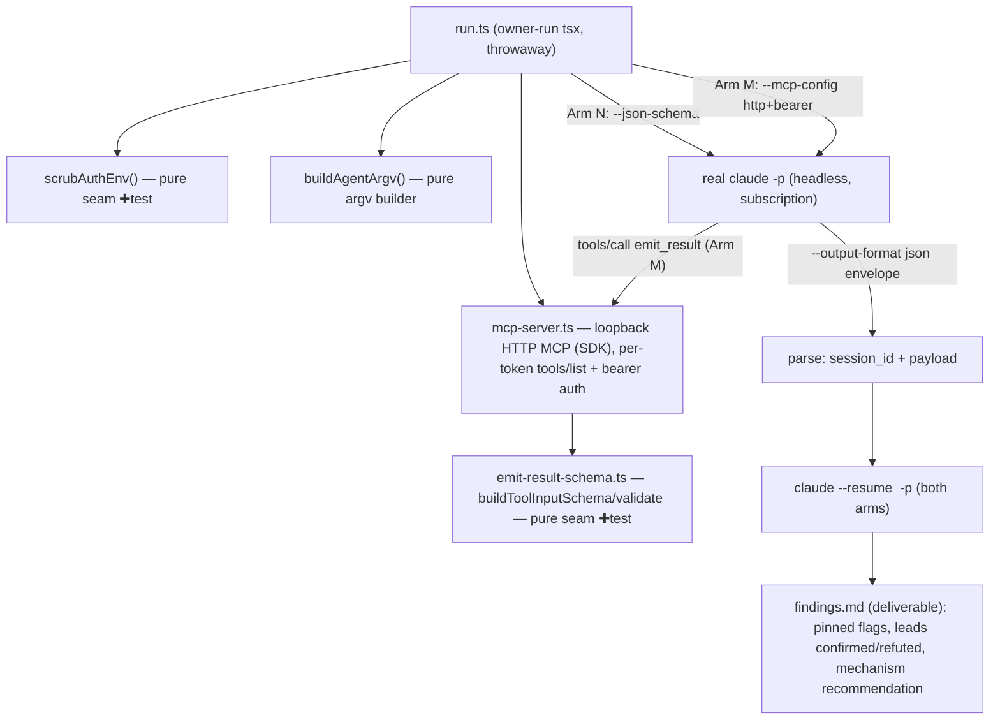

# WF1 — Headless Agent Spike Design

**Spec**: `.specs/features/workflows-headless-agent-spike/spec.md`
**Status**: Draft
**Constraints honored**: AD-006 (WF1 first, child-tasks in v1 → WF2), AD-004 (streaming IPC — N/A here, spike prints to stdout). No active AD conflicts. No confirmed lessons.

---

## Architecture Overview

A single **owner-run `tsx` script** drives a **real** headless `claude` process against a **self-hosted loopback HTTP MCP server**, and **empirically compares two structured-output mechanisms** (per the 2026-07-03 decision):

- **Arm N (native):** `claude -p … --output-format json --json-schema <expect>` → validated object in the envelope's `structured_output`. No MCP tool needed for the payload.
- **Arm M (MCP):** `claude -p … --mcp-config <http+bearer> --append-system-prompt "finish by calling emit_result"` → the agent is driven to call the self-hosted `emit_result` tool, whose per-token `inputSchema` is built from `expect`.

Both arms run the **done** path and the **`--resume`** continuation; the script captures `session_id`, prints the validated payload from each, and records which mechanism is simpler/more robust in the **findings note** — the input WF2/WF3 use to pick the production mechanism (the PRD's MCP choice is **not** superseded yet).

Two pieces are **pure seams** extracted as independently tested modules (they seed WF3): the **auth-env scrub** and the **emit-result schema** builder/validator. Everything else is disposable spike wiring.



---

## Research findings — leads to confirm empirically (pre-work for WF1-02)

Citation-backed from the official Claude Code docs (2026-07-03). **Treated as strong leads the execution confirms against the installed CLI, not as facts** (docs may be ahead of the installed version — that is precisely WF1-02's job).

| Concern | Documented lead | For the spike |
| --- | --- | --- |
| Headless print | `-p` / `--print`; prompt as arg or stdin | confirm |
| JSON envelope + session id | `--output-format json`; field **`session_id`** | confirm field name |
| Native structured output | **`--json-schema <schema>`** → payload in envelope **`structured_output`** (not `result`) | Arm N |
| MCP over HTTP | `--mcp-config '{"mcpServers":{"x":{"type":"http","url":…,"headers":{"Authorization":"Bearer …"}}}}'` (inline JSON or file) | Arm M |
| Permission posture (no hang) | `--permission-mode dontAsk` (v2.1.199+) + `--allowedTools`; `dontAsk` auto-denies un-approved prompts non-interactively | confirm; **emit_result must be allowed** |
| MCP tool allow-name in headless | `mcp__<server>__<tool>` in `--allowedTools` — **UNCERTAIN in headless** | probe → finding |
| System-prompt inject | `--append-system-prompt "…"` (preserves defaults) | Arm M |
| Resume in print mode | `--resume <session_id> -p "<prompt>"`; preserves context | confirm |
| Auth precedence | `ANTHROPIC_API_KEY` **and** `ANTHROPIC_AUTH_TOKEN` **and** cloud flags (`CLAUDE_CODE_USE_BEDROCK`/`…_VERTEX`) **all take precedence over subscription** | **scrub the whole set** (see Tech Decisions) |
| `--bare` | **does NOT read the OAuth/subscription token** — forces API key | **do not use** (refutes the PRD lead) |

---

## Code Reuse Analysis

### Existing components to leverage

| Component | Location | How to use |
| --- | --- | --- |
| Pure-builder test pattern | `src/main/spawn-plan.ts` + `spawn-plan.test.ts` | Model the two pure seams (`scrubAuthEnv`, emit-result-schema) as pure fns with table-driven Vitest tests. |
| Env-layering idea | `PtyPort.spawn(plan, env?)` (`src/main/pty-port.ts:27`) | Same "child env = derived from parent, minus/plus deltas" shape — but **scrub** (remove), not add. |
| Vitest `scripts/**/*.test.ts` glob | `vitest.config.ts` | Spike pure seams live under `scripts/wf1-spike/` and their `.test.ts` files **are picked up by the gate** — no config change. |
| Domain types (shape only) | `src/shared/workflows.ts` (per handoff §State & Data Model) | Reuse the `AgentStepSpec` / `PermissionPreset` / `emit_result` payload shapes as the spike's local types; do not yet create the shared file (that is WF3). |

### Integration points

| System | Integration |
| --- | --- |
| Claude Code CLI | `child_process.spawn` with **piped stdout capture** (NOT node-pty — headless has no TTY). Env = `scrubAuthEnv(process.env)`. |
| MCP protocol | `@modelcontextprotocol/sdk` `StreamableHTTPServerTransport` over a Node `http` server on `127.0.0.1:<random>`. **New dependency** (see Risks). |

**Deliberately NOT reused:** `PtyPort`/node-pty (interactive PTY; headless is a plain captured spawn), `spawn-plan`/`buildSpawnPlan` (builds an *interactive* hosting-shell auto-run; headless argv is different and stays separate — mirrors the PRD's "agent-command-builder kept separate from spawn-plan").

---

## Components

### 1. `scrubAuthEnv` — pure seam ✚ tested (→ WF3 `agent-command-builder`)
- **Purpose**: return a child env with **every higher-precedence auth source removed**, forcing subscription auth.
- **Location**: `scripts/wf1-spike/scrub-auth-env.ts` (+ `.test.ts`).
- **Interface**: `scrubAuthEnv(parent: NodeJS.ProcessEnv): NodeJS.ProcessEnv` — deletes `ANTHROPIC_API_KEY`, `ANTHROPIC_AUTH_TOKEN`, `CLAUDE_CODE_USE_BEDROCK`, `CLAUDE_CODE_USE_VERTEX` (and any others the auth-precedence list names); passes everything else through.
- **Reuses**: env-delta idea from `PtyPort.spawn`; test shape from `spawn-plan.test.ts`.

### 2. `emit-result-schema` — pure seam ✚ tested (→ WF3 `emit-result-schema`)
- **Purpose**: the single home of the structured-output contract shape, shared by **both** arms (Arm N passes `expect` to `--json-schema`; Arm M serves it as the tool `inputSchema`).
- **Location**: `scripts/wf1-spike/emit-result-schema.ts` (+ `.test.ts`).
- **Interfaces**:
  - `buildToolInputSchema(expect: JsonSchema): JsonSchema` → `{ type:'object', properties:{ status:{enum:['done','blocked']}, data: expect, question:{type:'string'} }, required:['status'] }`.
  - `validate(payload: unknown, expect: JsonSchema): { ok: true; value: EmitResultPayload } | { ok: false; error: string }`.
- **Dependencies**: a JSON-Schema validator (see Tech Decisions — spike uses a minimal structural check; WF3 picks ajv/zod).
- **Reuses**: pure-builder test shape from `spawn-plan.test.ts`.

### 3. `mcp-result-server` (spike wiring, disposable — proves the WF3 `mcp-result-server` shape)
- **Purpose**: host one loopback HTTP MCP endpoint; per-token `tools/list` exposes `emit_result` with the token's `inputSchema`; resolve a pending promise on a valid `emit_result` call.
- **Location**: `scripts/wf1-spike/mcp-server.ts`.
- **Interfaces**: `start(): Promise<{ url, port }>`; `register(token, expect): Promise<EmitResultPayload>`; `revoke(token)`; `stop()`.
- **Behavior**: reject requests with missing/unknown/revoked token (token = auth **and** routing); build per-token `tools/list` via `buildToolInputSchema`; validate the incoming `emit_result` via `validate`.
- **Dependencies**: `@modelcontextprotocol/sdk`, Node `http`, component 2.

### 4. `buildAgentArgv` (spike wiring)
- **Purpose**: assemble the headless argv per arm/preset (print, json, per-arm mechanism flag, `dontAsk` + allowed tools, append-system-prompt for Arm M, optional `--resume <id>`).
- **Location**: `scripts/wf1-spike/build-agent-argv.ts` (+ optional `.test.ts` — pure enough to unit-check the two arms and the resume form).
- **Interface**: `buildAgentArgv(opts: { arm:'native'|'mcp'; cwd; prompt; expect; mcpUrl?; token?; resumeSessionId? }): string[]`.

### 5. `run.ts` — spike orchestrator (throwaway)
- **Purpose**: end-to-end: start server, register token, spawn `claude` for each arm with `scrubAuthEnv`, capture stdout, parse envelope (`session_id` + payload), run `--resume` continuation, print a comparison, and scaffold the findings note.
- **Location**: `scripts/wf1-spike/run.ts`. Owner runs `tsx scripts/wf1-spike/run.ts`.
- **Behavior**: process-exit-without-payload → fail with captured stdout/exit code; per-step timeout kills the child.

### 6. `findings.md` — deliverable (survives)
- **Location**: `.specs/features/workflows-headless-agent-spike/findings.md`.
- **Content**: every pinned flag as observed on the installed CLI, each lead **confirmed/refuted** (esp. `--json-schema`, `dontAsk`, HTTP-MCP support, MCP-tool allow-name, `session_id` field, `--bare` refutation), the JSON envelope shape, and a **mechanism recommendation** (Arm N vs Arm M) for WF3.

---

## Data Models

```typescript
type JsonSchema = Record<string, unknown>            // author-declared `expect`
type PermissionPreset = 'read' | 'write' | 'bypass'  // reused shape (handoff)

interface EmitResultPayload {                         // both arms produce this
  status: 'done' | 'blocked'
  data?: unknown                                      // conforms to `expect`
  question?: string                                   // present when blocked
}

interface JsonEnvelope {                              // --output-format json
  result: string
  session_id: string                                  // WF1-05
  structured_output?: unknown                          // Arm N payload lands here
  total_cost_usd?: number
  // …other fields recorded in findings
}
```

---

## Error Handling Strategy

| Scenario | Handling | Surfaced as |
| --- | --- | --- |
| Child exits without a payload (no `emit_result` / no `structured_output`) | fail the arm, keep captured stdout + exit code | printed + noted in findings |
| Missing / unknown / revoked MCP token | server rejects the HTTP call | proves WF1-03 auth; unit-tested |
| Schema mismatch on `emit_result` | spike **reports** the mismatch (WF3 owns the corrective `--resume` retry) | finding |
| Timeout / cancel | kill the child process | printed |
| Installed CLI flag differs from the documented lead | that IS the finding | recorded in findings, refutes the lead |

---

## Risks & Concerns

| Concern | Location | Impact | Mitigation |
| --- | --- | --- | --- |
| Docs may be **ahead of the installed CLI** | external CLI | A lead flag may not exist on this machine | This is the spike's purpose (WF1-02) — every lead is confirmed/refuted by real run before WF2 builds on it. |
| `--allowedTools` **MCP tool naming** (`mcp__server__tool`) unconfirmed in headless | Arm M | Agent might refuse/hang on the `emit_result` call | Probe explicitly; rely on `dontAsk` + emit_result-always-allowed; record the working recipe. If unresolved, it becomes a WF3 blocker (and strengthens Arm N). |
| New dep `@modelcontextprotocol/sdk` | `package.json` | Adds to the app's main-process dep footprint | Main-process, externalized by `externalizeDepsPlugin` (no bundling issue). Spike-only until WF3 confirms MCP is the chosen mechanism (the comparison may favor Arm N and avoid the dep entirely). |
| **Comparative** spike = more surface than MCP-only | spike | More work in WF1 | Shared harness; the two arms differ only in a few argv flags + whether the payload comes from `structured_output` or `emit_result`. Both pure seams are shared. |
| Auth scrub is **load-bearing and broader than the API key** | `scrubAuthEnv` | A stray `ANTHROPIC_AUTH_TOKEN`/cloud flag would silently bill metered API | Scrub the whole higher-precedence set (Tech Decisions); covered by the unit test. |
| No unit test can prove subscription billing | external | Can't assert "not metered" directly | Assert the checkable proxies: key-set absent from child env (unit) + run still succeeds (empirical). Recorded in spec Assumptions. |

---

## Tech Decisions (non-obvious)

| Decision | Choice | Rationale |
| --- | --- | --- |
| MCP server impl | **`@modelcontextprotocol/sdk` StreamableHTTP**, not hand-rolled | The protocol correctness is the exact risk WF1 removes; hand-rolling re-introduces it. |
| Structured-output mechanism | **Comparative** — test Arm N (`--json-schema`) and Arm M (MCP) | 2026-07-03 decision; native structured output exists and may make the MCP server unnecessary in v1 — decide in WF3 on evidence. PRD's MCP choice **not superseded yet**. |
| Auth scrub scope | Remove **all** higher-precedence auth env vars (`ANTHROPIC_API_KEY`, `ANTHROPIC_AUTH_TOKEN`, `CLAUDE_CODE_USE_BEDROCK`, `CLAUDE_CODE_USE_VERTEX`, …), not only the API key | The auth-precedence list shows several sources outrank the subscription; the headline goal needs all of them gone. Refines spec WF1-01. |
| Spike form factor | Standalone `tsx scripts/wf1-spike/run.ts` (owner-run), pure seams as `scripts/wf1-spike/*.ts` with `*.test.ts` | The empirical gate needs a real CLI + subscription → cannot be CI. Pure-seam tests still run in the normal gate (glob already includes `scripts/**`). No CI change. |
| Spawn mechanism | `child_process.spawn` + piped stdout capture | Headless has no TTY; node-pty/`PtyPort` is for interactive sessions only. |
| `--bare` | Not used | It bypasses the OAuth/subscription token — defeats the headline goal. |
| Spike JSON-Schema validation | Minimal structural check in the spike; **defer ajv/zod choice to WF3** | Arm N is validated CLI-side; Arm M needs only enough validation to prove conformance. Avoids committing a validator dep before WF3 designs the real module. |

> **Not elevated to an AD yet:** the mechanism recommendation (Arm N vs Arm M) and the broadened-scrub convention become project standards when WF3's production `agent-command-builder`/`emit-result-schema` are built. Recorded here as feature-local until then.

---

## Verification (unchanged from spec, restated for the two arms)

- **Unit (Vitest, pure):** `scrubAuthEnv` removes the whole auth set / passes others through; `buildToolInputSchema` + `validate` accept conforming / reject non-conforming; MCP server rejects unknown token (HTTP client). Optionally `buildAgentArgv` per arm + resume form.
- **Empirical (owner-run):** both arms complete on the subscription with auth scrubbed; each prints a schema-valid payload + non-empty `session_id`; `--resume` continues the same conversation; a would-prompt action does not hang under `dontAsk`. Findings note recommends the production mechanism.
