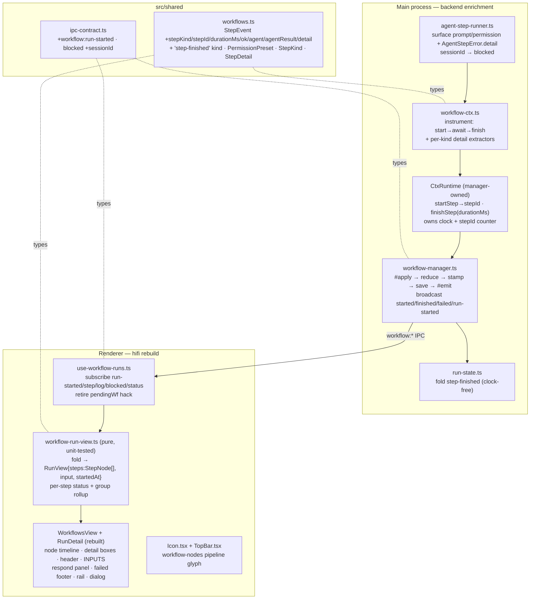

# Workflows UI — Hi-Fi Rebuild (WHF) Design

**Spec**: `.specs/features/workflows-ui-hifi/spec.md`
**Status**: Approved

> Visual source of truth: `design/handoff/DESIGN_HANDOFF_WORKFLOWS.md` (hifi). Behavior
> source of truth: PRD #56. This design conforms to **AD-012** (amends AD-011) — the handoff's
> failed footer + enriched stream supersede AD-011's "status-only failure" and "minimal stream".

---

## Architecture Overview

Two layers, one seam between them. The **backend enrichment** (WHF-01..10, unit-tested) grows the
existing `StepEvent` + IPC surface so the live `workflow:*` stream carries everything the hifi
timeline needs: a semantic `stepKind`, a monotonic `stepId` correlating **start↔finish**, a
manager-stamped `durationMs`, the agent envelope (`prompt`/`permission` on start; `status`/`data`/
`sessionId` on finish), a renderer-safe **detail** payload for `ado`/`changedFiles` steps, the
broadcast **failure** evidence (`error`/`stdout`/`code`), the **sessionId** on a blocked event, and
a new **`workflow:run-started`** event carrying `{runId, workflowId, input, startedAt}`. The
**renderer rebuild** (WHF-11..24, hand-verified; pure fold unit-tested) folds that stream into a
richer `RunView` and renders the handoff's node timeline, detail boxes, header/INPUTS strip, hifi
respond panel, failed footer, rail, dialog, and the pipeline glyph.

The clock and the `stepId` counter live in the **manager** (the reducer stays clock-free, AD-per
spec). `instrument()` brackets every primitive: it asks the runtime for a `stepId` (start), awaits
the real call, then reports the finish (with a per-step `ok` outcome + optional detail). Nothing
new is invented in the reducer beyond folding `step-finished`.



---

## Code Reuse Analysis

### Existing components to leverage

| Component | Location | How to use |
| --- | --- | --- |
| `instrument()` wrapper | `src/main/workflow-ctx.ts:175` | Extend: capture `stepId` (start) + bracket the `await` + report `finishStep` on resolve/throw + per-kind detail extractors. All primitives already flow through it. |
| `#apply` choke-point | `src/main/workflow-manager.ts:233` | Reuse verbatim — every new event (`step-finished`, enriched `step-started`) folds → stamps → saves → emits through the same lockstep path. |
| `#stamp` | `src/main/workflow-manager.ts:247` | Extend the clock ownership: `startStep` records `t0` per stepId; `finishStep` computes `durationMs`. Keeps the reducer clock-free. |
| `#emit` | `src/main/workflow-manager.ts:263` | Add: broadcast `step-finished` + terminal `failed` on `workflow:step`; fire `workflow:run-started` on the run-started transition; add `sessionId` to `workflow:blocked`. |
| `reduce()` | `src/main/run-state.ts:39` | Add one `case 'step-finished'` (append when `running`, clock-free) mirroring `step-started`. |
| `foldRunEvent` / `RunView` | `src/renderer/src/lib/workflow-run-view.ts` | Rebuild the fold to the richer `RunView` (steps as `StepNode[]`, `input`/`startedAt`, per-step status, group rollup). Keeps the pure-seam-behind-hook pattern. |
| `useWorkflowRuns` | `src/renderer/src/lib/use-workflow-runs.ts` | Add `workflow:run-started` subscription; **retire `pendingWf`** (workflowId now arrives on the event). |
| `WorkflowTriggerDialog` + `NewWorktreeDialog.css` chassis | `src/renderer/src/components/WorkflowTriggerDialog.tsx` | Reuse the dialog chassis; add the workflow tile + play-triangle + required-`*` per the handoff §Dialog. |
| `Icon` + shared SVG conventions | `src/renderer/src/components/Icon.tsx` | Add `workflow-nodes` (pipeline) + `play` (play-triangle) + `help-circle` + `x-circle` + `stop-square` glyphs to the union + `PATHS`. |
| `relativeTime` | `src/renderer/src/components/TopBar.tsx:30` | Extract to `src/renderer/src/lib/relative-time.ts` and reuse for run header + RECENT RUNS + the 30s tick pattern. |
| Base palette tokens + `pulse`/`blink`/`fadeIn`/`popIn` keyframes | existing CSS | Handoff mandates **no new tokens/keyframes** — add only mapping classes (`--blue`/`--amber`/`--green`/`--red`/`--accent`/`--text-faint`). |
| `WorkItemDetails` / `ChangedFile` | `src/shared/tasks.ts` / `src/shared/worktrees.ts` | Reuse as the **renderer-safe** `StepDetail` payload shapes — already shared, so no main-only type leaks to the renderer. |

### Integration points

| System | Integration method |
| --- | --- |
| `workflow:*` streaming IPC (AD-004) | One new event channel (`workflow:run-started`); `workflow:step` payload unchanged (its `StepEvent` grew); `workflow:blocked` gains `sessionId?`. |
| `smoke-blocker-resume.mjs` (owner gate) | The light `ctx.step` wrap in `implement-ticket` is transparent to the smoke (it greps the `notify` result line, which stays). No smoke change required. |

---

## Components

### Backend (unit-tested — WHF-01..10)

#### `src/shared/workflows.ts` — StepEvent growth (WHF-01/02/05/06)
- **Purpose**: the enriched cross-IPC event vocabulary.
- **Interfaces** (additions):
  ```ts
  export type StepKind = 'worktree' | 'sh' | 'git' | 'ado' | 'notify' | 'ask' | 'agent' | 'group'
  export type PermissionPreset = 'read' | 'write' | 'bypass'
  export type StepDetail =
    | { kind: 'ado'; task: WorkItemDetails; children: WorkItemDetails[] }
    | { kind: 'files'; files: ChangedFile[] }

  export interface StepEvent {
    seq: number
    kind: /* … */ 'step-started' | 'step-finished' | /* … */
    label?: string; message?: string; error?: string; stdout?: string; code?: number
    sessionId?: string; question?: BlockerQuestion
    group?: string            // parent group LABEL (unchanged) — nesting by label keeps the change additive
    stepId?: number           // step-started/step-finished: monotonic, correlates start↔finish (WHF-01)
    stepKind?: StepKind       // step-started (WHF-01)
    durationMs?: number       // step-finished, manager-stamped (WHF-02)
    ok?: boolean              // step-finished: false when fn threw → failed node glyph + group rollup
    agent?: { prompt: string; permission: PermissionPreset }          // step-started[agent] (WHF-05)
    agentResult?: { status: 'done' | 'blocked'; data?: unknown; sessionId: string } // step-finished[agent] (WHF-06)
    detail?: StepDetail       // step-finished[ado|worktree.changedFiles] (WHF-15 payload)
  }
  ```
- **Dependencies**: import `WorkItemDetails` (shared/tasks), `ChangedFile` (shared/worktrees).
- **Reuses**: existing `StepEvent`; `blocked` gains `sessionId`.

#### `src/main/workflow-ctx.ts` — instrument brackets start→finish (WHF-01/02/05/06)
- **Purpose**: bracket every primitive so start/finish + kind + detail are auto-emitted with zero author effort.
- **Interfaces** (CtxRuntime — clock/id owner is the manager):
  ```ts
  export interface CtxRuntime {
    checkCancel(): void
    startStep(spec: { label: string; kind: StepKind; group?: number
                      agent?: { prompt: string; permission: PermissionPreset } }): number  // → stepId
    finishStep(stepId: number, out?: { ok?: boolean; detail?: StepDetail
                                       agentResult?: StepEvent['agentResult'] }): void
    emitLog(message: string, group?: number, sessionId?: string): void
    input: Record<string, string>
    signal?: AbortSignal
    requestInput?(question: BlockerQuestion, sessionId?: string): Promise<RespondDecision>
  }
  ```
  `instrument(name, kind, fn, detail?)` becomes:
  ```ts
  runtime.checkCancel()
  const stepId = runtime.startStep({ label: name, kind, group: currentGroup(), agent: detail?.onStart?.(args) })
  try { const r = await fn(...args); runtime.finishStep(stepId, { ok: true, ...detail?.onFinish?.(r) }); return r }
  catch (err) { runtime.finishStep(stepId, { ok: false }); throw err }
  ```
  Per-kind extractors: `agent` → `onStart:(a)=>({prompt:a[0].prompt, permission:a[0].permission??'read'})`,
  `onFinish:(r)=>({agentResult:{status:r.status,data:r.data,sessionId:r.sessionId}})`; `ado.getTask` →
  `onFinish:(r)=>({detail:{kind:'ado',task:r.task,children:r.children.map(c=>c.details)}})`;
  `worktree.changedFiles` → `onFinish:(r)=>({detail:{kind:'files',files:r}})`. `ctx.step` uses the same
  bracket with `kind:'group'`; `groupStack` keeps holding **labels** (unchanged) so `currentGroup()` returns the parent label.
  `ctx.agent`'s `onBlocked` becomes `(q, sessionId) => requestInput(q, sessionId)` (forwards the sessionId, WHF-07).
- **Dependencies**: `CtxDeps` (unchanged); runtime injected by the manager.
- **Reuses**: the whole `instrument`/`groupStack` structure; `ctx.log`/`ctx.notify`/`ctx.ask` unchanged except the group id type.
- **L-001**: `startStep`/`finishStep` are **required** (not optional) and wired in the manager **in the same task** as this change — never relaxed to optional to green an interim typecheck (the recurring SPEC_DEVIATION lesson).

#### `src/main/run-state.ts` — fold step-finished (WHF-03)
- **Purpose**: append `step-finished` to the log, clock-free.
- **Interfaces**: add `case 'step-finished':` → `if (run.status !== 'running') return run; return {...run, events:[...run.events, event]}` (mirrors `step-started`; no status change, no clock).
- **Reuses**: the existing guarded reducer.

#### `src/main/workflow-manager.ts` — clock, stepId, broadcasts (WHF-02/04/07/08/09)
- **Purpose**: own the clock + stepId counter; broadcast the enriched stream.
- **Interfaces / changes**:
  - `#stepSeq = 0`; `#stepStart = new Map<number, number>()`.
  - `runtime.startStep(spec)`: `const id = this.#stepSeq++; this.#stepStart.set(id, Date.now()); this.#apply({kind:'step-started', label:spec.label, group:spec.group, stepId:id, stepKind:spec.kind, agent:spec.agent}); return id`.
  - `runtime.finishStep(id, out)`: `const durationMs = Date.now() - (this.#stepStart.get(id) ?? Date.now()); this.#stepStart.delete(id); this.#apply({kind:'step-finished', stepId:id, durationMs, ok:out?.ok??true, detail:out?.detail, agentResult:out?.agentResult})`.
  - `requestInput(question, sessionId?)`: `this.#apply({kind:'blocked', question, sessionId})`.
  - `#emit`: broadcast `step-finished` on `workflow:step`; broadcast terminal `failed` on `workflow:step` (WHF-09); on `run-started` also `this.deps.emit('workflow:run-started', {runId, workflowId, input, startedAt})` (WHF-08); `workflow:blocked` payload gains `sessionId: event.sessionId`.
  - Reset `#stepSeq`/`#stepStart` in `run()`'s `finally` (serial — one run at a time).
- **Reuses**: `#apply`/`#stamp`/`#emit`; `run-started` already stamps `startedAt` in `#stamp`.

#### `src/main/agent-step-runner.ts` — surface prompt/permission + failure detail (WHF-05/09/10)
- **Purpose**: make the agent's evidence reach the renderer.
- **Interfaces / changes**: no signature break for the author-facing `ctx.agent` envelope (WHF-04 back-compat). The `prompt`/`permission` are read by `instrument`'s `onStart` from `AgentStepOptions` (already carries both). On an agent failure, `AgentStepError.detail` (`{stdout, stderr, code}`) is already thrown; the manager's `catch` reads `stdout`/`code` off the error (it already does for `ShellError`) — confirm `AgentStepError.detail.stdout`/`.code` are surfaced (map `detail.stdout`→`stdout`, `detail.code`→`code`) so the failed footer has real evidence (WHF-10). `blocked` already carries `sessionId` back through `onBlocked` (WHF-07).
- **Reuses**: the runner's block-loop, `AgentStepError`, `parseEnvelope`.

#### `src/shared/ipc-contract.ts` — new event + blocked sessionId (WHF-07/08)
- **Interfaces** (additions to `IpcEvents`):
  ```ts
  'workflow:run-started': { runId: string; workflowId: string; input: Record<string, string>; startedAt: string }
  'workflow:blocked': { runId: string; question: BlockerQuestion; sessionId?: string }  // + sessionId
  ```

### Renderer (hand-verified; pure fold unit-tested — WHF-11..24)

#### `src/renderer/src/lib/workflow-run-view.ts` — richer fold (WHF-11..20 data)
- **Purpose**: fold the enriched stream into the hifi `RunView`; derive per-step status + group rollup (pure, unit-tested — the robust seam behind the view).
- **Interfaces**:
  ```ts
  export type StepStatus = 'pending' | 'running' | 'blocked' | 'done' | 'failed' | 'cancelled'
  export interface StepNode {
    stepId: number; kind: StepKind; label: string; group?: number
    finished: boolean; ok?: boolean; durationMs?: number
    agent?: { prompt: string; permission: PermissionPreset }
    agentResult?: { status: 'done' | 'blocked'; data?: unknown; sessionId: string }
    detail?: StepDetail
  }
  export interface RunView {
    runId: string; workflowId?: string; input: Record<string, string>; startedAt?: string
    status: RunStatus; steps: StepNode[]; logs: { message: string; group?: number }[]
    blocked?: BlockerQuestion; blockedSessionId?: string
    error?: string; stdout?: string; code?: number
  }
  export function stepStatus(node: StepNode, run: RunView): StepStatus  // exported for the renderer + tests
  export function groupRollup(children: StepStatus[]): StepStatus       // failed>blocked>running>done>pending
  ```
  Fold rules: `run-started` seeds `workflowId`/`input`/`startedAt` + status→running (retires `pendingWf`);
  `step-started` upserts a `StepNode` (finished:false); `step-finished` matches by `stepId` and sets
  `finished`/`ok`/`durationMs`/`agentResult`/`detail`; `log` appends to `logs`; `blocked` sets
  `blocked`+`blockedSessionId`; `status` folds the run status (a failed status also reads `error`/`stdout`/`code`
  from the broadcast `failed` step event). **Per-step status** (`stepStatus`): `finished` → `ok ? 'done' : 'failed'`;
  else by run status (`running`→running, `blocked`→blocked for the in-flight agent step, `failed`→failed,
  `cancelled`→cancelled, else pending). **Group rollup**: a group node's pill = `groupRollup(childStatuses)`.
- **Reuses**: the `upsert`/`emptyRun` create-or-update pattern.

#### `src/renderer/src/lib/use-workflow-runs.ts` — subscription (WHF-08, retire hack)
- Add `api.on('workflow:run-started', …)` → fold; drop `pendingWf` (workflowId arrives on the event); keep step/log/blocked/status. `foldRunEvent`'s union gains `run-started` + `step-finished`; `blocked` gains `sessionId`.

#### `RunDetail.tsx` + `RunDetail.css` — the run detail rebuild (WHF-11..20)
- **Purpose**: render the hifi run detail per handoff §D-b.
- **Sub-surfaces**: header (workflow tile + name + `RUN-ID · started <relative>` + status pill w/ pulsing dot + Cancel while running/blocked); **INPUTS strip** (one `key = value` chip per input, faint "no inputs"); **node timeline** (26px node + glyph-by-status + 2px connector; kind tag + label + right-aligned duration; group rows = bold label + rollup pill + indented children); **step detail box** (mono lines colored by leading glyph, from `StepDetail`); **agent detail box** (agent tile + name + permission pill + emit badge + italic prompt + `• key value` data lines / blocked line); hifi **respond panel** (`?`-tile, question, "resumes the same agent conversation (session `<id>`) via `--resume`" note from `blockedSessionId`, guidance textarea, Abort/Resume); **failed footer** (`✕`-in-circle + failing call + `error`/`stdout`/`code` + no-rollback note).
- **Reuses**: `RespondPanel` grown to hifi; status/kind/permission → color via mapping classes.

#### `WorkflowsView.tsx` + `WorkflowsView.css` — rail rebuild (WHF-21/22)
- Header ("WORKFLOWS" + "N defined" + Reload + "+ New"); **DEFINITIONS** cards (pipeline-glyph tile, name, description, "N input(s)", play-triangle Run; broken = red tile + "broken" pill + error); **RECENT RUNS** rows (status dot pulses if running + name + status pill + mono meta `<input summary> · <relative>`, selected = left accent bar); empty state uses the pipeline glyph (not `git-fork`).

#### `WorkflowTriggerDialog.tsx` — hifi dialog (WHF-24)
- Workflow tile + name + description; one mono field per `meta.inputs` (red `*` on required, placeholder = key); play-triangle "Run workflow" disabled until every required input non-empty; no-inputs → italic "just run it".

#### `Icon.tsx` + `TopBar.tsx` — pipeline glyph (WHF-23)
- Add `workflow-nodes` (two source nodes cx6/cy6 + cx6/cy18 r≈1.7 merging via elbows into cx18/cy12), `play`, `help-circle`, `x-circle`, `stop-square` to `IconName` + `PATHS`. TopBar's Workflows segment + rail tiles + run header use `workflow-nodes`.

#### fixtures — light group (owner decision)
- `scripts/fixtures/implement-ticket/workflow.ts`: wrap `worktree.create` + `agent` in one `await ctx.step(\`Implement ${branch}\`, async () => { … })` so **WHF-14 group rollup** is exercised live in the two-example gate. `review-pr` stays flat (its `changedFiles` detail box + read-only agent box already exercise WHF-15/16). The `notify(JSON)` result lines stay (smoke greps them); `agentResult.data` now flows natively for the renderer.

---

## Data Models

Covered inline above: `StepEvent` (backend), `StepNode`/`RunView` (renderer), the two IPC event
payloads, `StepKind`/`PermissionPreset`/`StepDetail` (shared). No persistence-schema change (runs
stay ephemeral, PRD v1); `WorkflowRun` (main-only store) is unaffected beyond the richer events it
already holds.

---

## Error Handling Strategy

| Scenario | Handling | User impact |
| --- | --- | --- |
| A primitive `fn` throws | `instrument` catch → `finishStep(id, {ok:false})` (duration + failed marker), rethrow → manager `catch` → `failed` event broadcast | Failing node shows the ✕ glyph; ancestor group pill rolls up to failed; failed footer shows the call + evidence |
| Agent step fails (no valid emit) | `AgentStepError.detail.{stdout,code}` surfaced onto the `failed` event | Failed footer shows `error` + captured stdout + exit code |
| Failure with no `stdout`/`code` | fields omitted; fold leaves them undefined | Footer shows just the call + `error` (edge case, spec §Edge) |
| Blocked before any `data` | `agentResult` absent; step unfinished; `stepStatus`→blocked | Agent box shows the amber blocked line, no key/value block; respond panel renders |
| `run-started` for an already-seen run | `upsert` update path (idempotent) | No duplicate run row |
| Event for an unknown `runId` | `emptyRun` create-or-update (defensive, never throws) | Run appears when its first event arrives |
| Group child throws | child + ancestor groups both `finishStep(ok:false)`; child node failed, group rollup failed | Correct failed glyph on the deepest failing node + failed group pill |

---

## Risks & Concerns

| Concern | Location | Impact | Mitigation |
| --- | --- | --- | --- |
| `instrument` no longer returns the raw `fn` promise (now `await`s to bracket finish) | `workflow-ctx.ts:175` | A subtle timing change could reorder events vs the old fire-and-return | The awaited value is identical; `step-finished` is emitted *after* the call settles (correct ordering). Covered by the Story-1 independent test (start/finish ordering per primitive). |
| Group nesting by **label** (not parent stepId) can collide if two groups share a label | `StepEvent.group` (string), fold `groupRollup` | Two same-label groups would merge their rollup | Kept `group: string` to make the shared change purely **additive** (green gate per task; no ripple through `emitStep`/`#apply`). The light gate fixture uses one uniquely-labelled group; label collision is an accepted v1 edge (logged). Revisit to parent-stepId if a real workflow needs duplicate group labels. |
| Per-step `ok` flag is beyond the enumerated WHF-01..10 ACs | `StepEvent.ok` | Scope creep risk | Justified + documented as a Tech Decision: it is the minimal signal that lets WHF-11 (failed node glyph) + WHF-14 (group rollup on failure) work without a fragile "failing stepId" hack. Reducer stays clock/interpretation-free; the fold interprets `ok`. |
| `ado` `StepDetail` never exercised live (owner chose light fixtures) | fixtures | WHF-15 ado-variant lacks two-example live coverage | **Logged assumption**: the ado detail box shares the fold+render path with the `files` detail box, which review-pr exercises live; the ado branch is covered by the fold unit tests + eyeball. |
| Agent detail extractor reads `AgentStepOptions.permission` default | `workflow-ctx.ts` agent `onStart` | A missing permission could render the wrong pill | Default to `'read'` (matches WF3 AD-008 preset default), asserted in the Story-2 independent test. |
| Existing suites (run-state, workflow-ctx, workflow-manager, agent-step-runner, workflow-run-view) must stay green | those `.test.ts` | Regression | The enrichment is additive; existing assertions on `step-started`/envelope return are preserved. New assertions cover the new fields. Full gate (typecheck+lint+all tests) per task. |
| `tree.test.ts` real-git-on-Windows flake (AD-005) | `src/main/tree.test.ts` | A green gate could flake on an unrelated test | Not WHF-touched; re-run in isolation if it flakes (per STATE baseline note). |

---

## Tech Decisions (non-obvious)

| Decision | Choice | Rationale |
| --- | --- | --- |
| Clock + stepId ownership | **Manager** owns both (`#stepSeq`, `#stepStart` map, `Date.now`) via `startStep`/`finishStep` | Spec: reducer stays clock-free; keeps `Date.now` out of the pure reducer + pure fold; serial runs ⇒ one counter, reset in `finally`. |
| Start↔finish correlation | Monotonic `stepId` on both events | Spec-confirmed model; robust vs label collisions; enables duration + per-step status + group nesting. |
| Per-step failure signal | An `ok: boolean` on `step-finished` (false on throw) | The failing step IS finished (spec AC3 requires the finish event); `ok` is the minimal marker that yields the failed glyph + group rollup without threading a "failing stepId" through the manager. |
| Group nesting key | Parent **label** (`group: string`, unchanged) | Keeps the `StepEvent` change purely additive → green gate per task, no `emitStep`/`#apply` ripple. Duplicate-label collision is an accepted v1 edge (light fixture uses one unique group); revisit to parent-stepId only if a real workflow needs duplicate labels. |
| Detail-box payload | A renderer-safe `StepDetail` union reusing **shared** `WorkItemDetails`/`ChangedFile` | No main-only type leaks to the renderer; the fold/render path is shared by the `ado` and `files` variants. |
| Failure surface | The **failed footer** (fed by the broadcast `failed` event) is the primary failure evidence; the failing node shows the ✕ glyph via `ok:false` | Avoids a second per-step failed-`sh` detail box + a failing-stepId hack; matches the handoff footer as the authoritative diagnostics box. |
| Per-step status + rollup | **Renderer-derived** (`stepStatus`/`groupRollup` in the pure fold) | Spec Out-of-Scope: no backend group-status field; keeps the backend lean and the derivation unit-tested. |
| Relative time | Renderer-computed from `startedAt` on a light interval; `relativeTime` extracted to a lib | Backend already stamps `startedAt`; no per-tick backend work; reuse the TopBar tick pattern. |
| `pendingWf` hack | **Retired** — `workflow:run-started` carries `workflowId` | The runId+workflowId now arrive together on a real event; removes the "first status = just-triggered" inference. |

> **Project-level:** AD-012 (already recorded) governs this slice. No new AD-NNN is required — the
> decisions above are feature-local. If the `ok`-flag step-outcome pattern (or a later move to
> parent-stepId group nesting) is reused by a future workflow feature, promote it to an AD then.

---

## Traceability (design coverage)

| AC | Component(s) | Test surface |
| --- | --- | --- |
| WHF-01 stepKind + stepId on start | `workflow-ctx.instrument`, manager `startStep` | unit (fake ctx: each primitive's kind + monotonic stepId) |
| WHF-02 step-finished + durationMs | manager `finishStep`, `instrument` bracket | unit (matching stepId, durationMs ≥ 0) |
| WHF-03 reducer folds start/finish clock-free | `run-state` `step-finished` case | unit (append when running; no clock) |
| WHF-04 broadcast start/finish | manager `#emit` | unit (both on `workflow:step`) |
| WHF-05 agent {prompt,permission} on start | `instrument` agent `onStart` | unit (agent detail, permission default `read`) |
| WHF-06 agentResult on finish | `instrument` agent `onFinish` | unit (status/data/sessionId) |
| WHF-07 sessionId on blocked | `ctx.agent` onBlocked → `requestInput(q, sessionId)` → manager blocked event + `#emit` | unit (sessionId on the blocked event) |
| WHF-08 workflow:run-started | manager `#emit` on run-started | unit (payload {runId,workflowId,input,startedAt}) |
| WHF-09 broadcast failed error/stdout/code | manager `#emit` failed → `workflow:step` | unit (failed broadcast carries evidence) |
| WHF-10 agent failure detail surfaced | manager `catch` reads `AgentStepError.detail` | unit (agent failure → stdout/code) |
| WHF-11..14 timeline/glyphs/kind/duration/rollup | fold `stepStatus`/`groupRollup` + `RunDetail` | unit (fold status + rollup) + hand-verify (glyphs/CSS) |
| WHF-15/16 detail + agent boxes | fold `StepNode.detail`/`agent`/`agentResult` + `RunDetail` | unit (fold detail) + hand-verify |
| WHF-17/18/19/20 header/INPUTS/respond/footer | `RunDetail` + fold `input`/`startedAt`/`blockedSessionId`/`error` | unit (fold seeds) + hand-verify |
| WHF-21/22 rail + RECENT RUNS | `WorkflowsView` + `relative-time` | hand-verify |
| WHF-23 pipeline glyph | `Icon` + `TopBar` | hand-verify |
| WHF-24 hifi dialog | `WorkflowTriggerDialog` | hand-verify |

---

## Tips honored
- Reuse-first (instrument, #apply, #emit, fold, dialog chassis, Icon, relativeTime).
- Interfaces defined before Tasks; L-001 applied (start/finish wired producer+consumer same task).
- No new tokens/keyframes (handoff constraint) — mapping classes only.
- One owner decision resolved (light fixtures) before detailing.
