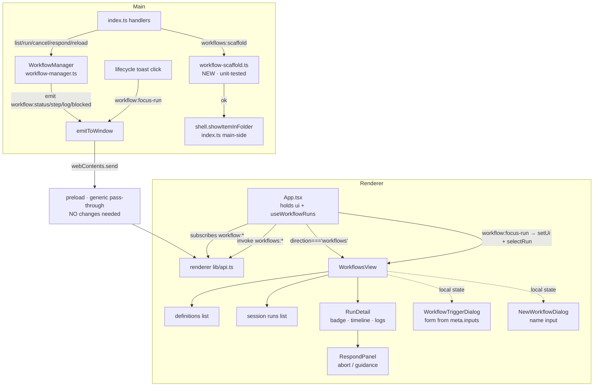

# Workflows UI (WF5) Design

**Spec**: `.specs/features/workflows-ui/spec.md`
**Status**: Draft

WF5 is the renderer surface over the already-merged workflows backend (WF1–WF4) plus **one**
main-process addition (`workflows:scaffold`). Per the project's UI convention every renderer
component is **hand-verified**; only `workflow-scaffold` (main, pure-ish) carries a unit test.

---

## Architecture Overview

The backend already emits a live event stream and exposes request/response channels. WF5 adds:
an always-mounted renderer hook that turns that stream into per-run view state, a Workflows
view that renders it, two dialogs, and the scaffold channel + module.

The load-bearing decision: **the `useWorkflowRuns` hook is mounted at `App` level (above the
direction ternary), not inside the view.** A run can block while the user is on another
direction; the WF4 lifecycle toast fires, and clicking it emits `workflow:focus-run` to pull
the user back with the run's *full* timeline intact. That only works if the subscription has
been accumulating events since app boot regardless of the active direction — exactly how the
existing `useSessions` hook is always mounted in `App`.



---

## Code Reuse Analysis

### Existing Components to Leverage

| Component | Location | How to Use |
| --------- | -------- | ---------- |
| Direction union + selector | `src/shared/config.ts:37` (`direction`), `TopBar.tsx:100-131` (tab strip), `App.tsx:228-291` (render ternary) | **Extend**: add `'workflows'` to the union, a fourth tab, a render branch — the established 3-edit pattern |
| `useSessions` hook | `src/renderer/src/lib/use-sessions.ts:42-49` | **Pattern**: always-mounted App hook that subscribes to `session:*` and refreshes; `useWorkflowRuns` mirrors it for `workflow:*` |
| Per-entity stream filtering | `src/renderer/src/components/TerminalPane.tsx:100-114` (`if (payload.id === sessionId)`) | **Pattern**: filter `workflow:*` payloads by `runId` when folding into a run |
| Renderer IPC client | `src/renderer/src/lib/api.ts` (`invoke`/`on`/`send`) | **Import**: all channel calls + event subscriptions go through it |
| Dialog chassis | `NewWorktreeDialog.tsx`, `StartWorkDialog.tsx` (backdrop/panel/header/body/footer, `busy`/`error`) | **Pattern**: `WorkflowTriggerDialog` + `NewWorkflowDialog` reuse the chassis + `NewWorktreeDialog.css` |
| Create-op result shape | `worktrees:create` → `{ ok, ... }` consumed in `NewWorktreeDialog.tsx:78-109` | **Pattern**: `workflows:scaffold` returns a discriminated result so the dialog shows inline errors |
| `shell` (main) | imported `src/main/index.ts:1`, used `index.ts:113` (`shell.openExternal`) | **Reuse**: `shell.showItemInFolder(path)` for the scaffold reveal, main-side |
| Typed IPC contract | `src/shared/ipc-contract.ts` (`IpcContract`, `IpcEvents`), `src/main/ipc.ts` (`handle`) | **Extend**: add `workflows:scaffold` to `IpcContract`; register via `handle()` |
| Loader (for the test) | `src/main/workflow-loader.ts` | **Reference**: scaffold's unit test parses the generated `workflow.ts` through the real loader to prove it is valid |

### Integration Points

| System | Integration Method |
| ------ | ------------------ |
| `workflow:status/step/log/blocked` events | `useWorkflowRuns` subscribes once at App mount; folds each (filtered by `runId`) into a `RunView` |
| `workflow:focus-run` event | App-level effect: `setUi({direction:'workflows'})` + `runs.selectRun(runId)` (needs both direction switch and selection, so it lives in App, not the hook) |
| `workflows:list/run/cancel/respond` | `useWorkflowRuns` methods wrap `api.invoke` |
| `workflows:scaffold` (new) | new `handle()` in `index.ts` → `scaffoldWorkflow()` → on ok, `shell.showItemInFolder` |
| Preload bridge | **No change** — the generic pass-through already exposes every channel/event |

---

## Components

### `useWorkflowRuns` (renderer hook, NEW)

- **Purpose**: Single source of truth for workflow definitions + this-session run state; owns the `workflow:*` subscription and wraps the `workflows:*` channels.
- **Location**: `src/renderer/src/lib/use-workflow-runs.ts`
- **Mounted**: called once in `App` (always mounted, independent of the active direction).
- **Interfaces**:
  - `defs: WorkflowDef[]` — from `workflows:list` (valid + broken).
  - `runs: RunView[]` — session runs, newest first.
  - `selectedRunId: string | null`, `activeRunId: string | null` (running/blocked; serial ⇒ ≤1).
  - `loading: boolean`, `error: string | null`.
  - `refresh(): Promise<void>` — invoke `workflows:list` (also the Reload action, WF5-21).
  - `start(id: string, input: Record<string,string>): Promise<void>` — invoke `workflows:run`, select the new `runId`; surfaces the serial-conflict error (WF5-07/20).
  - `cancel(runId: string): Promise<void>` — invoke `workflows:cancel` (WF5-18).
  - `respond(runId: string, decision: RespondDecision): Promise<void>` — invoke `workflows:respond` (WF5-15/16).
  - `scaffold(name: string): Promise<ScaffoldResult>` — invoke `workflows:scaffold`; on ok, `refresh()` (WF5-22/25).
  - `selectRun(runId: string): void` — set `selectedRunId`.
- **Dependencies**: `api` (`lib/api.ts`), shared `workflows.ts` types, the pure `workflow-run-view` fold module.
- **Reuses**: the `use-sessions.ts` always-mounted-subscription pattern.
- **Event folding**: the hook is thin wiring — it subscribes and calls the **pure** `foldRunEvent`
  (below) to compute new state, then `setState`. All fold branches live in the tested module,
  NOT in the hook (mirrors how `tree-selection` holds the pure logic behind the tree UI).

### `workflow-run-view` (renderer pure module, NEW — **unit-tested**)

- **Purpose**: Pure reducer that folds one `workflow:*` event into the session's `RunView[]` — the testable core of the timeline/badge logic.
- **Location**: `src/renderer/src/lib/workflow-run-view.ts` (+ `workflow-run-view.test.ts`)
- **Interface**: `foldRunEvent(runs: RunView[], ev: WorkflowFoldEvent): RunView[]` where `WorkflowFoldEvent` is a discriminated union over the four inputs:
  - `{ type: 'status'; runId; status }` → upsert run, set `status`; clear `blocked` when leaving `blocked` (resume) or on terminal (`done`/`failed`/`cancelled`); **idempotent** on a repeated status.
  - `{ type: 'step'; runId; step: StepEvent }` (a `step-started`) → append `{kind:'step', label, group}` to that run's timeline.
  - `{ type: 'log'; runId; message; group? }` → append `{kind:'log', message, group}`.
  - `{ type: 'blocked'; runId; question }` → set the run's `blocked = question`.
  - Every fold is **create-or-update**: an event for an unknown `runId` creates the `RunView` defensively (never throws — spec edge case).
- **Dependencies**: shared `workflows.ts` types only (pure — no `api`, no React).
- **Reuses**: the `run-state.ts` (main) pure-reducer shape + `tree-selection.ts` (renderer) pure-lib-under-test precedent.
- **Why extracted**: the project already unit-tests renderer pure logic (`tree-selection.test.ts`, `agent-registry.test.ts`); the fold is exactly that kind of seam, so it is tested rather than buried in the hand-verified hook.

### `WorkflowsView` (renderer component, NEW)

- **Purpose**: The fourth-direction master–detail surface: definitions + session runs on the left, run detail on the right; hosts the New workflow / Reload actions and owns the two dialogs' open state.
- **Location**: `src/renderer/src/components/WorkflowsView.tsx` (+ `WorkflowsView.css`)
- **Interfaces (props, passed down from App)**:
  - `defs`, `runs`, `selectedRunId`, `activeRunId`, `error`
  - `onRun(def, input)`, `onCancel(runId)`, `onRespond(runId, decision)`, `onReload()`, `onScaffold(name)`, `onSelectRun(runId)`
- **Local state**: which dialog is open (`triggerFor: WorkflowDef | null`, `newOpen: boolean`) — view-local because both are triggered from inside the view (unlike the App-level Sidebar/TasksPane dialogs).
- **Dependencies**: `RunDetail`, `WorkflowTriggerDialog`, `NewWorkflowDialog`.
- **Reuses**: `AgentsView`/`BoardView` layout conventions.
- **Behavior**: a broken `def` (`{id,error}`) renders its error and is **not runnable** (Run disabled). Run is disabled while `activeRunId != null` (WF5-19). Empty `defs` → empty-state with New workflow / Reload still available.

### `RunDetail` (renderer sub-component, NEW)

- **Purpose**: One run's live detail — status badge, step/log timeline, cancel, and the respond panel when blocked.
- **Location**: co-located in `WorkflowsView.tsx` (or `components/RunDetail.tsx` if it grows).
- **Interfaces (props)**: `run: RunView`, `onCancel(runId)`, `onRespond(runId, decision)`.
- **Behavior**:
  - Status badge tracks `run.status` (idempotent on repeat values — WF5-12 edge case).
  - Timeline renders `run.timeline` in arrival order; entries sharing a `group` are nested/indented (WF5-10/11).
  - `failed` shows only the status badge, **no reason** (WF5-13, v1 scope).
  - Cancel shown only when `status` ∈ {`running`,`blocked`} (WF5-18).
  - When `run.blocked` is set → render `RespondPanel`.

### `RespondPanel` (renderer sub-component, NEW)

- **Purpose**: The human-in-the-loop surface for a blocked run.
- **Location**: co-located with `RunDetail`.
- **Interfaces (props)**: `question: BlockerQuestion`, `onAbort()`, `onGuidance(text: string)`.
- **Behavior**: shows `title`+`body`; **Abort** → `{action:'abort'}`; guidance textarea (submit disabled when empty — edge case) → `{action:'guidance', guidance}` (WF5-14/15/16).

### `WorkflowTriggerDialog` (renderer component, NEW)

- **Purpose**: Collect `meta.inputs` values and start a run.
- **Location**: `src/renderer/src/components/WorkflowTriggerDialog.tsx` (reuses `NewWorktreeDialog.css`).
- **Interfaces (props)**: `def: WorkflowDef & {meta}`, `onClose()`, `onSubmit(input: Record<string,string>)`.
- **Behavior**: one field per `meta.inputs` entry labelled by `input.label`; submit disabled while any `required` field is empty (WF5-06); no inputs → allow direct submit with `{}` (WF5-08). Follows the dialog chassis (backdrop/panel/header/body/footer).

### `NewWorkflowDialog` (renderer component, NEW)

- **Purpose**: Collect a name for a new workflow.
- **Location**: `src/renderer/src/components/NewWorkflowDialog.tsx` (reuses `NewWorktreeDialog.css`).
- **Interfaces (props)**: `onClose()`, `onCreate(name: string): Promise<ScaffoldResult>` — shows the returned `error` inline (e.g. existing id) without closing on failure.
- **Behavior**: single name field; on success closes; on `{ok:false}` shows the error (WF5-22/24).

### `workflow-scaffold` (main module, NEW — **unit-tested**)

- **Purpose**: Create a new workflow folder from a template; reject an existing id without overwriting.
- **Location**: `src/main/workflow-scaffold.ts`
- **Interfaces**:
  - `sanitizeWorkflowId(name: string): string` — lowercase; non-`[a-z0-9-_]` → `-`; collapse repeats; trim leading/trailing `-`.
  - `scaffoldWorkflow(root: string, name: string): Promise<ScaffoldResult>` where `ScaffoldResult = { ok: true; id: string; path: string } | { ok: false; error: string }`.
    - empty/invalid sanitized id → `{ok:false}` (WF5 edge case).
    - `join(root, id)` already exists → `{ok:false}` (WF5-24, no overwrite).
    - else `mkdir` + write `workflow.ts` template → `{ok:true, id, path}` (WF5-23).
- **Dependencies**: `node:fs/promises`, `node:path` (use `join` — Windows-only app, AD-005).
- **Reuses**: tested against a temp dir like `workflow-loader`; the test parses the generated file through the **real loader** to prove `{meta, run}` is valid.
- **Template** (minimal valid, no imports so esbuild bundles cleanly):
  ```ts
  export const meta = {
    name: '<id>',
    description: 'A new workflow',
    inputs: [] as { key: string; label: string; required?: boolean }[]
  }
  export async function run(ctx: any) {
    ctx.log('Hello from <id>')
  }
  ```

### `workflows:scaffold` handler (main wiring, NEW)

- **Purpose**: Bridge the channel to the module + perform the reveal.
- **Location**: `src/main/index.ts` (near the other `workflows:*` handlers, ~`index.ts:304-308`) and `src/shared/ipc-contract.ts`.
- **Interfaces**: contract entry `'workflows:scaffold'` — `req: { name: string }`, `res: ScaffoldResult`. Handler: `scaffoldWorkflow(workflowsRoot, name)`; if `ok`, `shell.showItemInFolder(res.path)`; return `res`.
- **Reuses**: the `handle()` wrapper and the already-imported `shell`.

---

## Data Models

### `RunView` (renderer-only view state)

```typescript
type TimelineEntry =
  | { kind: 'step'; label: string; group?: string }
  | { kind: 'log'; message: string; group?: string }

interface RunView {
  runId: string
  workflowId?: string          // filled once known (some events omit it)
  status: RunStatus            // from shared/workflows.ts
  timeline: TimelineEntry[]    // arrival order (see Tech Decisions on ordering)
  blocked?: BlockerQuestion    // set on workflow:blocked; cleared on resume/terminal
}
```

**Relationships**: derived purely from the shared `StepEvent`/`RunStatus`/`BlockerQuestion`
stream; never persisted (live-session only, per spec Out of Scope).

### `ScaffoldResult` (shared, NEW)

```typescript
type ScaffoldResult =
  | { ok: true; id: string; path: string }
  | { ok: false; error: string }
```

Lives in `src/shared/workflows.ts` (consumed by the contract, the module, and the dialog).

---

## Error Handling Strategy

| Error Scenario | Handling | User Impact |
| -------------- | -------- | ----------- |
| `workflows:run` rejects (serial conflict) | `start()` catches, sets `error`; Run also disabled while `activeRunId != null` | Sees the manager's serial-conflict message; no phantom run (WF5-19/20) |
| Broken workflow selected | `def` is `{id,error}`; Run disabled, error shown | Cannot run a broken file; sees why (WF5-02) |
| `workflow:*` event for unknown `runId` | create-or-update fold; never throws | Graceful; a stray focus/status is absorbed (edge case) |
| Scaffold name → empty/invalid id | module returns `{ok:false}`; dialog shows error, creates nothing | Clear message; no folder created (edge case) |
| Scaffold id already exists | module returns `{ok:false}`; no overwrite | Existing workflow untouched; error shown (WF5-24) |
| Guidance submitted empty | submit disabled | Must type guidance or Abort (edge case) |
| Run fails | badge → `failed`, no reason (v1) | Sees it failed; diagnoses from on-disk log (Out of Scope) |

---

## Risks & Concerns

| Concern | Location (file:line) | Impact | Mitigation |
| ------- | -------------------- | ------ | ---------- |
| Cross-channel IPC ordering: `workflow:step` and `workflow:log` are separate channels but the timeline interleaves them by arrival | `workflow-manager.ts:268-275` (emit), hook fold | A log could render before/after its step if delivery reordered | Electron delivers `webContents.send` in emission order on one `webContents`; append-on-arrival is correct in practice. `step` events carry `seq` as a future tiebreak if needed; not sorted in v1 |
| Terminal events (`done`/`failed`/`cancelled`/`resumed`) reach the renderer **only** via `workflow:status`, not `workflow:step` | `workflow-manager.ts:263-288` | A renderer expecting a `step` row per terminal kind would miss them | Design drives terminal display from the status badge only; documented in the fold rules |
| Failure `error`/`stdout`/`code` are captured server-side but never broadcast | `workflow-manager.ts:170-176`, `#emit:263` | UI cannot show *why* a run failed | Owner-accepted (spec Out of Scope); v1 shows `failed` status only |
| L-001 (confirmed): a cross-phase dependency relaxed to `optional` to green an interim typecheck | new `workflows:scaffold` contract + handler + hook call | Type drift / a half-wired channel | **Wire the contract entry, the `index.ts` handler, and the `useWorkflowRuns.scaffold` caller in the *same* task** — no optional stopgap |
| Renderer *components* have no unit tests by convention | `WorkflowsView`, dialogs, `RunDetail`, `useWorkflowRuns` wiring | Regressions not caught by CI | Hand-verified milestone gate (both examples end-to-end); the pure logic seams (`workflow-run-view` fold, `workflow-scaffold`) ARE unit-tested, following `tree-selection`/`agent-registry` prior art |
| Non-ASCII substitution risk in the new component/CSS text | new files | — | None found; write UI strings correctly |

---

## Tech Decisions (only non-obvious ones)

| Decision | Choice | Rationale |
| -------- | ------ | --------- |
| Run-state ownership | Always-mounted App-level `useWorkflowRuns` hook | A run can block while another direction is active; `focus-run` must restore the *full* timeline. **Rejected:** subscribing inside `WorkflowsView` (unmounts on direction switch → loses accumulation, breaks WF5-04/focus-run). Matches `useSessions`. |
| Timeline ordering | Append-on-arrival | `workflow:log` payloads carry no `seq`; only `step-started` does. **Rejected:** sort by `seq` (logs have none). IPC preserves send order. |
| Scaffold reveal location | Main-side in the `workflows:scaffold` handler via already-imported `shell` | `shell` is main-only and present in `index.ts`. **Rejected:** exposing `shell` to the renderer just to reveal. Refines spec WF5-25 (reveal is main-side; renderer only re-lists). |
| Scaffold return shape | Discriminated `{ok:true,path}\|{ok:false,error}` in shared `ScaffoldResult` | Mirrors `worktrees:create`; lets the dialog show inline errors. **Rejected:** throwing (dialog wants an inline, non-fatal error for existing id). |
| Dialog open-state location | Local to `WorkflowsView` | Both dialogs are triggered from inside the view. **Rejected:** App-level state (used only because Sidebar/TasksPane dialogs are App siblings — not the case here). |
| `focus-run` handling location | App-level effect (not the hook) | It must both `setUi(direction)` and `selectRun` — direction lives in App, selection in the hook; App composes both. |

> **Project-level decision:** the WF5 scope pin (live-stream-only run state; failure detail
> not surfaced in v1; New workflow = scaffold + main-side reveal) will be appended to
> `.specs/STATE.md` as **AD-011** so future UI milestones conform.

---

## Requirement Coverage (spec → components)

| Requirement | Component(s) |
| ----------- | ------------ |
| WF5-01 | config union + TopBar tab + App branch |
| WF5-02/03 | `WorkflowsView` definitions list |
| WF5-04 | `workflow-run-view` fold (session state) + `useWorkflowRuns` (App-mounted) |
| WF5-05/06/07/08 | `WorkflowTriggerDialog` + `start()` |
| WF5-09 | `useWorkflowRuns` subscription/teardown |
| WF5-10/11/12 | `workflow-run-view` fold (**unit-tested**) + `RunDetail` timeline/badge render |
| WF5-13 | `RunDetail` (failed badge, no reason) |
| WF5-14/15/16 | `RespondPanel` + `respond()` |
| WF5-17 | App `focus-run` effect + `selectRun` |
| WF5-18 | `RunDetail` cancel + `cancel()` |
| WF5-19/20 | `WorkflowsView` Run-disabled + `start()` error |
| WF5-21 | `useWorkflowRuns.refresh()` (Reload) |
| WF5-22/25 | `NewWorkflowDialog` + `scaffold()` + main reveal |
| WF5-23/24 | `workflow-scaffold` module (**unit-tested**) |
</content>
