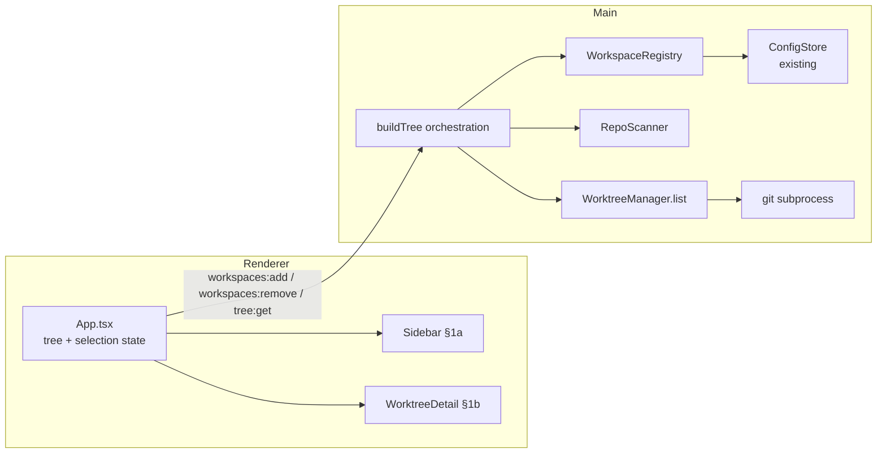

# Workspace Registration & Sidebar Tree Design

**Spec**: `.specs/features/workspace-sidebar-tree/spec.md`
**Status**: Approved (user approved spec → design → tasks → execute on 2026-06-11)

---

## Architecture Overview

Three main-process modules (per PRD §Module decomposition) compose into one read path. The renderer consumes a single denormalized tree snapshot via one IPC call; mutations (`add`/`remove`) return quickly and the renderer re-fetches the tree. No streaming, no caching layer — `tree:get` always reflects disk.



**Flow:** `tree:get` → registry.list() → per workspace: RepoScanner.scan() → per repo: WorktreeManager.list() (+ dirty status per worktree). Failures degrade into `missing`/`error` fields on nodes — the call itself never rejects for per-node problems.

---

## Code Reuse Analysis

| Component | Location | How to Use |
| --------- | -------- | ---------- |
| `IpcContract` + `handle()` | `src/shared/ipc-contract.ts`, `src/main/ipc.ts` | Add 3 channels; register handlers in `main/index.ts` (AD-003 growth point) |
| `ConfigStore` | `src/main/config-store.ts` | `WorkspaceRegistry` wraps it — workspaces become a new `AppConfig` section; atomic write + corrupt-file recovery for free |
| `api` client | `src/renderer/src/lib/api.ts` | Renderer calls new channels; no changes needed |
| `Icon` | `src/renderer/src/components/Icon.tsx` | Extend with the §1a/§1b glyphs not yet present (folder, chevron, fork, copy, trash) |
| Injected-dir test pattern | `src/main/config-store.test.ts` | Same colocated Vitest pattern; real FS/git in temp dirs per PRD §Testing |
| Token CSS (`data-theme`) | renderer CSS | All new panes styled exclusively with existing `--*` tokens + `color-mix` tints |

---

## Components

### WorkspaceRegistry

- **Purpose**: Owns the persisted workspace list (PRD: `add(path)`, `remove(id)`, `list()`); all I/O hidden.
- **Location**: `src/main/workspace-registry.ts`
- **Interfaces**:
  - `add(path: string): WorkspaceEntry | null` — registers; returns `null` if already registered (dedupe by normalized absolute path, case-insensitive on Windows); `displayName` = folder basename
  - `remove(id: string): void`
  - `list(): WorkspaceEntry[]`
- **Dependencies**: `ConfigStore` (constructor-injected) — Electron-free, testable.
- **Reuses**: ConfigStore persistence; `id` = normalized lowercased absolute path (PRD: "identified by absolute path" — stable across re-adds, no uuid needed).

### RepoScanner

- **Purpose**: Given a workspace path, return git repos inside (single-level scan). Pure FS, no git invocation.
- **Location**: `src/main/repo-scanner.ts`
- **Interfaces**:
  - `scanRepos(workspacePath: string): Promise<RepoRef[]>` — child dirs containing a `.git` **directory**; throws `ENOENT` on missing workspace path (caller marks workspace `missing`)
- **Rules**: ignore dot-dirs and `node_modules`; `.git`-**file** children (linked worktrees) are not repos (TREE-02 AC2); stable name-sorted order.
- **Dependencies**: `node:fs/promises` only.

### WorktreeManager (list-only in M1; create/remove arrive in M2)

- **Purpose**: Per-repo worktree reads; hides all `git` subprocess invocation and output parsing.
- **Location**: `src/main/worktree-manager.ts`
- **Interfaces**:
  - `listWorktrees(repoPath: string): Promise<Worktree[]>` — parses `git worktree list --porcelain` (block format: `worktree <path>` / `branch refs/heads/<name>` / `detached` / `bare`); first block = primary checkout → `isDefault: true`
  - per worktree: `git status --porcelain` in its path → `dirty` + `changes` count (untracked included)
- **Subprocess**: `execFile('git', […], { cwd })` — no shell, no quoting issues; git-not-found and non-repo errors surface as a typed `error` string on the repo node.
- **Detached HEAD**: `branch` rendered as `(detached <short-sha>)`, mono, untagged.

### Tree orchestration + IPC channels

- **Purpose**: Compose registry → scanner → worktrees into the renderer's snapshot; register handlers.
- **Location**: `src/main/tree.ts` (buildTree) + wiring in `src/main/index.ts`
- **Channels** (added to `IpcContract`):
  - `'workspaces:add': { req: void; res: WorkspaceEntry | null }` — main opens `dialog.showOpenDialog({ properties: ['openDirectory'] })`; `null` on cancel or duplicate
  - `'workspaces:remove': { req: { id: string }; res: void }`
  - `'tree:get': { req: void; res: WorkspaceNode[] }`
- **Concurrency**: repos scanned and worktrees statused with `Promise.all` per level; per-node failures caught and embedded, never rejecting the whole call.

### Sidebar (renderer)

- **Purpose**: §1a — 286px pane: header (+ button), workspace/repo/worktree rows, selection, empty state, remove affordance.
- **Location**: `src/renderer/src/components/Sidebar.tsx` (+ CSS)
- **Props**: `{ tree, selectedId, onSelect(id), onAddWorkspace(), onRemoveWorkspace(id) }` — fully controlled, stateless.
- **Remove affordance** (prototype is silent — design decision): hover-revealed 22px icon button (trash glyph) at the right of the workspace row, styled like the header "+" button; no confirm dialog (non-destructive to disk, P2, easily re-added).
- **Untagged line 2** per §1a: italic faint "primary checkout — no task" / "no task ID in branch" (all rows until M3).

### WorktreeDetail (renderer)

- **Purpose**: §1b subset — breadcrumb, mono h1, status pills (dirty amber / clean green / primary neutral), location row + copy; empty state when nothing selected.
- **Location**: `src/renderer/src/components/WorktreeDetail.tsx` (+ CSS)
- **Props**: `{ workspaceName, repoName, worktree } | { empty }`; copy via `navigator.clipboard.writeText` with ~1.5s "copied" feedback on the button.
- **Out of this feature**: linked-task card (M3), open-with cards (Launch Shortcuts), danger section (M2) — layout leaves natural insertion order per §1b.

### App.tsx changes

- Owns `tree: WorkspaceNode[] | null`, `selectedId: string | null` (worktree path = id).
- `refreshTree()` invokes `tree:get`; wired to top-bar refresh button (replacing the M3 placeholder comment — refresh re-scans disk now, gains ADO sync later); preserves selection if the id still exists, else clears it (TREE-06 AC1/AC2).
- Tree direction renders `Sidebar + WorktreeDetail` instead of the placeholder; Board placeholder unchanged.

---

## Data Models

`src/shared/tree.ts` (shared types, used by contract + renderer):

```typescript
export interface WorkspaceEntry {            // persisted in AppConfig.workspaces
  id: string                                 // normalized lowercased absolute path
  path: string                               // as picked
  displayName: string                        // folder basename
}

export interface WorktreeNode {
  id: string                                 // worktree absolute path
  branch: string                             // or '(detached <sha>)'
  path: string
  isDefault: boolean
  dirty: boolean
  changes: number
}

export interface RepoNode {
  name: string
  path: string
  worktrees: WorktreeNode[]
  error?: string                             // git failed for this repo
}

export interface WorkspaceNode extends WorkspaceEntry {
  missing?: boolean                          // path no longer exists
  repos: RepoNode[]
}
```

`AppConfig` gains a `workspaces: WorkspaceEntry[]` section (default `[]`). ConfigStore's shallow merge replaces arrays wholesale — exactly the wanted semantics for list updates.

---

## Error Handling Strategy

| Error Scenario | Handling | User Impact |
| -------------- | -------- | ----------- |
| Workspace path missing | `scanRepos` ENOENT → `missing: true` on node | Row renders with error note, still removable (spec edge case) |
| `git` not on PATH / repo corrupt | caught per repo → `RepoNode.error` | Repo row shows inline error text; rest of tree unaffected |
| Folder picker cancelled | `workspaces:add` → `null` | Nothing changes (TREE-01 AC4) |
| Duplicate registration | registry dedupe → `null` | No duplicate row (TREE-01 AC3) |
| Selected worktree vanished after refresh | App clears `selectedId` | Detail pane empty state (TREE-06 AC2) |
| Clipboard write fails | caught; console.error | Copy feedback not shown |

---

## Tech Decisions (non-obvious only)

| Decision | Choice | Rationale |
| -------- | ------ | --------- |
| Worktree parse source | `--porcelain` block format | Stable, documented; whitespace-safe vs. the columnar default |
| `isDefault` detection | First porcelain block | Git guarantees the main working tree is listed first |
| Workspace id | Normalized path, not uuid | PRD: identified by absolute path; stable, dedupe falls out naturally |
| Workspaces persisted in `AppConfig` | New section via existing ConfigStore | One config file (PRD: global config holds workspaces); atomic writes + corrupt recovery reused |
| One coarse `tree:get` | Full snapshot per call | Request/response IPC per PRD; tree is small (human-scale workspaces); avoids cache-invalidation machinery |
| Dirty check cost | `git status --porcelain` per worktree, parallel | Correct count needed for §1b pill text; parallelism keeps total ≈ slowest repo |
