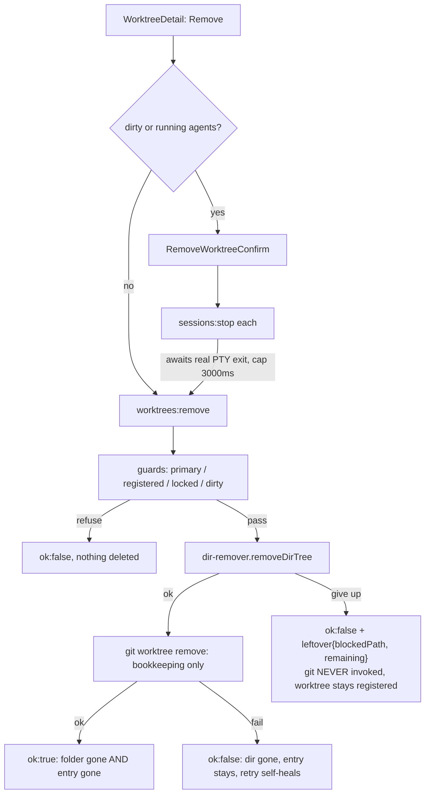
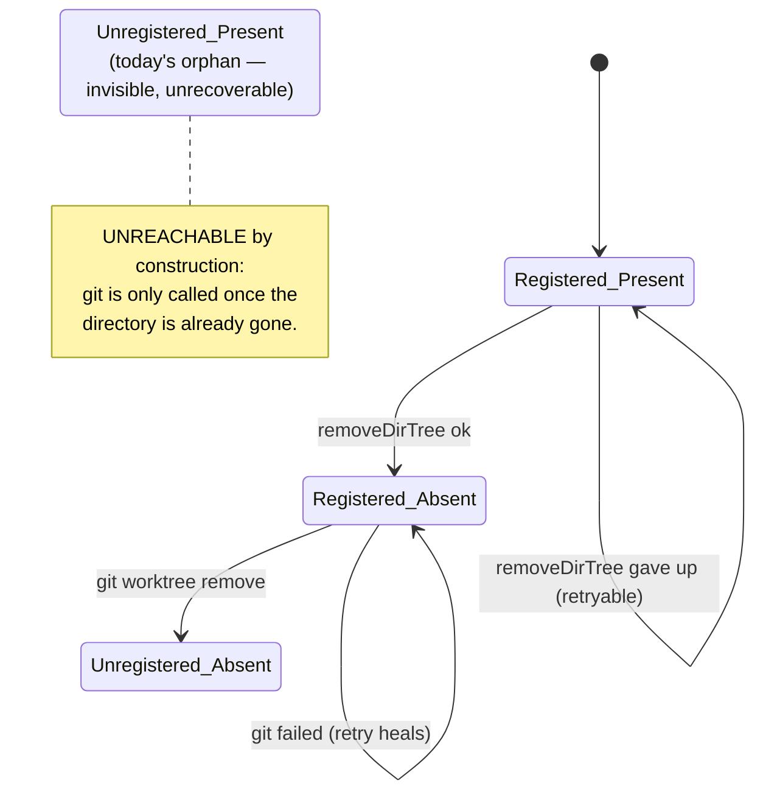

# Worktree Removal Fault Tolerance Design

**Spec**: `.specs/features/worktree-removal-fault-tolerance/spec.md`
**Status**: Draft
**Owner decisions this design implements**: delete-first ordering; bounded auto-retry then inline leftover
report; terminate-and-await app-owned sessions; create-time collision as P2 — plus the three architecture
choices confirmed during Design (reorder inside `removeWorktree` + `dir-remover.ts`; awaitable
`SessionManager.stop`; a separate `worktrees:clean-path` channel keyed by repo+branch).

**Active decisions checked (`.specs/STATE.md`)**: AD-005 (Windows-only, Windows-path assertions in tests —
conformed: new tests keep backslash/`realpathSync.native` discipline), AD-013 (`withPostCreateHook`
decorator; explicit refusal to widen `createWorktree`'s signature — conformed: the P2 cleanup is a separate
channel, not a 7th parameter; `worktree-manager.ts` gains no hook coupling), AD-004/AD-011 (renderer units
are not tested by convention — conformed: WRFT-06 is smoke + hand-verified). No decision is superseded.
**Confirmed lesson applied**: L-001 — `RemovalLeftover` crosses `shared` → main → renderer and is wired
producer-and-consumer in a single phase (see Tasks phasing note).

---

## Architecture Overview

One invariant drives the whole design: **git is never the deleter**. The app deletes the worktree tree
itself, and only calls `git worktree remove` once the directory is verifiably gone. Every failure therefore
lands on the safe side of the state machine — the worktree stays registered, visible and retryable.



The removal state machine, and the one state this feature makes unreachable:



---

## Code Reuse Analysis

### Existing components to leverage

| Component | Location | How to use |
| --- | --- | --- |
| `removeWorktree` guards + `RemoveWorktreeResult` discipline | `src/main/worktree-manager.ts:263-289` | Extend in place: same signature, same messages, new ordering + two new guards |
| `parsePorcelainBlocks` | `worktree-manager.ts:316-339` | Extend the block type with `locked`; already consumed by `listWorktrees` and `worktreeHosting` |
| `samePath` | `worktree-manager.ts:292-295` | Reuse verbatim for the registered-worktree match (case/separator-insensitive) |
| `gitFailureLine` | `worktree-manager.ts:298-303` | Reuse for the bookkeeping-step failure message |
| `statusOf` | `worktree-manager.ts:341-351` | Unchanged; still the dirty pre-check |
| `worktreePathFor` | `src/shared/worktrees.ts:45-50` | The clean-path channel recomputes the target from repo+branch+template instead of trusting a path |
| DI-with-defaults convention | `SessionManagerDeps`, `withPostCreateHook(create, deps)` | Same shape for the injected deleter |
| `BranchExistsChoice` + dialog conflict state | `NewWorktreeDialog.tsx:44,113`, `StartWorkDialog.tsx:55,130` | Same pattern for the new `path-exists` choice |
| Real-temp-git-repo test fixtures | `worktree-manager.test.ts:30-46` | Reuse `realpathSync.native(mkdtempSync(...))` setup for the new guard/junction/lock tests |
| `RemoveWorktreeConfirm` | `src/renderer/src/components/` | Unchanged — the confirm dialog's contract does not move |

### Integration points

| System | Integration |
| --- | --- |
| IPC contract | `worktrees:remove` res gains `leftover`; new `worktrees:clean-path`; `worktrees:create` res gains `path-exists` conflict |
| `workflow-ctx` `worktree.remove` | Signature unchanged — the workflow path inherits the fix for free, no rewiring |
| `withPostCreateHook` | Untouched; the P2 cleanup runs *before* create, so the hook still fires exactly once on the real create |
| `SessionManager` | `stop` becomes awaitable; `sessions:stop` handler awaits it; renderer unchanged |

---

## Components

### `dir-remover.ts` (new)

- **Purpose**: Delete a directory tree safely and bounded — junction-safe, retrying only lock-type errors, reporting what is left when it gives up.
- **Location**: `src/main/dir-remover.ts`
- **Interfaces**:
  - `removeDirTree(path: string, deps?: DirRemoverDeps): Promise<DirRemovalResult>`
  - `export const DELETE_RETRY_INTERVAL_MS = 250`
  - `export const DELETE_RETRY_BUDGET_MS = 3000`
- **Dependencies**: `node:fs/promises` (`rm`, `readdir`), `node:fs` (`existsSync`) — all injectable via `DirRemoverDeps` for unit tests
- **Reuses**: nothing — deliberately standalone and pure enough to unit-test without git or Electron

Algorithm (each numbered step maps to an AC):

```
if (!exists(path)) return { ok: true }                       // WRFT-02 AC 4
start = now()
loop:
  try { await rm(path, { recursive: true, force: true, maxRetries: 0 }) ; return { ok: true } }
  catch (err):
    if (!RETRYABLE.has(err.code)) return fail(err)            // WRFT-04 AC 4 — immediate
    if (now() - start >= DELETE_RETRY_BUDGET_MS) return fail(err)   // WRFT-04 AC 3
    await sleep(DELETE_RETRY_INTERVAL_MS)                     // WRFT-04 AC 1

fail(err) = { ok: false, code: err.code, leftover: { blockedPath: err.path ?? path,
                                                     remaining: countEntries(path) } }
RETRYABLE = { EBUSY, EPERM, ENOTEMPTY, EACCES }
```

`maxRetries: 0` is load-bearing, not a default: Node retries at every level of the recursive walk, so
`maxRetries: 5` measured **21 599 ms** against a locked directory (spec finding F). The comment in the code
must say so, or a future reader will "helpfully" raise it.

### `worktree-manager.ts` (modified)

- **Purpose**: Own the removal ordering and every guard that must run before a byte is deleted.
- **Interfaces**:
  - `removeWorktree(repoPath, worktreePath, opts?: { force?: boolean }, deps?: WorktreeRemoveDeps): Promise<RemoveWorktreeResult>` — 3-arg call sites unchanged; `deps` defaults to `{ removeDirTree }`
  - `cleanWorktreePath(repoPath, branch, worktreeTemplate?, deps?): Promise<RemoveWorktreeResult>` (P2)
  - `classifyTargetPath(target: string): Promise<TargetPathState>` (P2, internal + tested)
  - `parsePorcelainBlocks` → `PorcelainBlock` gains `locked?: string`
- **Reuses**: `samePath`, `gitFailureLine`, `statusOf`, `parsePorcelainBlocks`, `worktreePathFor`

New `removeWorktree` flow — the guard order is the contract:

| # | Step | Failure behavior | AC |
| --- | --- | --- | --- |
| 1 | `samePath(repoPath, worktreePath)` → primary refusal | unchanged message, nothing deleted | WRFT-01 AC 4 |
| 2 | `git worktree list --porcelain`, match by `samePath` | git failure ⇒ **fail closed** (refuse, delete nothing) | WRFT-01 AC 2 |
| 3 | matched block has a `locked` line | refuse with git's lock reason | WRFT-01 AC 3 |
| 4 | `!force` → `statusOf` dirty check | unchanged message | WRFT-01 AC 5 |
| 5 | `deps.removeDirTree(worktreePath)` | **return before touching git**, carry `leftover` | WRFT-02 AC 1, WRFT-04 |
| 6 | `git worktree remove <path>` (bookkeeping) | `gitFailureLine`; retry self-heals | WRFT-02 AC 3 |

Steps 1-4 all run before step 5, so no guard can be bypassed by the new ordering — the reason the locked
check is mandatory here is that git's own lock refusal (which needs `-f -f` to override) would otherwise
arrive *after* we deleted the files.

### `session-manager.ts` (modified)

- **Purpose**: Make "the agent is stopped" mean "its PTY has actually exited".
- **Interfaces**: `stop(id: string): Promise<void>` (was `void`); `export const SESSION_EXIT_WAIT_MS = 3000`
- **Mechanics**: `#start` stores an `exited` promise on the `RunningSession`, resolved from the existing
  `handle.onExit` callback. `stop()` captures it, kills, calls `#finalize` **immediately** (status flips to
  stopped exactly as today), then awaits `exited` raced against a 3000 ms timer. The timer is cleared in a
  `finally` and `unref`'d so a fake PTY that never exits cannot hold the event loop open in tests.
- **Unchanged on purpose**: `killAll()` stays fire-and-forget (`void this.stop(id)`). Awaiting it would add
  up to 3 s per session to app quit — this **corrects the "bonus" I claimed when presenting the options**:
  the quit path gets no new guarantee, only the removal path does.
- **Reuses**: the existing idempotent `#finalize` (its own comment already covers being called twice).

### Renderer: `WorktreeDetail.tsx` + `WorktreeDetail.css` (modified)

- **Purpose**: Show *what* is blocking, and keep the retry one click away.
- **Changes**: `removeError: string | null` gains a sibling `removeLeftover: RemovalLeftover | null`, both
  set from the failed result and cleared on every new attempt. Below the existing
  `.detail-danger-note.error` line, render the blocked path in monospace with `word-break: break-all`
  (WRFT-06 AC 4) and the `N item(s) still on disk` count.
- **Already correct, deliberately unchanged**: `setRemoving(false)` on the failure branch already re-enables
  the button (WRFT-06 AC 3, `WorktreeDetail.tsx:128`); the session-stop failure path
  (`WorktreeDetail.tsx:173-179`) is untouched (WRFT-05 AC 4); `onRemoved` refresh/reselect is untouched.

### P2 surfaces

- **`cleanWorktreePath`** (main): recomputes the target with `worktreePathFor(repoPath, branch, template)`,
  re-runs `classifyTargetPath`, refuses unless the state is `leftover`, then calls `removeDirTree`.
  A raw path is never accepted over IPC — the handler derives it, so no caller can aim the recursive
  deleter at an arbitrary directory.
- **`LeftoverPathChoice.tsx`** (new, ~40 LOC): mirrors `BranchExistsChoice` — states the path and entry
  count, offers "Delete folder & create" (danger) and Cancel.
- **`NewWorktreeDialog` / `StartWorkDialog`**: widen the existing `conflict` state to
  `'branch-exists' | 'path-exists'`, render the new choice, and on confirm call `worktrees:clean-path`
  then re-invoke `worktrees:create` unchanged.

---

## Data Models

```typescript
// src/shared/worktrees.ts
/** What a failed deletion left behind (WRFT-04). */
export interface RemovalLeftover {
  /** The first path the deleter could not remove (absolute). */
  blockedPath: string
  /** Entries still present under the worktree root after the failed attempt. */
  remaining: number
}

export interface RemoveWorktreeResult {
  ok: boolean
  error?: string
  /** Present only when a deletion attempt gave up; the worktree is still registered. */
  leftover?: RemovalLeftover
}

export interface CreateWorktreeResult {
  // …unchanged fields…
  conflict?: 'branch-exists' | 'path-exists'
  /** Set with conflict:'path-exists' — what is sitting at the target (WRFT-07 AC 1). */
  pathConflict?: { path: string; entries: number }
}

// src/main/dir-remover.ts
export interface DirRemovalResult {
  ok: boolean
  /** Node error code of the last failing attempt (EBUSY, EPERM, …). */
  code?: string
  leftover?: RemovalLeftover
}

// P2 classification — the only state that may be auto-deleted is 'leftover'
export type TargetPathState =
  | { kind: 'free' }                                  // does not exist
  | { kind: 'empty' }                                 // exists, no entries → git accepts it
  | { kind: 'leftover'; entries: number }             // non-empty, no .git → cleanup offerable
  | { kind: 'occupied' }                              // contains .git (repo or registered worktree)
```

IPC additions:

```typescript
'worktrees:remove':     { req: { repoPath, worktreePath, force? }; res: RemoveWorktreeResult }  // res widened
'worktrees:clean-path': { req: { repoPath: string; branch: string; worktreeTemplate?: string }
                          res: RemoveWorktreeResult }                                            // new
```

---

## Error Handling Strategy

| Scenario | Handling | User impact |
| --- | --- | --- |
| Lock released within 3000 ms | Retry loop absorbs it | Nothing — removal just succeeds (~800 ms measured) |
| Lock persists past budget | `ok:false` + `leftover`; git never called | Inline error names the blocked path + count; row stays; retry works |
| Non-lock fs error (e.g. `EINVAL`) | Reported immediately, budget untouched | Same surface, no 3 s stall |
| Worktree `git worktree lock`ed | Refused at guard 3 with git's reason | "unlock it first" — nothing deleted |
| Path not a registered worktree | Refused at guard 2 | Nothing deleted (this is also the anti-`rm -rf` guard) |
| `git worktree list` itself fails | Fail closed: refuse, delete nothing | git's first stderr line inline |
| Deletion ok, bookkeeping fails | `ok:false` + git's line; dir gone, entry stays | Retry succeeds (git accepts removing a worktree whose dir is missing) |
| Directory already absent | Deletion no-ops, bookkeeping still runs | `ok:true` |
| Session never exits within 3000 ms | Proceed anyway; retry + leftover cover it | Worst case the normal blocked-path error |
| P2 cleanup deletion fails | Create aborts, leftover reported | Dialog shows the blocked path; no worktree created |
| P2 target holds a `.git` | Refused, cleanup **not** offered | "path already contains a repository or worktree" |

---

## Risks & Concerns

| Concern | Location | Impact | Mitigation |
| --- | --- | --- | --- |
| **Existing test asserts the behavior WRFT-07 changes** — and its fixture is an *empty* dir, which under AC 5 must now proceed | `worktree-manager.test.ts:428-438` | The "path guard wins over branch check" ordering assertion would silently change meaning | Intentional: update the fixture to a **non-empty** leftover dir to preserve the ordering assertion, and add a separate test pinning empty-dir passthrough. Called out in Tasks as an expected test edit, not an unexplained diff |
| Every removal now runs an extra `git worktree list --porcelain` | `worktree-manager.ts` step 2 | ~30 ms per removal; a git failure could block a legitimate removal | Accepted for the guard it buys; fails closed by design (refusing is the safe direction) |
| `stop()` becoming async with 7 existing sync call sites | `session-manager.test.ts:141,150,181,194,293,330,338`, `killAll` | Floating promises; a pending 3 s timer could outlive a test | Immediate `#finalize` keeps every existing assertion valid; timer cleared in `finally` and `unref`'d; `killAll` explicitly `void`s |
| Confirm dialog now waits for real exits before deleting | `WorktreeDetail.tsx:168` | Up to ~3 s of apparent hang on a stuck agent (parallel, so not per-session) | Button already disabled while removing; wait is capped and then proceeds |
| `remaining` count walks the tree on failure | `dir-remover.ts` | A `node_modules`-sized leftover costs a recursive `readdir` (~100-300 ms) | Failure path only, and it is what makes the message actionable. Not capped — a truncated count would mislead |
| Junction safety depends on Node's `fs.rm` treating junctions as links | `dir-remover.ts` | A Node behavior change would silently reintroduce data loss | Pinned by a real-fs test asserting the **target's** contents (spec finding D fixture) — the assertion that fails against today's implementation |
| Timer `unref` here vs candidate lesson L-003 | `session-manager.ts` | L-003's sibling fix (663e2d3) was caused by an `unref`'d grace timer skipping work | Different shape: this timer only races an awaited promise for a live caller, so `unref` cannot skip work — it only prevents holding the loop open. Noted so Execute does not "fix" it either way blindly |
| `path-exists` carries both `conflict` and `error`; `branch-exists` carries only `conflict` | `shared/worktrees.ts` | Mild asymmetry in the result contract | Deliberate: non-interactive callers (`ctx.worktree.create`) otherwise get `ok:false` with no message. `branch-exists` is left untouched rather than widening this feature's blast radius |
| Renderer has no unit tests (project convention AD-004/AD-011) | `WorktreeDetail.tsx` | WRFT-06 is not machine-verified | CDP smoke extension with a real external lock holder + hand-verified visual pass |
| Long paths (>260 chars) unprobed | `dir-remover.ts` | Unknown `fs.rm` behavior | Assumption logged in the spec; failure mode is a *named leftover*, never a silent orphan — safe either way |

---

## Tech Decisions

| Decision | Choice | Rationale |
| --- | --- | --- |
| Deleter injection | 4th `deps` param on `removeWorktree`, defaulted to the real `removeDirTree` | Matches the project's DI-with-defaults convention (`SessionManagerDeps`, `withPostCreateHook`); all 55 existing real-git tests keep their 3-arg calls; retry-policy tests get a deterministic fake without `vi.mock` |
| Per-attempt retry setting | `maxRetries: 0`, own outer loop | Measured: Node's ladder costs 21.6 s vs 786 ms for a self-managed loop (spec finding F) |
| Bookkeeping command | plain `git worktree remove <path>` | Verified exit 0 once the directory is gone. `--force` is unnecessary (nothing left to protect) and `prune` is repo-wide, so it could clear unrelated stale entries |
| Guard order | primary → registered → locked → dirty → delete | Cheapest/most-certain refusals first; every guard precedes deletion, which is the whole point of the reorder |
| Retry clock in tests | Vitest fake timers with the **real** constants, plus one test pinning the literals `250`/`3000` | Candidate lesson L-004: overriding the constants in tests would let a mutation of the constants survive |
| `stop()` semantics | Immediate finalize + awaited real exit | Keeps the instant UI status flip (and every existing test) while making the promise mean what the caller assumes |
| Clean-path addressing | `{repoPath, branch, worktreeTemplate}`, target recomputed main-side | Honors AD-013's refusal to widen `createWorktree`, and structurally prevents an arbitrary path reaching a recursive delete |
| Junction handling | Rely on `fs.rm`'s native symlink/junction semantics | Measured safe (spec finding D); hand-rolled reparse-point logic would be strictly more code and more risk |

> **Project-level decision:** the delete-first invariant is a convention future features must follow (no
> future cleanup surface may use `git worktree remove --force` as a *deleter*). To be recorded as **AD-014**
> in `.specs/STATE.md` with the Tasks commit.

---

## Test Strategy

| Layer | What | Where |
| --- | --- | --- |
| Unit, fake deps | Retry cadence, budget exhaustion, non-retryable immediate fail, leftover payload, already-absent no-op | `dir-remover.test.ts` (new) — fake `rm` + fake timers, no fs |
| Unit, real fs | Junction target survives; read-only files and a nested repo's `0444` object store delete | `dir-remover.test.ts` (new) — explicit generous timeouts (L-005) |
| Unit, real git | Guard order (primary/registered/locked/dirty), delete-first ordering, bookkeeping-failure retry, already-absent path, P2 classification | `worktree-manager.test.ts` (extend) |
| Integration, real lock | One test: external holder (`spawn(process.execPath, ['-e','setTimeout…'], { cwd: <inside wt> })`) → assert `ok:false`, `leftover`, **and that `git worktree list` still lists the worktree**; release, retry, assert fully clean | `worktree-manager.test.ts` (extend), explicit timeout |
| Unit | `stop()` resolves only after the fake PTY's exit fires; resolves anyway after 3000 ms for a port that never exits | `session-manager.test.ts` (extend) |
| Smoke (CDP) | Blocked remove shows the path and keeps the row; retry after release removes it | `scripts/smoke-remove.mjs` (extend) |

Baseline to preserve: **533 tests / 39 files green**, no deletions; the one intentional edit is the
`worktree-manager.test.ts:428` fixture described in Risks.
