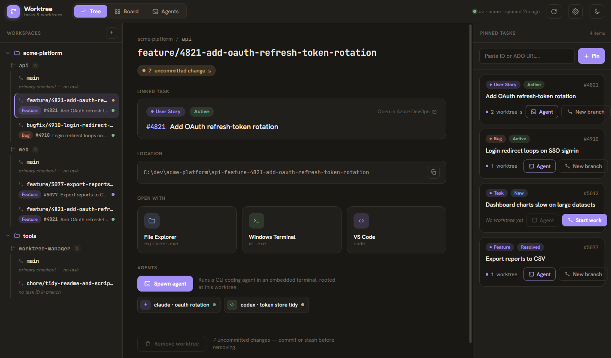
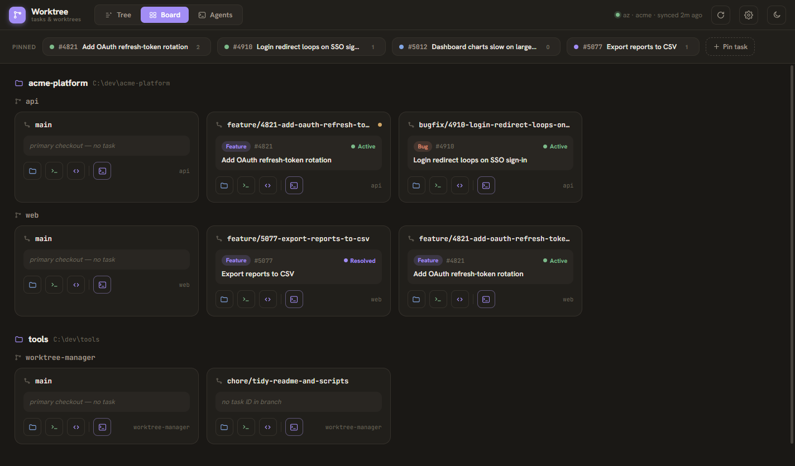
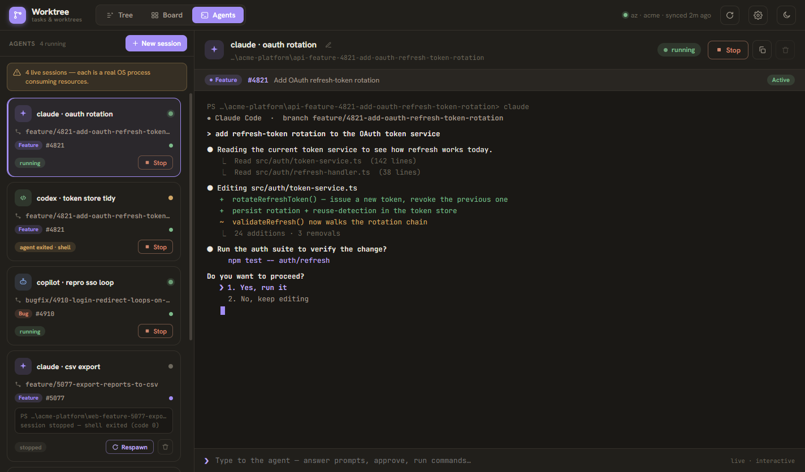

# Playground

> A Windows desktop app that bridges **Azure DevOps work items** to **git worktrees** — and now hosts your **AI coding agents** right where the code lives.

One window to see every worktree across your registered workspaces, pin the ADO tasks you're working on, spin up task-linked worktrees in a single dialog, launch Explorer / Windows Terminal / VS Code rooted at any worktree, and run embedded agent terminals (Claude / Copilot / Codex / ad-hoc) attributed to the worktree — and, by derivation, the task — they run in.

Built for a solo developer juggling several multi-repo projects with multiple AI coding agents running in parallel on different branches. It hosts nothing itself beyond the agent PTYs — external tools are spawned as child processes.



## Why

Going from "task in ADO" to "worktree on disk with tools open on it" is normally a manual chain of terminal commands, path memorization, and window juggling — with no single overview. Once several agents are running, loose terminal windows make it worse. Playground collapses that into one dashboard.

## Features

**Navigation & worktrees**

- Register workspace folders; auto-discover their git repos and every `git worktree` with live dirty/clean status
- Sidebar **Tree** (workspaces → repos → worktrees) with a detail pane: branch, status pills, copyable path, linked-task card
- Create a worktree (with or without a task) and delete one — guarded: refuses a dirty or primary checkout
- One-click launchers: **File Explorer**, **Windows Terminal**, **VS Code**

**Azure DevOps tasks & start-work**

- Pin tasks by ID or URL; title / type / state fetched live (refresh on focus + manual)
- **Start work**: task → worktree with a branch from a configurable template (`{type}/{id}-{slug}`), editable in the dialog with a live path preview
- The task↔worktree link is **derived from the branch name** (the first standalone multi-digit number) — no shadow state. Task tags appear on worktree rows, cards, and the detail pane
- Auth is strictly via `az account get-access-token` — **no stored secrets**; a graceful "run `az login`" prompt on failure

**Board view**

- A task-centric layout: pinned-task chip strip + a workspace/repo-grouped worktree card grid; clicking a chip highlights its linked worktree cards



**Embedded agent sessions**

- Spawn CLI coding agents (**Claude / Copilot / Codex**) as worktree-rooted embedded terminals — a card rail next to a live `xterm.js` terminal (master-detail)
- Multiple concurrent sessions; attach/detach with ring-buffer scrollback replay; per-session Stop / Respawn / Remove
- Sessions are attributed to their worktree and task; sessions persist as metadata and reload as **stopped** (one-click respawn) — PTYs never survive app quit



**Throughout**

- Light / dark theme, persisted last-session UI state (direction, selection, theme)
- Per-workspace overrides via `.app/config.json` (branch + worktree-folder templates); global defaults in Settings

## Stack

- [Electron](https://www.electronjs.org/) + [React 19](https://react.dev/) + TypeScript, scaffolded with [electron-vite](https://electron-vite.org/)
- [node-pty](https://github.com/microsoft/node-pty) PTYs (main process) + [xterm.js](https://xtermjs.org/) (renderer), bridged by typed streaming IPC
- A single typed IPC contract (`src/shared/ipc-contract.ts`) is the spine between main / preload / renderer
- [Vitest](https://vitest.dev/) for behavior-level tests (real git / FS in temp dirs; hand-rolled fakes, no mocking library)
- JSON config persisted to `%APPDATA%/playground/config.json` — no database

> Windows-only. ADO integration is view-only.

## Development

```bash
npm install
npm run dev        # start the app with HMR
npm test           # vitest run
npm run typecheck  # type-check main + renderer
npm run lint       # eslint
npm run format     # prettier
npm run build:win  # production build + Windows installer
```

Pre-PR gate: `npm run typecheck && npm run lint && npm test`.

## Project docs

- [`CLAUDE.md`](CLAUDE.md) — architecture overview and working notes
- [`.specs/project/`](.specs/project/) — vision, roadmap, and decision log; [`.specs/features/`](.specs/features/) — per-feature spec → design → tasks
- [`design/handoff/`](design/handoff/) — the hifi design reference (the source of the screenshots above); reference-only, never shipped
- The screenshots are regenerated from the prototype with `npx electron scripts/capture-prototype-shots.mjs`
